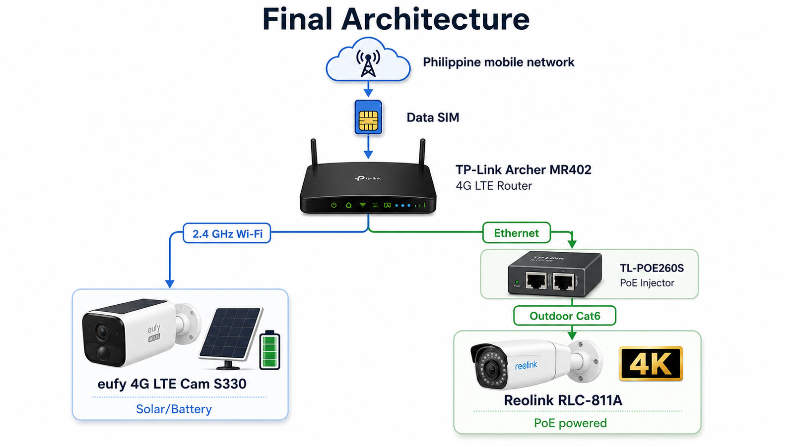
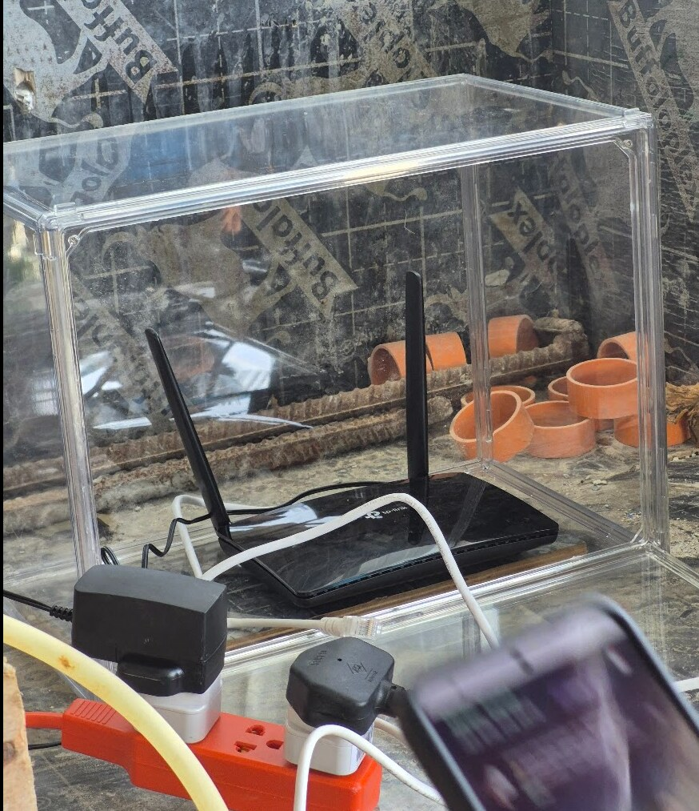
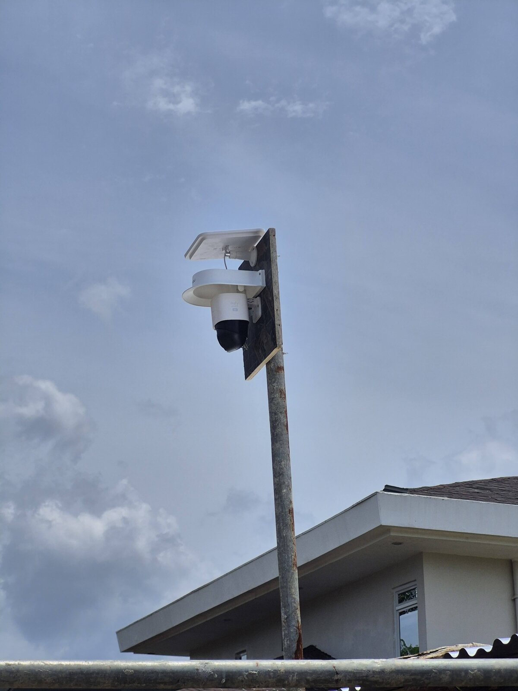
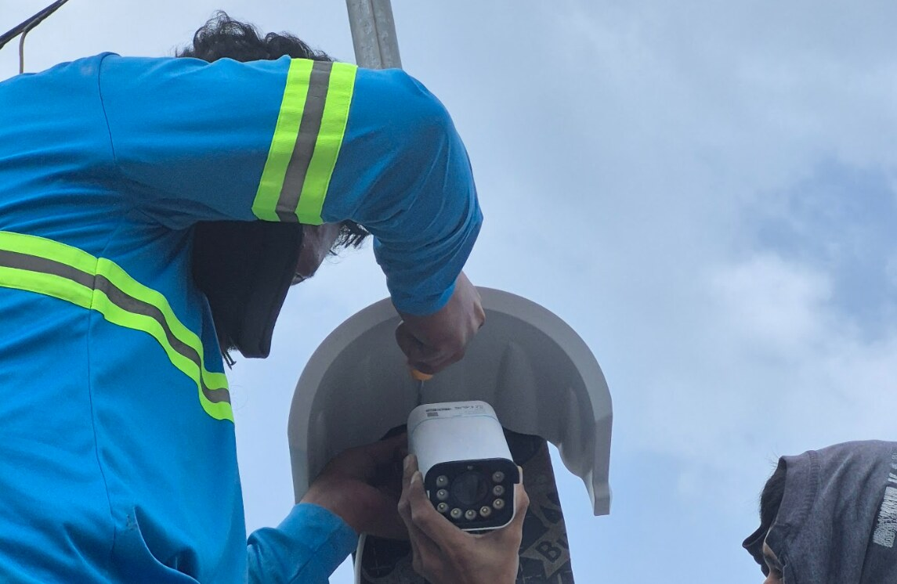
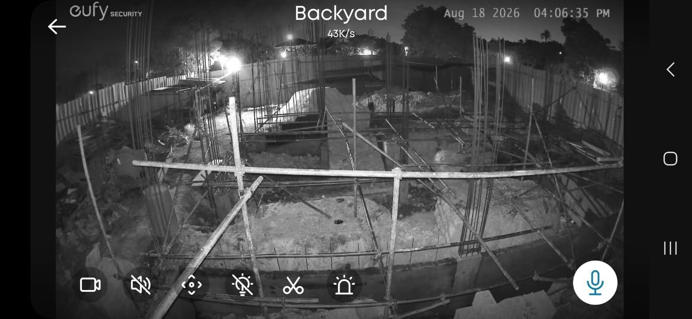
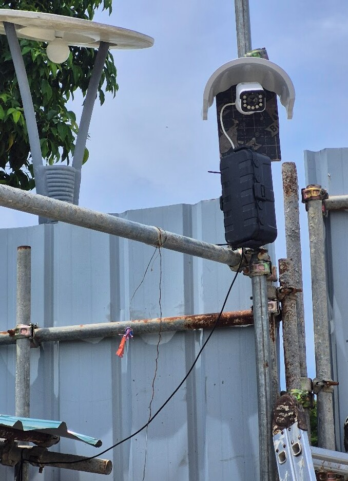

# How I Set Up Construction Site Cameras in the Philippines Using One SIM

Hey, Daniel here!

I wanted cameras on my construction site in Cebu so I could check the work remotely when I am not in the Philippines.

At first this sounded easy. Buy a couple of 4G cameras, put a SIM inside each one, and done.

It did not work out that cleanly.

One of the SIM setups gave me problems, I wanted at least one proper wired 4K camera, and I did not like the idea of paying for and managing a separate SIM for every camera.

After testing different options, I ended up with a hybrid setup:

- One 4G router with one Philippine data SIM
- One solar/battery eufy camera connected by Wi-Fi
- One Reolink 4K camera connected by Ethernet and PoE

This is what I have working now.

## The Final Architecture

The Philippine data SIM sits in the TP-Link Archer MR402 router. The eufy camera joins that router over 2.4 GHz Wi-Fi, while the Reolink connects through the router's Ethernet port, a TP-Link PoE injector and outdoor Cat6 cable.

The important part is this:

**Both cameras are using the internet connection from one SIM.**

That ended up being the main improvement compared with my original idea.

## Why I Did Not Put a SIM in Every Camera

My first idea was to put one SIM inside the eufy camera, then add another SIM for every cellular camera I installed later.

It looks simple because every camera is independent.

But it also means more SIM cards, more mobile plans and more things to troubleshoot.

I had already experienced problems getting a SIM working properly directly in the camera, so I decided to move the cellular connection out of the cameras completely.

Now the router deals with the Philippine mobile network. The cameras just see a normal local network: eufy over Wi-Fi and Reolink over Ethernet.

That separation made much more sense to me.

## The Router: TP-Link Archer MR402

At the centre of everything is a **TP-Link Archer MR402**.

It has its own nano-SIM slot and 4G LTE modem. TP-Link rates it for LTE downloads up to 150 Mbps and it creates dual-band AC1200 Wi-Fi, up to 300 Mbps on 2.4 GHz and 867 Mbps on 5 GHz. It also has three LAN ports plus one LAN/WAN port.

For this installation I do not really care about reaching those maximum Wi-Fi speeds. A construction camera system does not need gigabit internet.

What I wanted was something much simpler: one box that connects to the mobile network, gives the eufy camera Wi-Fi and gives the Reolink camera a wired LAN connection.

The other advantage is that when I am physically at the construction site, I can also connect a phone or laptop to the same Wi-Fi network.

I originally looked at more industrial cellular routers. Those are interesting, especially for a permanent outdoor or industrial installation, but for this temporary construction setup the Archer was easier to get and is doing the job.

One limitation is important: **the normal Archer MR402 is an indoor router**.

TP-Link actually sells a separate MR402-Outdoor with an IP65 enclosure. The normal MR402 I bought should stay somewhere protected.

I am not mounting mine uncovered on a pole beside the sea.

## Camera One: eufy 4G LTE Cam S330

The wireless camera is the **eufy 4G LTE Cam S330**.

This camera is interesting because it can use both cellular and Wi-Fi connections. eufy confirms that it supports both, which means I can connect it directly to the Archer's Wi-Fi instead of using a separate SIM for normal operation.

So although the camera has its own LTE modem, I do not need to use it for the normal setup.

The eufy has a 9,400 mAh battery, solar charging, 4K video and pan/tilt coverage with AI detection and tracking for people and vehicles.

For a construction site that combination is useful.

I can mount it somewhere without:

- Ethernet
- A nearby electrical outlet
- A permanent cable route

The solar panel and battery take care of power, while Wi-Fi comes from the Archer.

It also gives me more freedom to move the camera as construction progresses.

A good camera location during foundations may be useless once walls and scaffolding start appearing.

With the eufy, moving it is relatively easy.

## One Detail About the eufy S330 Name

There is a slightly confusing naming problem worth mentioning.

eufy also sells the **S330 eufyCam / eufyCam 3**, which is a different product and requires HomeBase 3.

That is **not** the camera I am talking about here.

Mine is specifically:

**eufy 4G LTE Cam S330 — model family T86P2.**

The 4G version can connect directly using Wi-Fi or cellular.

I nearly confused the two when researching them.

## Camera Two: Reolink RLC-811A

For the main fixed camera I wanted something more conventional.

I chose the **Reolink RLC-811A**.

This is an 8 MP 4K PoE camera with a motorised 2.7–13.5 mm lens and **5× optical zoom**. Its horizontal field of view goes from around 105° wide to 31° when zoomed in.

That optical zoom was one of the main reasons I liked it.

For construction monitoring, sometimes I want the complete site. Other times I want to zoom in and check one column or connection.

Digital zoom just enlarges the pixels already captured. With the RLC-811A, the lens physically changes focal length.

The camera also supports person and vehicle detection, infrared night vision, colour night vision using its spotlights and two-way audio.

## Why I Used PoE for the Reolink

The Reolink is permanently mounted, so I did not see much benefit in making this camera wireless.

PoE makes more sense because one Ethernet cable carries both data and power to the camera.

The RLC-811A supports standard IEEE 802.3af active PoE and uses less than 12 W according to Reolink's specifications.

My router does not provide PoE directly, so another piece was needed between the router and camera.

## TP-Link TL-POE260S PoE Injector

I added a **TP-Link TL-POE260S**.

The Archer's LAN port connects to the injector's data input. One outdoor Cat6 cable then carries power and data from the injector to the Reolink camera.

The TL-POE260S supports IEEE 802.3af and 802.3at PoE and can supply up to 30 W.

The camera needs less than 12 W, so there is plenty of capacity.

The injector is also capable of 2.5 Gbps Ethernet, which is completely unnecessary for this particular camera, but it does not hurt anything.

The RLC-811A itself has a 100 Mbps Ethernet interface.

## I Avoided CCA Ethernet Cable

This was one part where I decided not to buy the cheapest cable.

There is a lot of inexpensive "Cat6" cable sold online using **CCA**, or copper-clad aluminium, instead of solid copper conductors.

For a normal short Ethernet cable it may be tempting.

For outdoor PoE I did not want it.

Fluke Networks specifically warns that CCA cable has significantly higher DC resistance than copper. That means more heating and less voltage reaching the powered device, exactly what I do not want when the cable is also powering a surveillance camera. Fluke also notes that CCA does not meet the cabling standards requiring solid copper conductors.

My preferred specification is therefore **100% copper, outdoor-rated, UV-resistant Cat6 with 23 or 24 AWG conductors**.

For exposed areas I also want conduit rather than leaving the Ethernet cable permanently baking in Philippine sun and rain.

It costs a little more now and removes one more potential problem later.

## Local Recording Matters

I also installed a **SanDisk High Endurance 256 GB microSD card** in the Reolink.

This type of card is designed specifically for applications that continuously record and rewrite video, including home monitoring and security systems. SanDisk rates the High Endurance range for repeated Full HD and 4K recording.

This gives the system two separate functions: the microSD card inside the camera handles local recording, while the router and 4G connection provide remote access from my phone.

That distinction is useful.

If the cellular connection disappears for a while, the Reolink does not suddenly forget how to record.

It can continue recording locally as long as the **camera still has electrical power**.

That last part is important.

## Internet Failure and Power Failure Are Different Problems

The eufy and Reolink behave differently if something fails.

If only the mobile internet goes down, local recording can continue.

But if the construction site's mains power disappears, the Archer MR402, PoE injector and Reolink all turn off. The Reolink stops because its PoE power disappears.

The eufy has an advantage here because it has its own battery and solar panel.

That means my next logical improvement is not another camera. It is probably a small UPS for the router and PoE equipment.

That would keep the wired part of the system running through shorter construction-site power interruptions.

## Data Usage Is Something I Will Watch

Using one SIM does not mean data is unlimited.

4K cameras can obviously move a lot of data if I sit remotely watching live video for hours.

Fortunately, the cameras do not need to upload everything continuously just because they are connected to the internet.

The Reolink can record locally and I can connect remotely when I want to inspect something.

eufy gives an example of around 700 MB per month for its 4G LTE Cam S330, but that number assumes a very specific pattern of short live views and short motion recordings. It should **not** be treated as an estimate for my complete two-camera system.

I would rather check the real SIM usage after a month than invent a number.

## Why I Like the Hybrid Setup

The two cameras are doing different jobs.

| | eufy 4G LTE Cam S330 | Reolink RLC-811A |
|---|---|---|
| Power | Solar + battery | PoE |
| Network | Wi-Fi | Ethernet |
| Resolution | 4K | 4K / 8 MP |
| Movement | Pan and tilt | Fixed |
| Zoom | Mainly digital | 5× optical |
| Easy to relocate | Yes | Less convenient |
| Works during site power outage | Camera can | No, unless PoE is backed up |
| Main use | Flexible secondary view | Main fixed construction view |

I prefer this to buying two identical cameras.

The eufy is good where running cables is annoying.

The Reolink is good where I want a stable, permanently powered surveillance camera.

## The Coastal Problem

My construction site is only around **200 metres from the sea**.

That changes how I think about the installation.

Salt air, humidity, heavy rain, UV and typhoon winds are not things I want to ignore.

For exposed parts I am trying to keep the installation simple:

- Short, strong camera brackets
- 316 stainless fasteners where practical
- Outdoor junction boxes
- Outdoor UV-resistant cable
- Conduit for exposed Ethernet
- Drip loops before cables enter boxes
- Protected router and PoE equipment
- Surge protection and proper electrical grounding

I also plan to inspect the connections and mounting hardware periodically rather than assuming "outdoor rated" means "forget about it for ten years beside the sea."

The router and PoE injector especially should remain sheltered.

Only the equipment that actually needs to be outside should be outside.

## Would I Use Two Pure 4G Solar Cameras Instead?

Maybe for a farm or a place with absolutely no electrical power.

For my construction site, probably not.

A completely independent camera with its own SIM, solar panel and battery is attractive. But multiply that several times and suddenly every camera is also its own little internet installation.

My current setup separates the responsibilities:

- The **TP-Link Archer MR402** provides cellular internet for the site.
- The **eufy 4G LTE Cam S330** handles the flexible solar-powered view.
- The **Reolink RLC-811A** handles the main wired 4K view.
- The **TL-POE260S** powers the Reolink over Ethernet.
- The **256 GB High Endurance microSD card** stores video locally.

That is easier for me to understand and easier to troubleshoot.

## What I Learned

The main lesson from this little project is that cameras with the biggest feature list are not necessarily the best system.

Originally I was looking for cameras that could individually do everything: 4G, Wi-Fi, solar, battery, cloud access, AI and recording.

What worked better was making each component responsible for one thing.

The Archer handles the cellular connection.

The eufy handles the difficult wireless location.

The Reolink handles the main high-quality wired view.

The PoE injector handles power.

The microSD card handles local storage.

And one SIM gives internet access to everything.

That also means adding another camera later should be easy.

If I add another Wi-Fi or Ethernet camera, I do not automatically need another SIM or another mobile subscription.

I just connect it to the existing site network.

For a temporary construction site in the Philippines, that is probably the part of this setup I like the most.

## Related Reading

- [How I Supervise a Philippine Build From Abroad](/remote-supervision-philippine-build)

## Sources

- [TP-Link — Archer MR402 specifications](https://www.tp-link.com/au/home-networking/5g-4g-router/archer-mr402/)
- [TP-Link — Archer MR402-Outdoor specifications](https://www.tp-link.com/au/home-networking/5g-4g-router/archer-mr402-outdoor/)
- [TP-Link — TL-POE260S PoE+ injector datasheet](https://static.tp-link.com/upload/product-overview/2023/202303/20230328/TL-POE260S%28UN%291.0%20Datasheet.pdf)
- [eufy — 4G LTE Cam S330 specifications](https://www.eufy.com/products/t86p2121)
- [Reolink — RLC-811A specifications](https://reolink.com/us/product/rlc-811a/)
- [SanDisk — High Endurance microSD card datasheet](https://documents.sandisk.com/content/dam/asset-library/en_us/assets/public/sandisk/product/memory-cards/high-endurance-uhs-i-microsd/data-sheet-high-endurance-uhs-i-microsd.pdf)
- [Fluke Networks — Copper-clad aluminium cable and PoE](https://www.flukenetworks.com/content/application-note-copper-clad-aluminum-cables)
