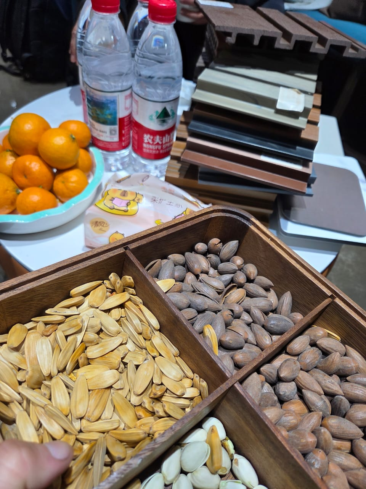
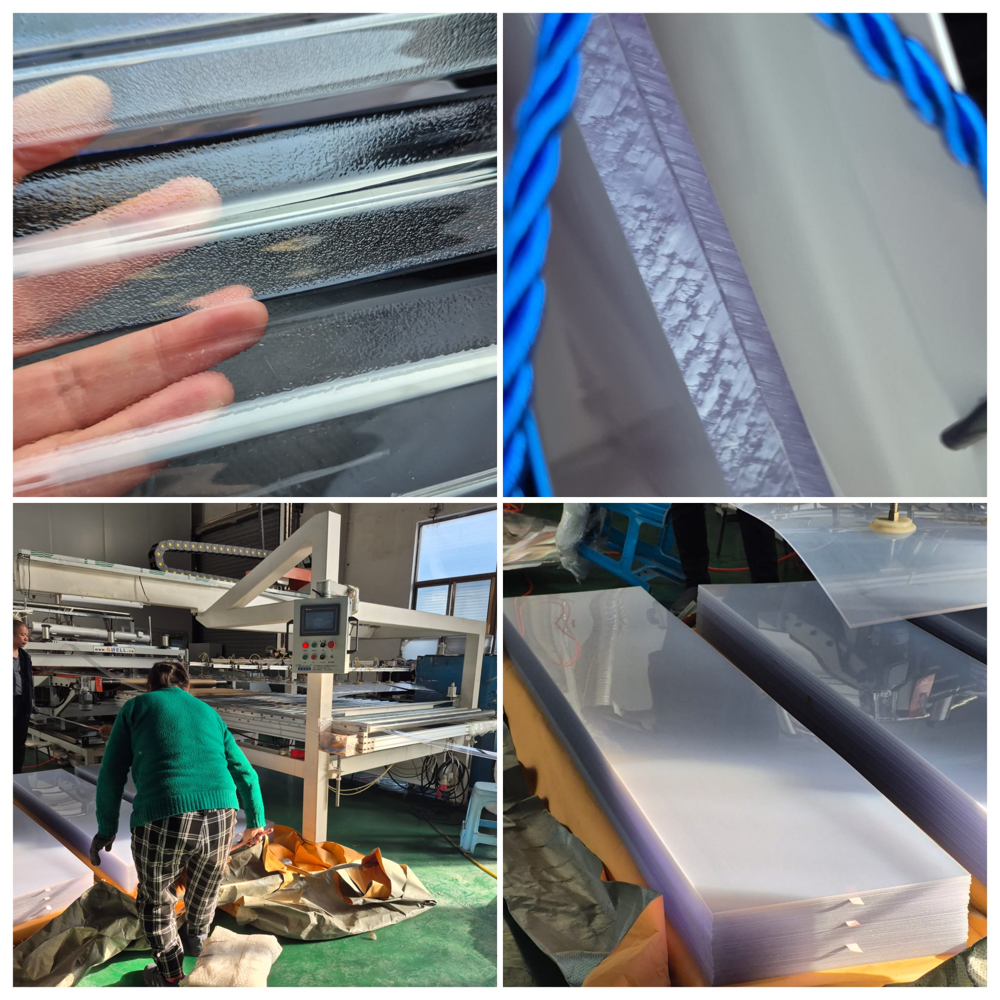
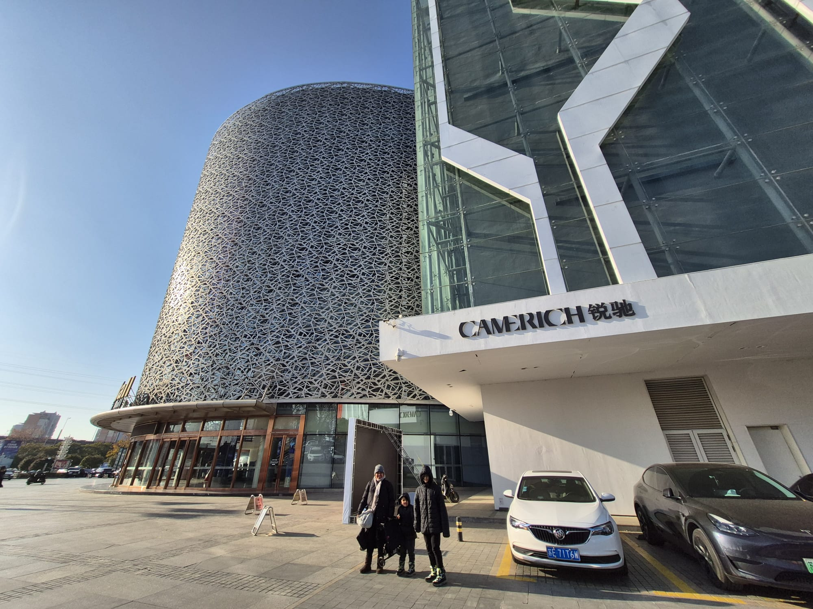
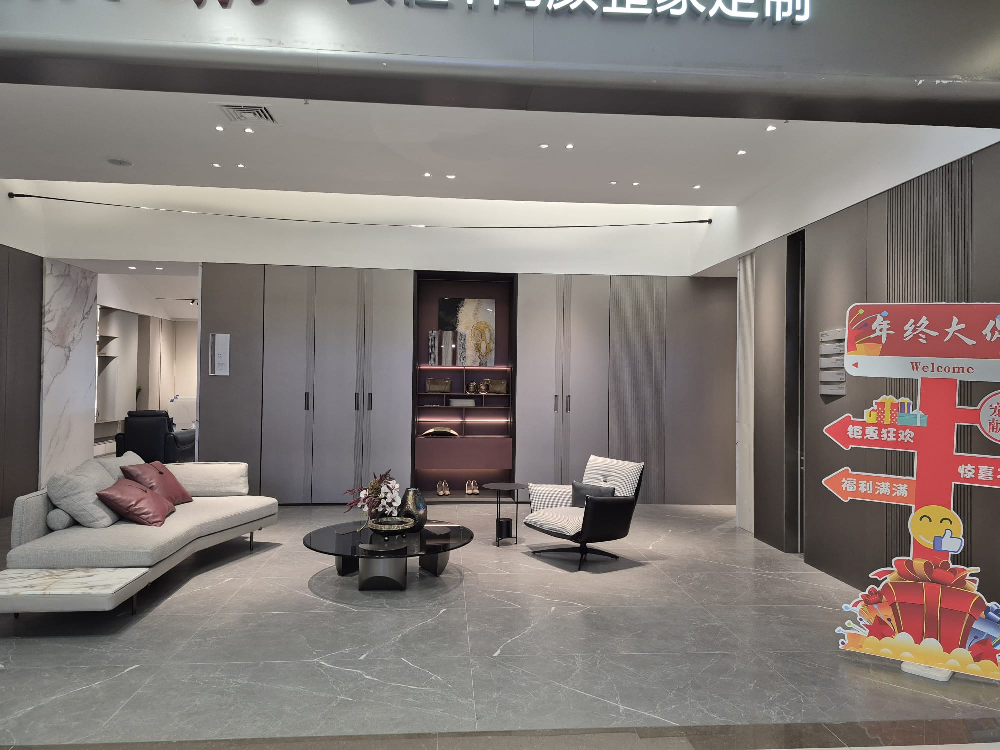
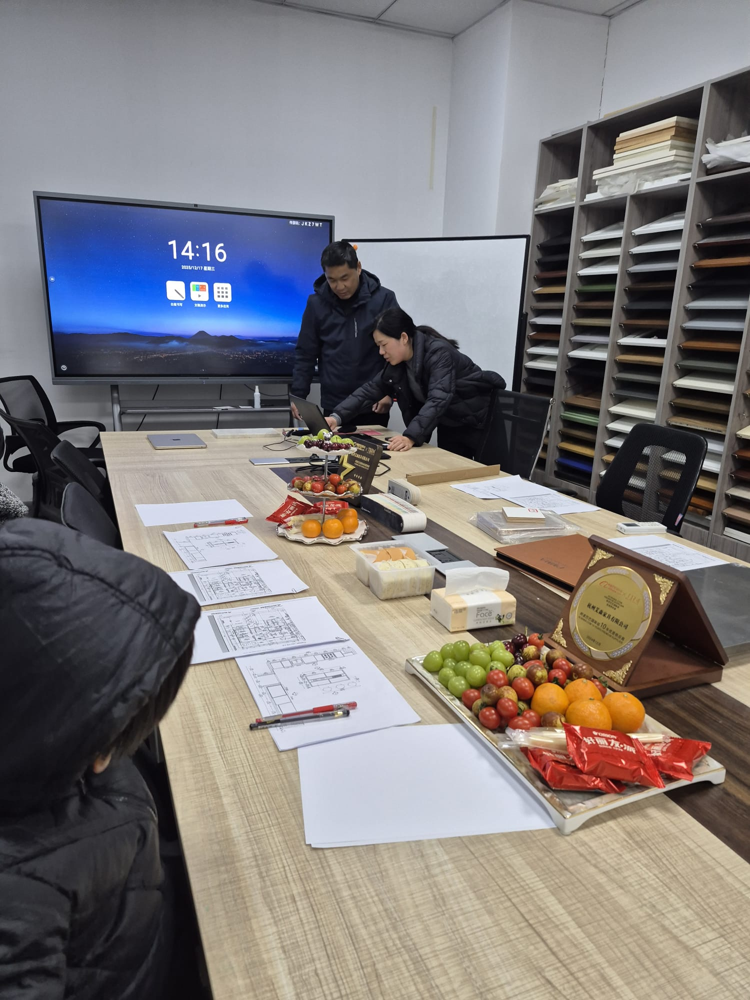
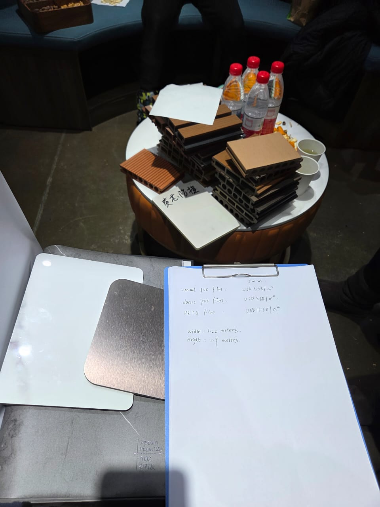

Daniel here. After 4 trips to China for construction materials I've learned quite a few things the hard way. Some practical, some about suppliers, some about not trusting your GPS. Figured I'd put it all together because when I started this I couldn't find a single useful guide for someone building in the Philippines trying to source from China.

So here it is. Everything I wish someone told me before my first trip.

## The Practical Stuff Nobody Tells You

### VPN situation

Your phone basically stops working the moment you land in China. No Google, no WhatsApp, no Instagram, nothing. You NEED a VPN pre-installed before you fly. I used Proton VPN, the free version, and it worked fine for me.

But here's the annoying part. You need Chinese apps too. Alipay, Amaps, Didi... and those don't always play nice with VPN on. So you're constantly toggling VPN on and off. Want to check WhatsApp? VPN on. Need to call a taxi on Didi? VPN off. Want to check your bank app? depends on the bank. It gets old fast.

Better option honestly? Buy a Hong Kong eSIM online before you go. Around 10 dollars gets you 1GB per day, works without VPN, and you can keep your regular SIM for Chinese apps. Way less headache.

### Payments

This is a big one. Cards are basically not accepted anywhere. Not Visa, not Mastercard, nothing. Some places take cash but not the metro, not most taxis, not the small restaurants you actually want to eat at.

You need Alipay or WeChat Pay connected to your bank card BEFORE you arrive. Set this up at home. I can't stress this enough. The process of connecting a foreign card can be tricky and you don't want to be doing it in a taxi line at Pudong airport at midnight.

### Getting Around

Use Amaps (Gaode Maps) instead of Google Maps. Way more detailed for China, better transit info, and it actually knows where the small factory showrooms are. Google Maps in China is... not great even with VPN.

For taxis use Didi through the Alipay app. Works just like Uber. Make sure you set the pickup location correctly because here's the thing - western phones have GPS offset problems in China. Something about the coordinate system being different.

My GPS was consistently about 1km off. Which means the Didi driver goes to the wrong spot, you're calling each other not understanding anything (they don't speak English), and its a mess. Same problem in stores - tried to order at Luckin Coffee and it kept selecting a different branch across the street. Annoying but you get used to adjusting manually.

### Samples

This is a great tip. You can request samples from many factories to be delivered directly to your hotel. Usually the samples are free, you only pay for the courier which inside China is almost nothing. Like really cheap. So even if you can't visit a factory in person, reach out on Alibaba or WeChat and ask them to send samples to wherever you're staying.

I ended up with like 15kg of material samples across my trips. Had to buy an extra suitcase.

## Where to Go - The Cluster Thing

China is all about manufacturing clusters. Different cities specialize in different materials and it matters A LOT for pricing and variety.

**Foshan** - This is your main city for overall construction materials. Windows, doors, aluminum, ceramics, tiles, bathroom fixtures. It's very close to Guangzhou and Shenzhen so you can base yourself in either city easily. If you're doing a single trip for all your materials, Foshan is the best bet. Most stuff is there.

**Shanghai area** - Kitchens, WPC (wood plastic composite), modern interior materials. Hangzhou specifically for kitchen manufacturers. More expensive area overall but some materials you just won't find in Foshan.

**Suzhou** - Polycarbonate sheets, prefab houses. We visited Suzhou New Highlight Precision Technology, a polycarbonate factory in Suzhou. They have some interesting stuff including scratch-resistant polycarbonate which is a big deal for roofing panels that need to last.

**Shenzhen** - Electronics, smart home stuff, LED. Though we found LED factories near Shanghai too.

**Taizhou** - Steel.

If you want one specific material and you want the best price, research on Alibaba where the factories cluster for that material and plan your trip around that area. If you want to see a bit of everything, just go to Foshan.

We did Guangzhou, Foshan and Shenzhen first trip. Shanghai and Hangzhou second trip. Going back to Foshan in March 2026 for a final round before making purchasing decisions.

## The Mall Experience - Red Star Macalline

OK so Red Star Macalline. Think of it like... SM Mall but only for construction and interior design stuff. Hundreds of showrooms across multiple floors. Every brand has their own space set up with full displays.

We went to the one in Pudong, about 40 minutes east of central Shanghai.

It's great for research. You walk through beautiful kitchen setups, living room displays, tile showrooms, everything is presented perfectly. Great for getting ideas and understanding what's available.

But don't buy there. The markup is insane, like 200-300% or more over factory price. Use it to figure out what you like, take photos of everything, and then find the actual manufacturers.

oh and one funny thing. In many shops they'll tell you the product is from Italy or Germany or wherever. A local friend told us that most of those are actually manufactured in China for foreign brands. Not actually imported. So you're paying premium prices for the "Italian" label on a Chinese product. Just go direct to the Chinese factory making the same thing.

There's other big markets in Shanghai too. Huayi Decoration Material Market, Meiju International Building Material Center, Casa Ceramics Mall. Shanghai has a lot of options. But Red Star Macalline is the most well known and the most premium one.

### Wholesale Markets

Also visited some wholesale markets. These are more raw materials, less fancy showrooms. They're mostly factory resellers actually. Honestly worst value for a foreign buyer. You'll get better prices going directly to factories plus you can get free samples. Wholesale markets are worth a quick look to see more variety of raw materials but that's about it.

### Factory Visits - The Best Option

Going directly to factories is where you get the real prices and the real quality assessment. Problem is they can be far apart from each other. Like REALLY far. Plan for this.

But here's the thing that blew me away about Chinese suppliers. They pick you up from your hotel. Drive you to their factory. Show you everything. Then many of them will literally drive you to your next supplier appointment. For free. The level of service is something else.

## Shanghai Trip Highlights

### Hangzhou for Kitchens

This was the main reason for this trip. From Shanghai Hongqiao station you can get to Linping in about 30 minutes by train. Linping is where you find the kitchen suppliers.

The kitchen factories we met employ 60-70 people each. They showed us all the installations, explained the manufacturing process end to end, countertops to cabinet assembly. Super professional. They picked us up, invited us for lunch, helped us with logistics for the rest of the trip.

Unfortunately we didn't have time for tourism in the area this time, we'd visited Suzhou on the previous trip but didn't get to see the West Lake in Hangzhou. Need to come back for that.

I'll write a detailed article on the kitchen sourcing because there's so much to cover there.

### Superhouse - Aluminum Windows

We visited Superhouse in Shanghai, the top rated aluminum supplier with most certifications, especially for hurricane windows. They picked us up from the hotel and brought us to their modern offices. They showed us videos of their fully automated factory and their extensive luxury portfolio.

honestly? Not very impressed. The products look great and the certifications are solid but there were restrictions that didn't work for us. Like fluorocarbon coating only available for high MOQs. We'll stick with suppliers in Foshan for windows where we got better flexibility on the first trip.

### Meeting Culture

Every meeting started with tea. Always tea. Then the factory tour, then sitting down with samples and catalogs. Seeds, nuts, dried fruits on the table. One company had a full lunch prepared.

We were really impressed with the professionalism and how accommodating everyone was. Chinese business culture is relationships first. Don't rush the small talk, enjoy the tea, ask about their families. It pays off in better pricing and service later.

One comment from a kitchen supplier that stuck with me. They mentioned that salaries and taxes in the Shanghai/Hangzhou area are going up and they're considering moving production further away. Could explain why the area feels more expensive than Foshan.

A friend of ours, the husband of my wife's university colleague who lives locally, confirmed that the construction industry in China is going through a downturn. Materials companies are having a hard time. Good for us as buyers I guess since they really want export business, but still... something to be aware of.

## Shanghai vs Foshan - The Reality

Been to both areas now. Quick comparison:

Foshan wins for: windows, doors, aluminum profiles, ceramics, tiles, plumbing. More factories, more competition, better prices. Also cheaper hotels and food.

Shanghai/Hangzhou wins for: kitchens, WPC panels, modern composite materials, design-forward products. Better organized showrooms, very international-friendly suppliers.

Some expat people told us there's a quality difference between products from the Shanghai area and Guangzhou/Foshan. Like Shanghai area is higher quality. Can't confirm this personally but its worth noting.

For my project I needed both trips. And we're going back to Foshan in March 2026 for final decisions on the big items before placing orders.

## The Tourism Side

Can't go to Shanghai without mentioning the food and tourism. The city at night is incredible, the Bund skyline is unreal. Food is completely different from Guangzhou - Shanghai xiaolongbao (soup dumplings) are mandatory.

We also went to Harbin after the sourcing part of the trip. Tourist detour. Very cold. Very beautiful.

Travelling with kids makes everything more time consuming though. Our schedule was packed between supplier meetings and kid logistics. Didn't get to see everything we wanted.

Shanghai is more expensive than Guangzhou/Foshan for daily expenses. Budget maybe 30-40% more for hotels, food, transport.

## Quick Tips Summary

Some random things I've picked up across all my trips:

- Get Proton VPN (free) installed before you fly, or better yet buy a Hong Kong eSIM for ~$10/day
- Set up Alipay with your bank card at home, cards basically dont work anywhere
- Use Amaps not Google Maps
- Use Didi (through Alipay) for taxis, but double check pickup location cause GPS is off by ~1km
- Request samples shipped to your hotel, even from factories you can't visit
- Red Star Macalline for research only, don't buy there
- Go to actual factories for real prices
- For one trip covering everything, go to Foshan
- For kitchens specifically, look at Hangzhou/Linping area
- Suppliers will often pick you up AND drive you to your next meeting
- Bring an empty suitcase for samples
- "Italian" and "German" products in the malls are usually Chinese made
- Wholesale markets look tempting but factory direct is always better value

## What's Coming

I'll write separate articles on each material category from these trips. Kitchens first because that's the biggest and most complex purchase. Then WPC which I think is going to be huge for Philippine construction. Then windows, LEDs, polycarbonate, tiles, composite panels.

Planning the Foshan trip for March and will update with what we find there too.
