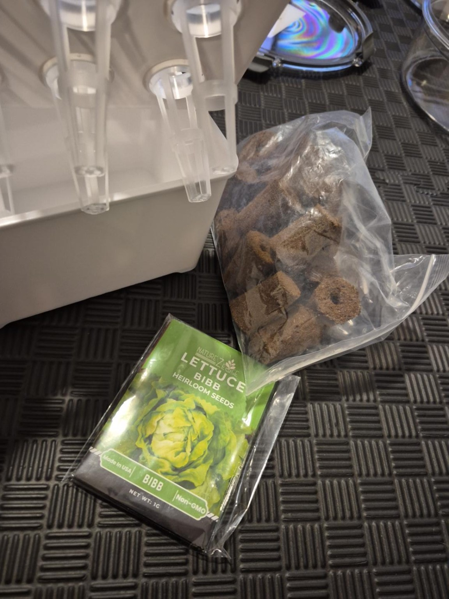
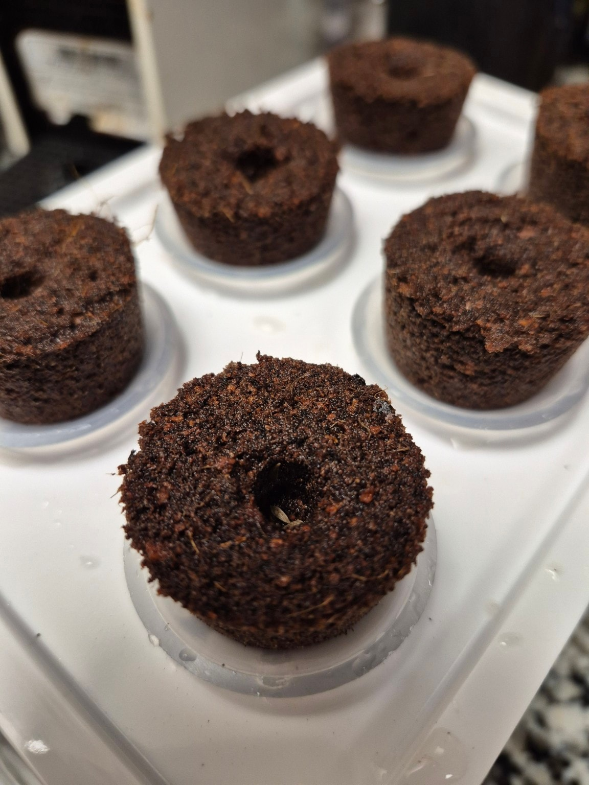
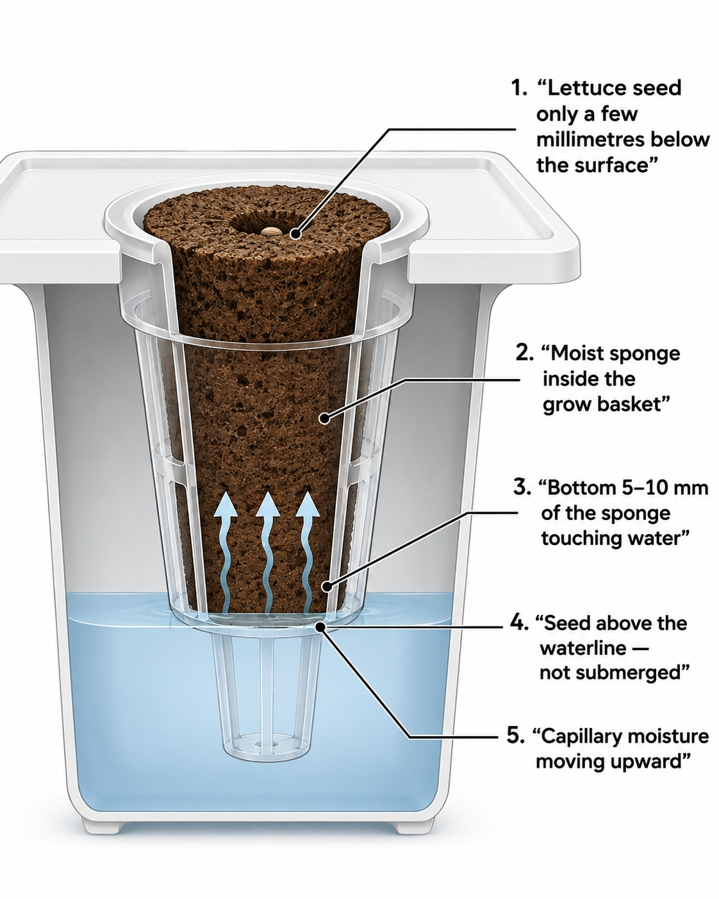

I have been planning a small indoor hydroponics system, but I do not want to start by automating everything.

It would be easy for me to add sensors, an ESP32, MQTT, Home Assistant, pumps, alarms and automatic nutrient dosing. The problem is that automation does not fix a system that I do not understand.

So I am starting with something much simpler: **seeds → healthy seedlings → DWC reservoir → stable nutrients → healthy lettuce**.

The first objective is simple: **grow healthy lettuce manually and understand every stage of the process**.

Only after I can do that reliably will I start adding automation.

For my first test, I chose **Bibb lettuce**.

## Why I started with lettuce

Lettuce is widely used in hydroponic growing systems, including research and commercial controlled-environment agriculture.

Cornell University's Controlled Environment Agriculture program has published an entire [hydroponic lettuce production handbook][cornell-handbook]. Its system starts lettuce seeds in small growing plugs before moving the seedlings into the main hydroponic growing area.

That makes lettuce a good crop for learning the basic process.

For this first experiment, I am using:

- Bibb lettuce seeds
- small hydroponic growing sponges
- plastic grow baskets
- a small indoor hydroponic unit
- clean water
- hydroponic nutrients for the later stages
- an LED grow light

At this stage, however, I only need the seeds, sponges and water.

## Step 1: preparing the growing sponges

The brown growing plugs arrived dry.

Before putting seeds into them, I soaked the plugs in clean, room-temperature water. I placed each sponge completely underwater for around **5 to 10 minutes**.

The objective was not simply to make the outside wet. I wanted water to penetrate the entire sponge.

While the sponge was underwater, I gently pressed it once or twice. Small air bubbles escaped from inside.

This is useful because a dry growing medium can contain air pockets that prevent moisture from reaching the seed evenly.

I did not crush or wring out the sponge. After soaking, I removed it from the water and allowed the excess water to drain naturally for a few seconds.

The result was a sponge that was:

- completely moist
- heavier than when dry
- wet throughout
- not streaming water

The sponge should be moist, but it does not need to behave like a completely saturated kitchen sponge.

Cornell's hydroponic lettuce guidance also starts lettuce in moistened growing plugs. Keeping the germination medium from drying out is particularly important during this stage.

## Step 2: installing the sponge in the basket

Next, I inserted each wet sponge into its plastic grow basket.

The sponge has a wider upper section and a narrower lower section. The wide section rests on the top of the basket while the narrow section extends downward.

This is important later because the bottom of the sponge can receive water while the seed remains much higher and still has access to oxygen.

I made sure the small planting hole in the center of the sponge remained accessible.

## Step 3: adding the Bibb lettuce seeds

Lettuce seeds are very small.

For this first experiment, I placed **two seeds in each sponge**. Using two gives me some redundancy if one seed fails to germinate. If both germinate successfully, I will eventually keep the strongest seedling and remove the weaker one.

I placed the seeds inside the small central hole in the sponge.

One thing I corrected while doing this was the depth. Initially, it is tempting to push the seed deep into the hole. That is not what I want with lettuce.

I left the seeds very close to the surface, only a few millimetres down.

Cornell's seed-sowing guidance says that lettuce seeds need light for germination and recommends scattering them on the surface and pressing them in lightly. The federal seed-testing conditions for lettuce also specify light. ([Cornell Garden-Based Learning][cornell-planting]; [7 CFR § 201.58][cfr-germination])

The seed is damp. It is not submerged.

That distinction is important.

## Step 4: installing the pods

Once the seeds were positioned correctly, I placed the baskets into the hydroponic unit.

During this early stage, the sponges need to remain moist. I do not want the entire sponge underwater.

Instead, the lower part of the sponge can remain in contact with the water. Moisture then moves upward through the growing material. The upper part stays damp while still having access to air.

The seed itself should not be sitting underwater.

For my setup, I am starting with roughly the bottom **5 to 10 mm of the sponge contacting the water**. I will adjust this if necessary after observing how well the plugs retain moisture.

This is one reason I want to learn the system manually before automating it.

A water-level sensor can tell me the depth of the reservoir. It cannot tell me whether I chose the correct water level in the first place.

## Step 5: no complicated nutrient mixing yet

I am deliberately keeping the germination stage simple.

The immediate objective is **seed + moisture + suitable temperature + light → germination**.

I do not need to start by pushing a strong nutrient solution through newly planted seeds.

Once the seedlings are established and start producing real leaves, nutrient management becomes much more important. That will be the next stage of the experiment.

Eventually I will need to understand and control:

- pH
- EC
- water temperature
- water level
- nutrient concentration
- light
- air temperature
- humidity

But there is little value in measuring everything before I understand what each measurement means for the plants.

## Step 6: waiting for germination

Now there is not much to do.

That is intentional.

My job during germination is mostly to make sure the growing plugs do not dry out and are not flooded.

Cornell's hydroponic lettuce production work uses controlled germination conditions around 20°C. Its commercial process is obviously much more controlled than my small home experiment, but it gives me a useful reference point for understanding what lettuce prefers. ([Cornell Hydroponic Lettuce Handbook][cornell-handbook])

Once the seedlings emerge, light becomes increasingly important.

My LED grow light will eventually run on a controlled schedule. Later I can automate that easily.

For now, I first want to observe how the seedlings behave.

## What happens if both seeds grow?

I placed two seeds into each sponge because this is my first experiment.

If both germinate, I do not plan to grow two mature lettuce plants from the same small plug. They would compete for light, root space and nutrients.

Once I can clearly identify the stronger plant, I will keep that seedling.

Instead of pulling the unwanted seedling out and potentially disturbing the roots of the plant I want to keep, I can simply cut the weaker seedling close to the sponge.

The final objective is straightforward: **one sponge → one strong seedling → one healthy root system**.

## Why I am not automating it yet

The interesting part of this project will eventually be the electronics.

I already have a much bigger architecture in mind, with temperature, humidity, water-temperature, water-level, leak, pH and EC sensors connected through an ESP32, MQTT and Home Assistant to my own application.

From there I can start controlling:

- grow lights
- circulation
- ventilation
- alarms
- reservoir monitoring
- water top-ups
- nutrient dosing

Eventually a local application could also collect historical data and help me understand how environmental changes affect the plants.

But I do not want to build that yet.

My first milestone is much more basic:

**Can I reliably turn these tiny Bibb lettuce seeds into healthy hydroponic lettuce?**

If the answer is no, adding another ten sensors will not solve the fundamental problem.

If the answer is yes, then I have something worth automating.

## Current status

The first six growing sponges are now wet, installed and seeded.

The project is currently at the beginning of this sequence: **Bibb lettuce seeds → moist growing sponges → germination → healthy seedlings**.

The next article will start when I have seedlings. At that point I can begin looking at lighting, root development, nutrients and eventually transferring the plants into their main hydroponic growing environment.

This is a very small experiment, but that is exactly what I want.

First understand the plant.

Then understand the hydroponics.

Then automate it.

Continue with [Part 2: building the minimum indoor hydroponic system](/diy-indoor-hydroponics-part-2-starting-simple-before-i-automate-it).

## Sources

- Cornell Controlled Environment Agriculture, [Hydroponic Lettuce Handbook][cornell-handbook]
- Cornell Controlled Environment Agriculture, [Hydroponic leafy-green resources][cornell-greens]
- Cornell Garden-Based Learning, [Planting the Garden][cornell-planting]
- Electronic Code of Federal Regulations, [7 CFR § 201.58: germination testing conditions][cfr-germination]

[cornell-handbook]: https://cea.cals.cornell.edu/files/2019/06/Cornell-CEA-Lettuce-Handbook-.pdf
[cornell-greens]: https://cea.cals.cornell.edu/crops/greens/
[cornell-planting]: https://gardening.cals.cornell.edu/lessons/project-s-o-w-seeds-of-wonder-food-gardening-with-justice-in-mind/unit-3-sowing-seeds-of-curiosity/3-7-planting-the-garden/
[cfr-germination]: https://www.ecfr.gov/current/title-7/subtitle-B/chapter-I/subchapter-K/part-201/section-201.58
