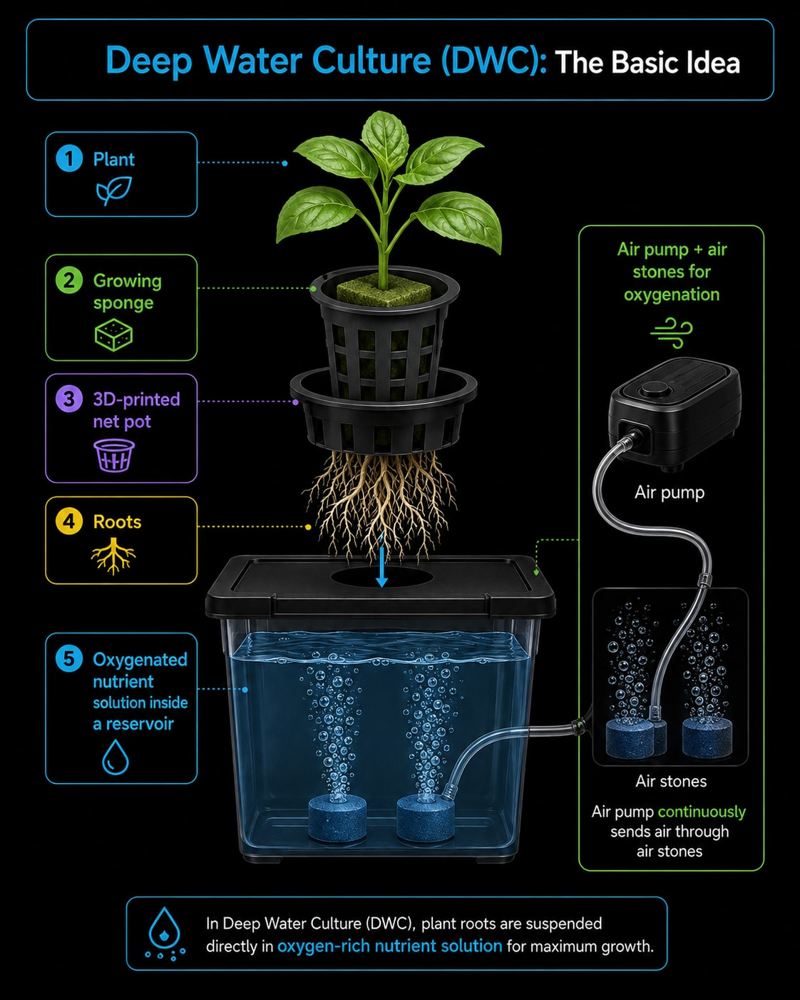
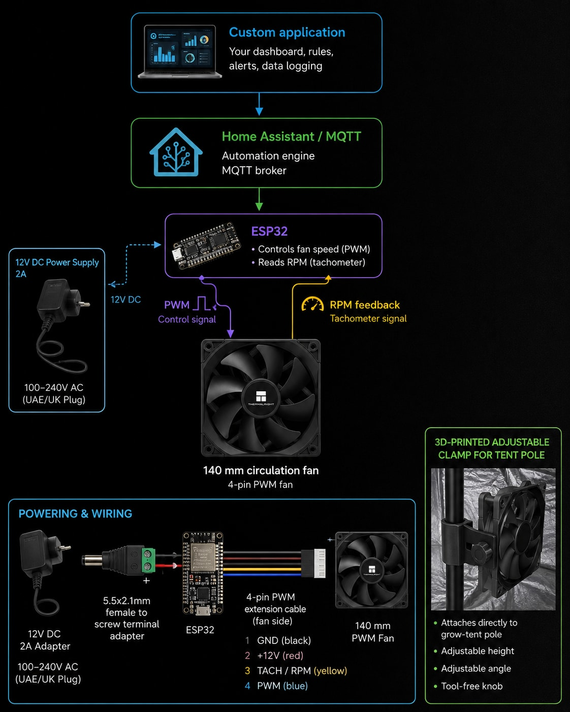
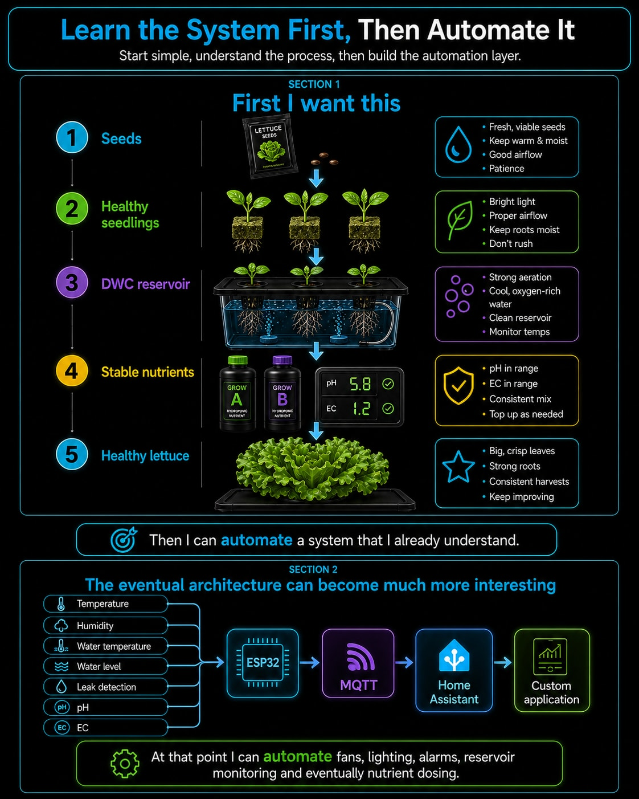

Hey, Daniel here!

I'm starting a new hydroponics series.

The long-term goal is not simply to grow a few lettuces indoors. I want to build a **modular indoor hydroponic system that I understand completely**, then gradually add sensors, Home Assistant, ESP32 controllers and eventually my own software.

But there is an easy way to make a project like this unnecessarily complicated: automate everything before proving that the basic system actually grows plants.

So I decided to do the opposite.

For version one, I am building the **simplest useful hydroponic system I can**, while choosing components that I can reuse when I automate it later.

This first article covers the planning and the parts I selected. Nothing is fully installed yet. As everything arrives, I will follow up with separate articles covering assembly, 3D printing, testing, nutrients, planting and finally automation.

## The basic objective

I want the first version to grow lettuce indoors reliably.

Later I also want to experiment with dwarf tomatoes and other vegetables, but lettuce is a much better crop for learning the system.

The first setup will use **Deep Water Culture, or DWC**.

The basic idea is simple:

```text
Plant
  │
Growing sponge
  │
3D-printed net pot
  │
Roots
  │
  ▼
Oxygenated nutrient solution
inside a reservoir
```



An air pump continuously sends air through air stones inside the nutrient solution.

Oklahoma State University describes water culture as one of the simplest active hydroponic systems: the plants sit above the nutrient solution while an air pump and air stone supply oxygen to the roots. ([Oklahoma State University Extension][hydroponics])

That simplicity is exactly why I chose it for version one.

## Why I did not buy a complete smart grow kit

I originally looked at complete grow-tent packages containing:

- tent
- LED light
- extraction fan
- circulation fan
- carbon filter
- controller
- sensors
- phone application

They are convenient, but I didn't really want the proprietary controller.

If I am eventually going to build my own automation, paying extra for somebody else's closed smart ecosystem makes little sense.

Instead, my approach became:

> Buy the physical components that are difficult or pointless to manufacture myself, and build the custom parts and intelligence myself.

That gives me much more freedom later.

I can replace the controller without replacing the light. I can replace the fan without replacing the sensors. I can add Home Assistant without depending on a particular grow-tent manufacturer.

And when I eventually build my own application, I will already know exactly how everything works.

## Step 1: choosing the tent size

This took more thought than expected.

I first found a very small tent around:

```text
42 × 42 × 121 cm
```

It was cheap, but it was simply too small.

Once you account for:

- the hydroponic reservoir
- plant height
- distance between the plants and the LED
- the LED itself
- fans
- tubing
- cables

121 cm disappears very quickly.

I then looked at an:

```text
82 × 82 × 181 cm
```

That would work, especially for lettuce, but I wanted something I would not immediately outgrow.

The size I eventually settled around is the standard **3 × 3 foot class**, roughly:

```text
91 × 91 × 200 cm
```

That is compact enough to fit comfortably inside a room while giving approximately **0.83 m² of floor area**.

It also gives me enough height to experiment with different reservoir and lighting arrangements.

For this project, I think the 3×3 format is the sweet spot.

## Step 2: the grow light

This is where I was willing to spend more money.

There are hundreds of very cheap grow lights advertised as:

```text
1000W
2000W
3000W
```

but the marketing number often has little relationship with actual electrical consumption.

I wanted the actual power specification.

After comparing several AliExpress and Amazon options, I chose a:

### FARMLITE 240 W full-spectrum grow light

The version I selected uses a four-bar design with a quoted **240 W actual power**, dimming and 1,056 Samsung LEDs.

I considered cheaper AliExpress lights using Samsung LM301-series LEDs and Mean Well drivers. Technically, some of them looked excellent.

The problem was price and purchase risk.

Once the correct 240 W configuration and shipping were selected, some of those AliExpress options were almost as expensive as, or more expensive than, the Amazon alternatives.

For this component, I preferred Amazon's easier returns and customer service.

The light is deliberately more powerful than I need for young lettuce.

That is fine because it is dimmable.

I would rather buy one useful light now and initially run it at lower power than replace an undersized light when I start growing larger plants.

## Step 3: circulation inside the tent

I initially considered a normal clip-on grow fan.

Then I realized that I would eventually want software control of the fan speed.

That changed the requirement completely.

Instead, I bought a:

### Thermalright TL-C14C-S 140 mm PWM fan

This is technically a computer cooling fan rather than a grow-tent fan.

That sounds strange, but it has several advantages for this project.

The manufacturer specifies:

- 140 × 140 × 25 mm
- 12 V DC
- 4-pin PWM control
- maximum 1,500 RPM
- maximum 75.8 CFM airflow
- tachometer/RPM feedback
- maximum rated noise of 26.4 dBA. ([Thermalright][thermalright])

The important part is the **4-pin PWM interface**.

Today, I can simply power the fan.

Later an ESP32 can control its speed and read its actual RPM:

```text
Custom application
        │
        ▼
Home Assistant / MQTT
        │
        ▼
      ESP32
       │  │
 PWM ──┘  └── RPM feedback
       │
       ▼
140 mm circulation fan
```



I will probably 3D-print an adjustable clamp so the fan can attach directly to the grow-tent pole.

## Step 4: powering the circulation fan

The Thermalright fan needs 12 V DC.

I therefore selected a simple:

```text
12 V
2 A
regulated AC/DC adapter
UK/UAE Type-G plug
5.5 × 2.1 mm barrel connector
```

Two amps is far more than the single fan requires, but it gives me useful spare capacity for later control electronics.

I also bought:

- a 4-pin PWM extension cable
- a 5.5 × 2.1 mm female barrel-to-screw-terminal adapter

The important idea here is that I do **not** want to cut the original fan cable.

I can modify the cheap extension cable instead.

## Step 5: using a storage box as the hydroponic reservoir

I considered 3D printing the complete reservoir.

Technically, that is possible.

Practically, it would be a poor use of a 3D printer.

A 30 L tank contains roughly 30 kg of water before adding the lid, plants and equipment. A commercially molded PP or HDPE container is cheaper, stronger, smoother and easier to clean than a large FDM print.

So I chose a:

### Tactix 30 L heavy-duty storage box

The box becomes the DWC reservoir.

The clever parts will be printed around it instead.

That gives me the best combination:

```text
Commercial molded reservoir
              +
     Custom printed parts
```

## Step 6: 3D printing the net pots

This is exactly the kind of component that does make sense to print.

Instead of buying standard hydroponic net pots, I will design them around the seed-starting sponges I already have.

I plan to print them in **PETG**, with:

- a wide upper flange
- tapered sides
- large root openings
- an open bottom
- an internal support for the sponge
- no printing supports

Something approximately like this:

```text
        plant
          │
      ┌───┴────┐
      │ sponge │
   ┌──┴────────┴──┐
   │    printed    │
   │    net pot    │
    \ │ │ │ │ │ /
     \│ │ │ │ │/
        roots
          │
          ▼
       nutrient
       solution
```

Once I have the final dimensions of the Tactix lid and sponge, I will make the model parametric so I can easily produce different sizes later.

That will be one of the next articles.

## Step 7: oxygenating the reservoir

The roots in DWC need oxygen.

After rejecting several very small USB aquarium pumps, I selected a:

### SOBO SB-8806 dual-outlet air pump

I specifically wanted a proper mains-powered aquarium pump rather than a tiny portable pump designed for transporting fish.

The pump has two outputs, which lets me place an air stone on each side of the 30 L reservoir.

The complete air system will be:

```text
             SOBO air pump
               /       \
              /         \
       check valve   check valve
            │             │
         airline       airline
            │             │
       50mm stone     50mm stone
            │             │
            ▼             ▼
     ┌────────────────────────┐
     │                        │
     │    30 L reservoir      │
     │                        │
     │  bubbles ↑    ↑        │
     │         roots          │
     │                        │
     └────────────────────────┘
```

For the accessories I bought inexpensive aquarium parts:

- 4 mm ID / 6 mm OD airline tubing
- two 50 mm air stones
- two 4 mm non-return/check valves

The check valves are there to reduce the risk of water flowing backwards through the airline toward the pump.

The pump itself will normally run continuously.

## Step 8: nutrients

For the first grow, I am keeping the nutrient side equally simple.

I chose:

### Casa De Amor Hydroponic A+B nutrients

It is a two-part nutrient system intended for leafy vegetables and other hydroponic crops.

There is an important reason hydroponic nutrients commonly come as separate A and B concentrates: concentrated mineral components should not simply be mixed directly together before dilution because some compounds can precipitate.

My basic process will therefore be:

```text
Water
  ↓
Part A
  ↓
Mix
  ↓
Part B
  ↓
Mix
  ↓
Measure EC
  ↓
Measure pH
```

I already own pH and EC/TDS meters, so I did not need to buy those again.

EC is particularly useful because electrical conductivity gives us an indication of the concentration of dissolved salts in the nutrient solution. Managing both EC and pH is a fundamental part of hydroponic nutrient management. ([Oklahoma State University Extension][ec-ph-guide])

I will cover actual nutrient concentrations in the grow article rather than guessing before I have measured my water and the mixed solution.

## Step 9: calibrating the pH meter

A cheap digital meter is only useful if it is reasonably calibrated.

I bought calibration powders for:

```text
pH 4.01
pH 6.86
pH 9.18
```

For the range we are interested in, 4.01 and 6.86 are the most relevant calibration points.

I also bought a small hydroponic:

### Garden Genie pH Up + pH Down kit

My plan is not to chase a perfect decimal every few minutes.

I want to measure the water, add the nutrients, let everything mix, measure again and make small corrections when required.

Hydroponic pH matters because it affects nutrient availability. Oklahoma State University's hydroponics guidance recommends maintaining nutrient solutions in a mildly acidic range and monitoring both pH and EC rather than treating nutrient concentration as guesswork. ([Oklahoma State University Extension][ec-ph-guide])

## Step 10: controlling the light

I do not want to manually turn the grow light on and off every day.

A cheap mechanical timer would solve that.

But I also want this hardware to remain useful when I start automating the system.

So I chose a:

### TP-Link Tapo P110M Matter smart plug

This is one of the few "smart" parts I am adding immediately.

The P110M supports:

- scheduling
- remote on/off control
- energy monitoring
- Matter
- 2.4 GHz Wi-Fi
- a physical power button
- up to 13 A on the UAE model. ([TP-Link][tapo-p110m])

The light draws nowhere near the plug's maximum rating.

More importantly, Matter gives me a better path toward integrating the device into a larger system instead of locking the grow light permanently into one manufacturer's application.

One detail worth knowing: TP-Link's UAE documentation currently notes that energy monitoring may still need to be viewed through the Tapo application rather than being exposed through every Matter platform. I am therefore treating Matter mainly as an interoperability feature, not assuming every measurement will automatically be available through every controller. ([TP-Link][tapo-p110m])

For now:

```text
Wall socket
     │
Tapo P110M
     │
240 W grow light
```

Later:

```text
Custom application
        │
Home Assistant / Matter
        │
    Tapo P110M
        │
     Grow light
```

## The complete V1 architecture

This is what the first version should look like:

```text
                 3 × 3 GROW TENT

             ┌─────────────────────┐
             │                     │
             │    240W LED         │
             │       │             │
             │   Tapo P110M        │
             │                     │
             │  140mm PWM fan →    │
             │                     │
             │   🌱  🌱  🌱  🌱    │
             │    │   │   │   │    │
             │  3D-printed pots    │
             │                     │
             │ ┌─────────────────┐ │
             │ │ 30L reservoir   │ │
             │ │ ↑↑         ↑↑   │ │
             │ │ air stones      │ │
             │ └─────────────────┘ │
             └───────────┬─────────┘
                         │
                  SOBO air pump
```

There are no automated nutrient pumps.

There are no automated pH adjustments.

There is no giant sensor network.

There isn't even an ESP32 yet.

That is intentional.

## Things I deliberately did not buy

It was tempting to keep adding components.

I stopped.

Version one does **not** need:

- automatic nutrient dosing
- automatic pH dosing
- continuous pH probes
- automated EC probes
- CO₂ control
- water-level sensors
- leak sensors
- cameras
- custom ESP32 controller
- custom mobile application
- carbon filter

I also haven't committed to an inline exhaust fan yet.

The 140 mm fan circulates air inside the tent, but it does not replace warm tent air with room air.

I want to install the 240 W LED first and measure what actually happens.

If the tent becomes too hot or humid, I will add a proper exhaust fan.

That is much better than buying equipment before knowing whether I need it.

## Why I am building it this way

This project could easily become an electronics project disguised as gardening.

I don't want that.

At least not yet.

First I want this:

```text
Seeds
  ↓
Healthy seedlings
  ↓
DWC reservoir
  ↓
Stable nutrients
  ↓
Healthy lettuce
```

Then I can automate a system that I already understand.

The eventual architecture can become much more interesting:

```text
Temperature
Humidity
Water temperature
Water level
Leak detection
pH
EC
        │
        ▼
      ESP32
        │
       MQTT
        │
  Home Assistant
        │
        ▼
 Custom application
```

At that point I can automate fans, lighting, alarms, reservoir monitoring and eventually nutrient dosing.

But every new layer will have a reason to exist.



## What happens next

Now I wait for the components to arrive.

The next stage will be much more practical.

I will:

1. assemble the tent;
2. inspect and test the grow light;
3. mount the circulation fan;
4. 3D-print the tent-pole fan bracket;
5. design and print the hydroponic net pots;
6. modify the Tactix reservoir lid;
7. install the SOBO pump, airlines, check valves and air stones;
8. fill the system with plain water and check for problems;
9. calibrate the pH and EC meters;
10. test the smart plug and lighting schedule;
11. mix the first nutrient solution;
12. transplant the lettuce seedlings;
13. measure temperature and humidity before deciding whether I need additional extraction.

That will be the next part of this series.

I am particularly interested in seeing how much of the hydroponic system can eventually be **3D printed and automated without making it unnecessarily complicated**.

For now, the shopping phase is finished.

Next comes the fun part: finding out whether all these individually sensible decisions actually work together.

## Sources

- Oklahoma State University Extension, [Hydroponics][hydroponics]
- Oklahoma State University Extension, [Electrical Conductivity and pH Guide for Hydroponics][ec-ph-guide]
- Thermalright, [TL-C14C-S specifications][thermalright]
- TP-Link UAE, [Tapo P110M][tapo-p110m]

[hydroponics]: https://extension.okstate.edu/fact-sheets/hydroponics
[ec-ph-guide]: https://extension.okstate.edu/fact-sheets/electrical-conductivity-and-ph-guide-for-hydroponics
[thermalright]: https://www.thermalright.com/product/tl-c14c-s/
[tapo-p110m]: https://www.tp-link.com/ae/home-networking/smart-plug/tapo-p110m/
