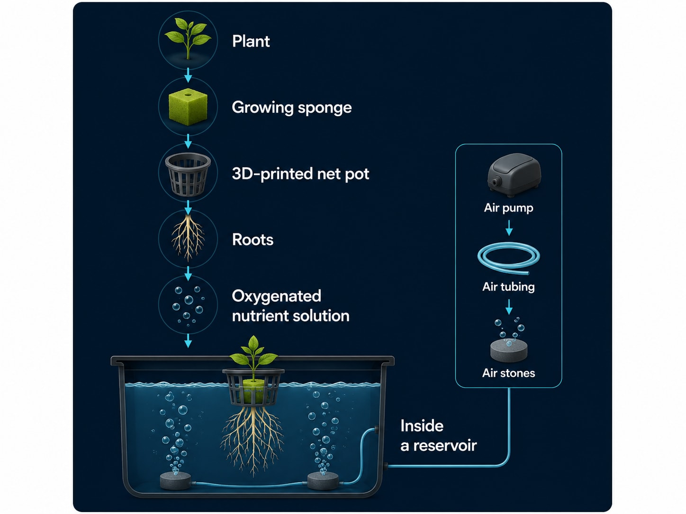
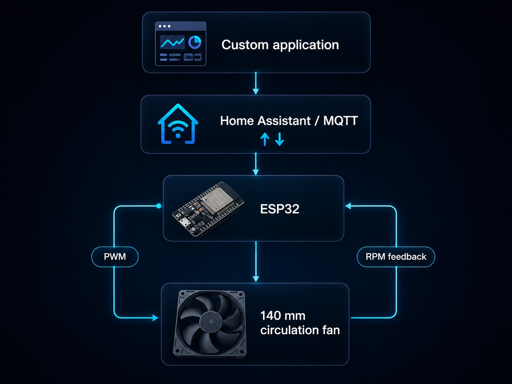
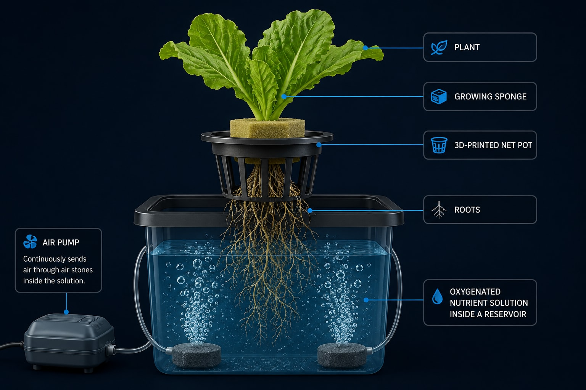
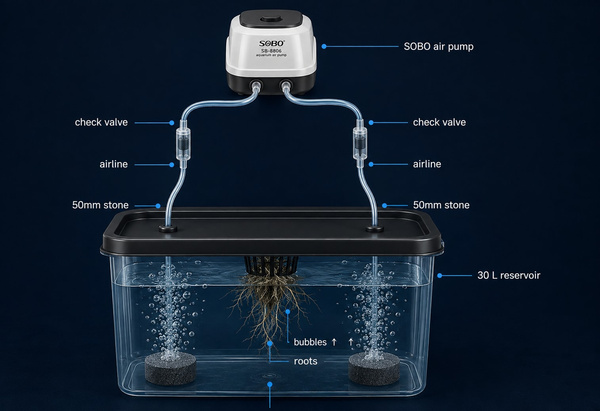
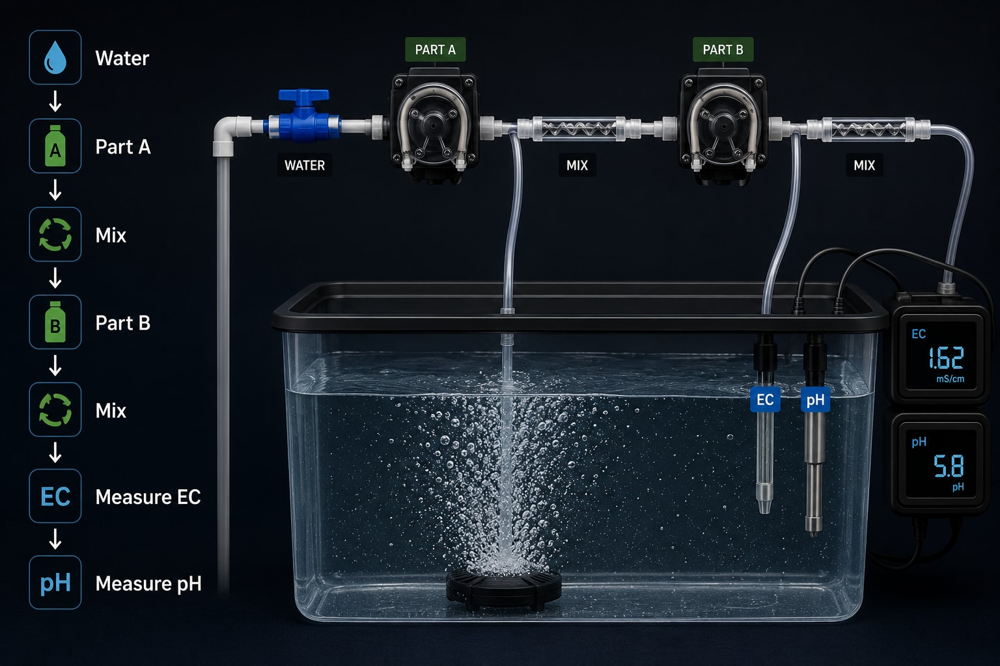
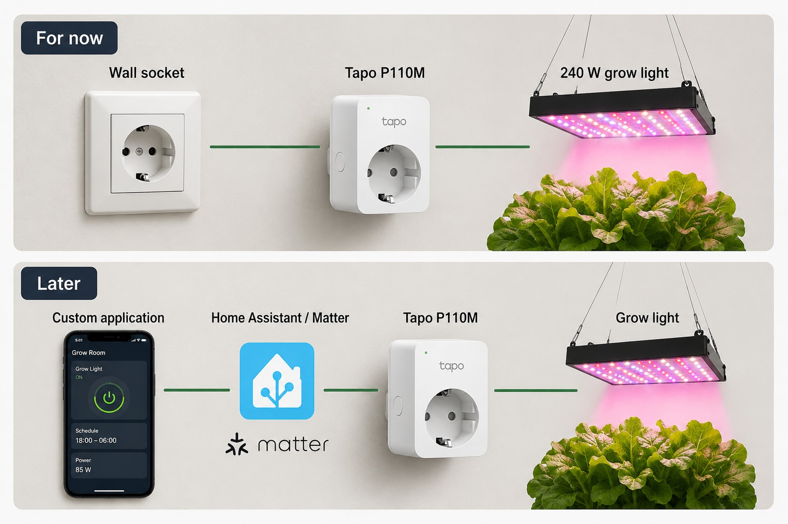
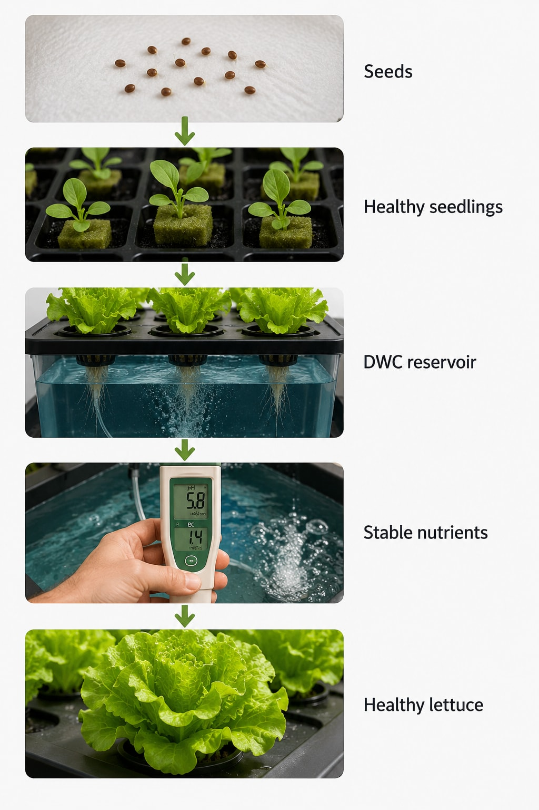
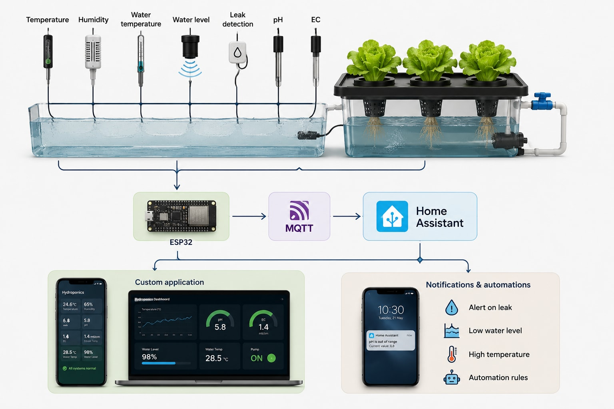

Hey, Daniel here!

I'm starting a small indoor hydroponics project.

Of course, my first instinct was to add an ESP32, sensors, MQTT, Home Assistant and start thinking about my own software before I had grown a single lettuce.

That is probably backwards.

So for the first version I am keeping it simple: **grow lettuce successfully first, automate it later**.

I still want the hardware I buy now to be useful later. The long-term plan is a modular system with sensors, Home Assistant, ESP32 controllers and eventually my own application, but first I need to understand the basic hydroponics properly.

This article is mostly about that planning and the parts I selected. Nothing is fully installed yet. As everything arrives, I will cover the assembly, 3D printing, testing, nutrients, planting and automation separately.

## The basic objective

I want the first version to grow lettuce indoors reliably.

Later I also want to experiment with dwarf tomatoes and other vegetables, but lettuce looks like a much better crop for learning the system.

The first setup will use **Deep Water Culture, or DWC**.

The basic idea is simple:



An air pump continuously sends air through air stones inside the nutrient solution.

Oklahoma State University describes water culture as one of the simplest active hydroponic systems: the plants sit above the nutrient solution while an air pump and air stone supply oxygen to the roots. ([Oklahoma State University Extension][hydroponics])

For a first system, that is exactly what I want.

## Why I did not buy a complete smart grow kit

I originally looked at complete grow-tent packages with the tent, LED light, fans, carbon filter, sensors, controller and phone application.

They are convenient, but I didn't really want the proprietary controller.

If I am eventually going to build my own automation, paying extra for somebody else's closed smart ecosystem makes little sense.

My rule became simple: buy the physical components that are difficult or pointless to manufacture myself, then build the custom parts and intelligence myself.

I can replace the controller without replacing the light, change the fan without changing the sensors, and add Home Assistant without depending on one grow-tent manufacturer.

## Choosing the tent

This took more thought than expected.

I first found a very small tent around:

```text
42 × 42 × 121 cm
```

It was cheap, but simply too small. Once the reservoir, plants, distance to the LED, the light itself, fans, tubing and cables are inside, 121 cm disappears very quickly.

I then looked at:

```text
82 × 82 × 181 cm
```

That would work, especially for lettuce, but I wanted something I would not immediately outgrow.

The size I eventually settled on is the standard **3 × 3 foot class**, roughly:

```text
91 × 91 × 200 cm
```

It is still compact enough for a room and gives approximately **0.83 m² of floor area**, with enough height to try different reservoir and lighting arrangements.

For this project, I think the 3×3 format is the sweet spot.

## The grow light

This is where I was willing to spend more money.

There are hundreds of cheap grow lights advertised as:

```text
1000W
2000W
3000W
```

but those marketing numbers often have little relationship with the actual electrical consumption. I wanted the real power specification.

After comparing several AliExpress and Amazon options, I chose a:

### FARMLITE 240 W full-spectrum grow light

The version I selected uses a four-bar design with a quoted **240 W actual power**, dimming and 1,056 Samsung LEDs.

I considered cheaper AliExpress lights using Samsung LM301-series LEDs and Mean Well drivers. Technically, some looked excellent. The problem was price and purchase risk.

Once I selected the correct 240 W configuration and added shipping, some AliExpress options were almost as expensive as, or more expensive than, the Amazon alternatives. For this component I preferred Amazon's easier returns and customer service.

The light is more powerful than I need for young lettuce, but it is dimmable. I would rather run one useful light at lower power now than replace an undersized light when I start growing larger plants.

## A computer fan instead of a grow fan

I initially considered a normal clip-on grow fan, then realized I would eventually want software control of the fan speed.

Instead, I bought a:

### Thermalright TL-C14C-S 140 mm PWM fan

It is actually a PC cooling fan, not a grow-tent fan. I picked it mainly because it gives me PWM speed control and RPM feedback.

The manufacturer specifies:

- 140 × 140 × 25 mm
- 12 V DC
- 4-pin PWM control
- maximum 1,500 RPM
- maximum 75.8 CFM airflow
- tachometer/RPM feedback
- maximum rated noise of 26.4 dBA. ([Thermalright][thermalright])

For now I can simply power it. Later an ESP32 can control its speed and read the actual RPM:



I will probably 3D-print an adjustable clamp so the fan can attach directly to the grow-tent pole.

## Powering the fan

The Thermalright fan needs 12 V DC, so I selected a simple:

```text
12 V
2 A
regulated AC/DC adapter
UK/UAE Type-G plug
5.5 × 2.1 mm barrel connector
```

Two amps is far more than one fan requires, but it leaves spare capacity for later control electronics.

I also bought a 4-pin PWM extension cable and a 5.5 × 2.1 mm female barrel-to-screw-terminal adapter.

I don't want to cut the original fan cable. I can modify the cheap extension cable instead.

## The reservoir

I considered 3D printing the complete reservoir.

I could do it, but honestly it makes little sense. A 30 L tank contains roughly 30 kg of water before adding the lid, plants and equipment. A commercially molded PP or HDPE container is cheaper, stronger, smoother and easier to clean than a large FDM print.

So I chose a:

### Tactix 30 L heavy-duty storage box

The box becomes the DWC reservoir. I'll print the parts that actually benefit from being custom around it instead.

```text
Commercial molded reservoir
              +
     Custom printed parts
```

## Printing my own net pots

This is a part where the 3D printer actually makes sense.

Instead of buying standard hydroponic net pots, I will design them around the seed-starting sponges I already have.

I plan to print them in **PETG**, with a wide upper flange, tapered sides, large root openings, an open bottom and an internal support for the sponge. I also want the model to print without supports.

Something approximately like this:



Once I have the final dimensions of the Tactix lid and sponge, I will make the model parametric so I can easily produce different sizes later.

That should become one of the next articles.

## Air pump and air stones

The roots in DWC need oxygen.

After rejecting several tiny USB aquarium pumps, I selected a:

### SOBO SB-8806 dual-outlet air pump

I wanted a proper mains-powered aquarium pump rather than a portable pump meant for transporting fish.

The two outputs let me place an air stone on each side of the 30 L reservoir:



For the accessories I bought inexpensive 4 mm ID / 6 mm OD airline tubing, two 50 mm air stones and two 4 mm non-return/check valves.

The check valves reduce the risk of water flowing backwards through the airline toward the pump. The pump itself will normally run continuously.

## Nutrients

For the first grow, I am keeping the nutrient side simple too.

I chose:

### Casa De Amor Hydroponic A+B nutrients

It is a two-part nutrient system intended for leafy vegetables and other hydroponic crops.

There is a reason hydroponic nutrients commonly come as separate A and B concentrates: concentrated mineral components should not simply be mixed directly together before dilution because some compounds can precipitate.

My basic process will be:



I already own pH and EC/TDS meters, so I did not need to buy those again.

Electrical conductivity gives an indication of the concentration of dissolved salts in the nutrient solution. Managing both EC and pH is a fundamental part of hydroponic nutrient management. ([Oklahoma State University Extension][ec-ph-guide])

I will cover actual nutrient concentrations in the grow article rather than guessing before I have measured my water and the mixed solution.

## Calibrating the pH meter

A cheap digital meter is only useful if it is reasonably calibrated.

I bought calibration powders for:

```text
pH 4.01
pH 6.86
pH 9.18
```

For the range I am interested in, 4.01 and 6.86 are the most relevant calibration points.

I also bought a small hydroponic:

### Garden Genie pH Up + pH Down kit

I am not planning to chase a perfect decimal every few minutes. I want to measure the water, add the nutrients, let everything mix, measure again and make small corrections when required.

Hydroponic pH matters because it affects nutrient availability. Oklahoma State University's hydroponics guidance recommends maintaining nutrient solutions in a mildly acidic range and monitoring both pH and EC rather than treating nutrient concentration as guesswork. ([Oklahoma State University Extension][ec-ph-guide])

## Controlling the light

I do not want to manually turn the grow light on and off every day. A cheap mechanical timer would solve that, but I also want the hardware to remain useful when I start automating the system.

So I chose a:

### TP-Link Tapo P110M Matter smart plug

This is one of the few "smart" parts I am adding immediately.

The P110M supports:

- scheduling
- remote on/off control
- energy monitoring
- Matter
- 2.4 GHz Wi-Fi
- a physical power button
- up to 13 A on the UAE model. ([TP-Link][tapo-p110m])

The light draws nowhere near the plug's maximum rating.

Matter also gives me a path toward integrating the device into a larger system instead of locking the grow light permanently into one manufacturer's application.

One detail worth knowing: TP-Link's UAE documentation currently notes that energy monitoring may still need to be viewed through the Tapo application rather than being exposed through every Matter platform. I am treating Matter mainly as an interoperability feature, not assuming every measurement will automatically be available through every controller. ([TP-Link][tapo-p110m])

The image below shows both the simple arrangement I will use now and the automation path I can add later:



## The complete V1 architecture

This is what the first version should look like:

```text
                 3 × 3 GROW TENT

             ┌─────────────────────┐
             │                     │
             │    240W LED         │
             │       │             │
             │   Tapo P110M        │
             │                     │
             │  140mm PWM fan →    │
             │                     │
             │   🌱  🌱  🌱  🌱    │
             │    │   │   │   │    │
             │  3D-printed pots    │
             │                     │
             │ ┌─────────────────┐ │
             │ │ 30L reservoir   │ │
             │ │ ↑↑         ↑↑   │ │
             │ │ air stones      │ │
             │ └─────────────────┘ │
             └───────────┬─────────┘
                         │
                  SOBO air pump
```

There are no automated nutrient pumps.

There are no automated pH adjustments.

There is no giant sensor network.

There isn't even an ESP32 yet.

That is intentional.

## Things I deliberately did not buy

It was tempting to keep adding components, so I stopped.

Version one does **not** need:

- automatic nutrient dosing
- automatic pH dosing
- continuous pH probes
- automated EC probes
- CO₂ control
- water-level sensors
- leak sensors
- cameras
- custom ESP32 controller
- custom mobile application
- carbon filter

I also haven't committed to an inline exhaust fan yet.

The 140 mm fan circulates air inside the tent, but it does not replace warm tent air with room air. I want to install the 240 W LED first and measure what actually happens.

If the tent becomes too hot or humid, I will add a proper exhaust fan. I would rather find that out from the real setup than buy more equipment now because I think I might need it.

## Why I am building it this way

This project could easily become an electronics project disguised as gardening.

I don't want that. At least not yet.

First I want this:



Then I can automate a system that I already understand.

The eventual architecture can become much more interesting:



At that point I can automate fans, lighting, alarms, reservoir monitoring and eventually nutrient dosing.

But I want every new layer to solve a problem I have actually seen.

## Next

Now I actually need the rest of the components to arrive.

The next article should be much more practical because I can start putting everything together: tent, light, reservoir, air pump, fan and the first 3D-printed parts.

I have already started the first lettuce seeds, so hopefully by then I also have something green ready for the system.

I am particularly interested in seeing how much of the hydroponic setup I can eventually **3D print and automate without turning a simple garden into an unnecessarily complicated engineering project**.

For now, the shopping phase is finished. Next comes the useful part: finding out whether all these individually sensible decisions actually work together.

## Sources

- Oklahoma State University Extension, [Hydroponics][hydroponics]
- Oklahoma State University Extension, [Electrical Conductivity and pH Guide for Hydroponics][ec-ph-guide]
- Thermalright, [TL-C14C-S specifications][thermalright]
- TP-Link UAE, [Tapo P110M][tapo-p110m]

[hydroponics]: https://extension.okstate.edu/fact-sheets/hydroponics
[ec-ph-guide]: https://extension.okstate.edu/fact-sheets/electrical-conductivity-and-ph-guide-for-hydroponics
[thermalright]: https://www.thermalright.com/product/tl-c14c-s/
[tapo-p110m]: https://www.tp-link.com/ae/home-networking/smart-plug/tapo-p110m/
