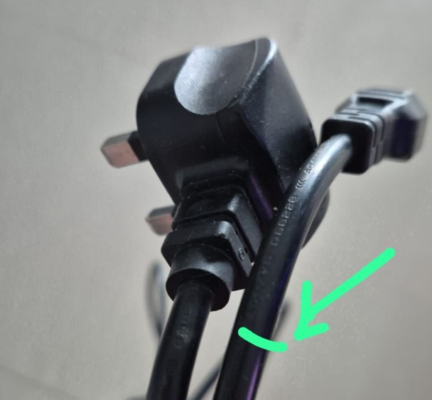
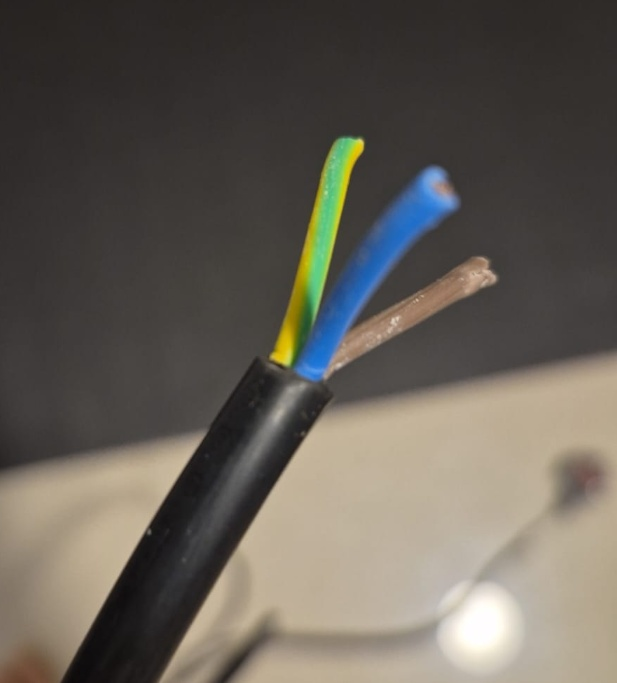
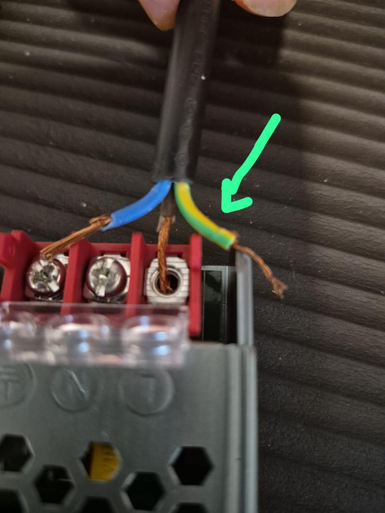
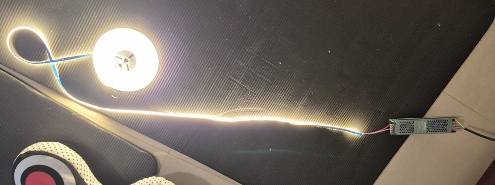

# LED Strip Installation: Complete DIY Wiring Guide for Smart Home Beginners

You've bought LED strips, a power supply, and maybe a smart controller, but staring at those terminal blocks with exposed wires gives you pause. One wrong connection could mean fried components or worse. This comprehensive guide walks you through safely wiring LED strips from AC mains to working lights, preparing for smart home integration.

**Warning:** This guide involves mains voltage (220V/110V) wiring. If you're not comfortable working with electricity, hire a licensed electrician. Always turn off power at the breaker before starting any electrical work.



## What You'll Need: Components and Tools

### Essential Components
- **LED Driver/Power Supply:** 24V or 12V DC (match your LED voltage)
- **LED Strip:** Single color or RGBW
- **AC Power Cable:** 3-core with plug (brown/live, blue/neutral, green-yellow/earth)
- **Wire Ferrules:** 0.75-1.5mm² (highly recommended)
- **Terminal Blocks:** If not integrated in driver

### Tools Required
- Wire strippers
- Ferrule crimping tool
- Screwdriver (typically Phillips)
- Multimeter (for verification)
- Electrical tape

### Safety Equipment
- Voltage tester
- Insulated screwdrivers
- Safety glasses

## Understanding Your LED Driver Terminal Blocks

Modern LED drivers have two distinct sides that must never be confused:

### AC Input Side (Mains Voltage - DANGEROUS)
Look for terminals marked:
- **L** → Live (Connect Brown wire)
- **N** → Neutral (Connect Blue wire)
- **⏚** → Earth/Ground (Connect Green/Yellow wire)

### DC Output Side (Low Voltage - Safe)
Terminals marked:
- **V+** → Positive DC output
- **V-** → Negative/Ground DC output

**Critical:** Never connect AC mains to the DC side or DC to the AC side. This will instantly destroy your equipment and create fire hazards.



## Step 1: Preparing Your AC Power Cable

The most dangerous part of this installation is the AC mains connection. Here's how to do it safely:

### Wire Preparation

1. **Strip the cable jacket:** Remove 5-6cm of outer insulation
2. **Strip individual wires:** Remove exactly 6-7mm of insulation from each wire
3. **Identify your wires:**
   - Brown = Live (L)
   - Blue = Neutral (N)
   - Green/Yellow = Earth (⏚)

### The Ferrule Advantage

**Without ferrules (risky):**
- Stranded wires can fray and escape terminals
- Repeated tightening breaks copper strands
- Higher risk of short circuits

**With ferrules (recommended):**
```
Wire preparation:
1. Strip 6-7mm insulation
2. Insert wire into ferrule
3. Crimp with proper tool
4. Result: Solid pin that won't fray
```



## Step 2: Connecting AC Mains to LED Driver

**⚠️ SAFETY FIRST: Ensure power is OFF at the breaker!**

### Proper Terminal Connection Technique

1. **Insert wires fully:** The copper must go completely inside the terminal
2. **No exposed copper:** Insulation should reach the terminal edge
3. **Tighten firmly:** But don't overtighten to damage the wire
4. **Tug test:** Gently pull each wire to ensure secure connection

### Connection Order:
```
Brown wire → L terminal
Blue wire → N terminal
Green/Yellow wire → ⏚ terminal
```

**Common Mistake:** Leaving copper strands outside the terminal (as shown in image) creates dangerous short circuit risks. Always ensure ALL copper is inside the terminal block.

## Step 3: Wiring DC Output to LED Strips

Now for the safer, low-voltage side:

### For Single-Color LED Strips (2 wires)

Your LED strip has two wires:
- Red/marked (+) → Connect to V+ on driver
- Black/White/marked (-) → Connect to V- on driver

**Simple connection:**
```
LED Driver V+ → LED Strip Red (+)
LED Driver V- → LED Strip Black/White (-)
```

### For RGBW Strips (5 wires) - Preparing for Smart Control

RGBW strips have:
- 1 common positive (usually red)
- 4 negative returns (R, G, B, W channels)

**Direct connection (no smart control):**
```
LED Driver V+ → All positive channels
LED Driver V- → All negative channels
Result: All colors on at full brightness
```

**With Smart Controller (covered in Part 2):**
The controller will sit between driver and strip to control individual colors.


## Step 4: Testing Your Installation

### Pre-Power Checklist

- [ ] All AC connections secure with no exposed copper
- [ ] Earth wire properly connected
- [ ] DC polarity correct (+ to +, - to -)
- [ ] No wires touching each other
- [ ] Terminal screws tight but not overtightened
- [ ] LED strip voltage matches driver output

### First Power-On

1. **Turn on breaker:** Stand back from the installation
2. **Check driver LED:** Most have a power indicator
3. **Verify output:** Use multimeter to confirm DC voltage
4. **Connect LED strip:** Should illuminate immediately

### Troubleshooting

**LEDs don't light:**
- Check DC voltage with multimeter
- Verify polarity (+/- not reversed)
- Test continuity of LED strip

**Driver doesn't power on:**
- Verify AC connections
- Check breaker/fuse
- Test AC voltage at terminals

**Flickering/dimming:**
- Driver may be undersized
- Poor connection (retighten terminals)
- Voltage drop (wire too thin/long)



## Step 5: Cable Management and Safety

### Proper Installation Practices

**Secure mounting:**
- Mount driver on non-flammable surface
- Ensure adequate ventilation (drivers get warm)
- Keep away from moisture unless IP-rated

**Cable routing:**
- Use cable clips or conduit
- Keep AC and DC cables separated
- No sharp bends or pinch points

**Documentation:**
- Label your connections
- Take photos before closing covers
- Note driver specifications for future reference

## Power Supply Sizing: Getting It Right

### Calculate Your Requirements

**Formula:**
```
Required Wattage = LED Strip Wattage × Length × 1.2 (safety factor)
Example: 14.4W/m × 5m × 1.2 = 86.4W minimum
```

### Common Mistakes to Avoid

1. **Undersized driver:** Causes overheating and failure
2. **Wrong voltage:** 12V driver with 24V strips won't work
3. **No safety margin:** Always add 20% headroom
4. **Cheap drivers:** Poor regulation causes flickering

## Cost Breakdown (Philippines Market)

| Component | Budget Option | Quality Option | Premium Option |
|-----------|--------------|----------------|----------------|
| LED Driver 24V 100W | ₱800-1,200 | ₱1,500-2,500 | ₱3,000-5,000 |
| LED Strip per meter | ₱150-300 | ₱400-800 | ₱1,000-2,000 |
| Ferrule Kit | ₱300-500 | ₱800-1,200 | - |
| Crimping Tool | ₱500-800 | ₱1,500-2,500 | - |
| Installation (DIY) | ₱0 | ₱0 | ₱0 |
| Installation (Pro) | ₱1,500-2,500 | ₱2,500-4,000 | ₱4,000-6,000 |

## Safety Warnings and Best Practices

### Never Do This:
- ❌ Work with power on
- ❌ Mix AC and DC connections
- ❌ Use undersized wires
- ❌ Leave exposed copper outside terminals
- ❌ Skip the earth connection
- ❌ Exceed driver capacity

### Always Do This:
- ✅ Test with multimeter before connecting
- ✅ Use ferrules on stranded wires
- ✅ Double-check polarity
- ✅ Provide adequate ventilation
- ✅ Follow local electrical codes
- ✅ Document your wiring

## What's Next: Smart Home Integration (Part 2)

In the next article, we'll add smart control using a Shelly RGBW2 controller to:
- Control colors individually
- Dim lights via smartphone
- Create lighting scenes
- Integrate with voice assistants
- Set schedules and automations

The foundation you've built here makes smart upgrade simple - just one module between your driver and LED strip.

## Frequently Asked Questions

### Can I connect multiple LED strips to one driver?
Yes, if total wattage is within driver capacity. Wire in parallel, not series.

### My strips are 12V but driver is 24V. Will it work?
No. Voltage must match exactly. 24V will burn out 12V strips instantly.

### Do I need ferrules?
Technically no, but highly recommended for safety and reliability, especially with stranded wire.

### Can I dim single-color strips without a controller?
Only with a dimmable driver and compatible dimmer switch. Smart controller is more versatile.

### How long can cable runs be?
For 24V: up to 10m with proper gauge wire. 12V: maximum 5m before voltage drop issues.

## Conclusion

Proper LED strip installation is the foundation of any smart lighting system. By following this guide, you've created a safe, reliable base that's ready for smart home upgrades. The time invested in proper wiring—using ferrules, ensuring solid connections, and following safety protocols—pays dividends in reliability and peace of mind.

Remember: electricity doesn't forgive mistakes. When in doubt, consult a professional electrician. Your safety is worth more than any DIY savings.

**Next in Series:** [Part 2: Adding Shelly RGBW2 Smart Control to Your LED Strips](#)

## Additional Resources

- [Philippine Electrical Code](https://www.iiee.org.ph/philippine-electrical-code/)
- [Shelly RGBW2 Official Documentation](https://shelly.cloud/products/shelly-rgbw2-smart-home-automation-led-controller/)
- [LED Strip Power Calculator](https://www.rapidtables.com/calc/light/led-strip-calculator.html)
- [Wire Gauge Calculator](https://www.calculator.net/voltage-drop-calculator.html)