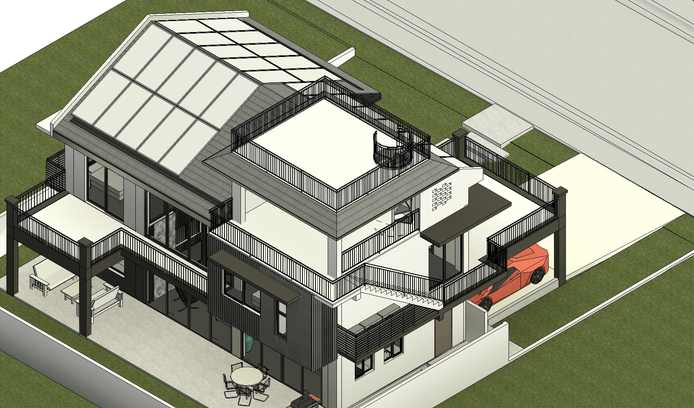
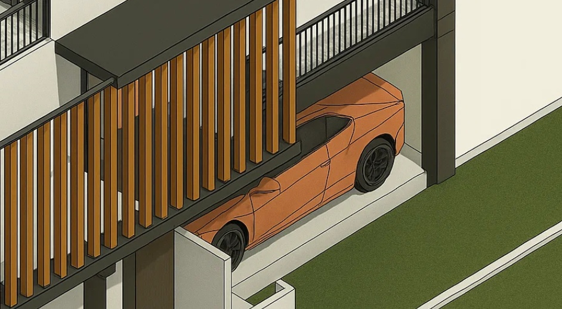
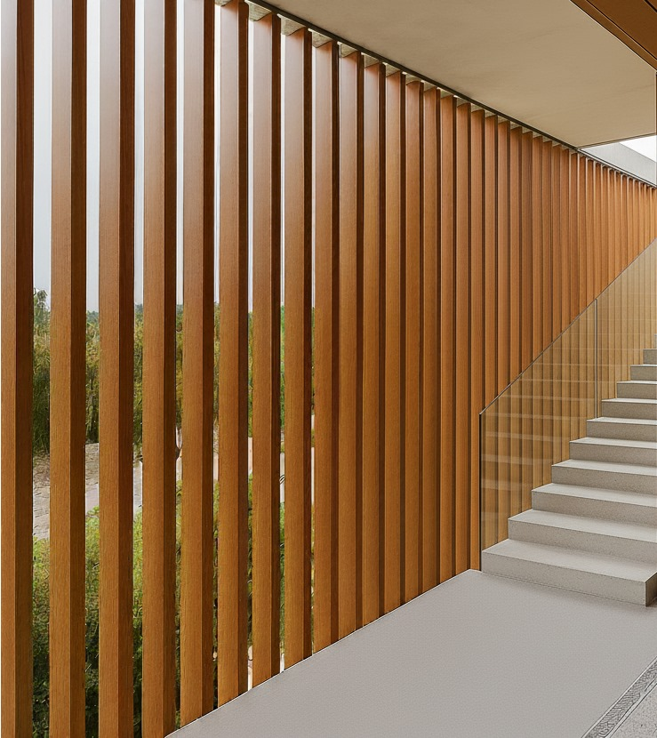

You're staring at your concrete outdoor stairs getting hammered by Cebu's salt air and afternoon UV, knowing they need protection but don't want another expensive local contractor quote. Your neighbor just spent ₱180,000 on basic stair covering that's already showing rust spots after one typhoon season.

**Here's what you can do:** Combining Chinese-sourced aluminum tubes for structure with selective WPC accents creates a typhoon-resistant stair covering for 60% less than local "premium" solutions.

## Coastal Stair Protection Philippines: Typhoon and Salt Air Challenges

Outdoor stairs in Cebu face a perfect storm: 250+ kph typhoon winds, daily thermal cycling from 24°C to 38°C, salt spray at 200 meters from the sea, and UV levels that destroy most materials in 3-5 years.

**The uncomfortable truth:** Most local stair coverings use mild steel with basic paint that fails within 2-3 years. "Stainless steel" options often use 304 grade that corrodes in marine environments, while aluminum systems from local suppliers cost ₱4,000-6,000 per linear meter for mediocre quality.

## Aluminum vs WPC for Philippines Outdoor Stairs: Material Comparison

### Primary Structure: Marine-Grade Aluminum

**Why aluminum wins for exposed elements:**
- **Structural modulus**: 69 GPa vs WPC's 1-5 GPa - critical for 1.2-meter spans
- **Thermal expansion**: 1mm/meter vs WPC's 2-4mm/meter reduces joint failures
- **Typhoon resistance**: Won't become projectiles in 250 kph winds
- **Fire safety**: Non-combustible around electrical installations
- **Salt air survival**: 15-20 year lifespan with proper marine finishes

**Specification for Cebu coastal:**
- 6063-T6 aluminum extrusion (higher strength than T5)
- 100x50mm rectangular tubes, 3mm wall thickness
- Marine-grade powder coating: Class 3 polyester, 80-120 micron thickness
- 316L stainless steel fasteners throughout
- Isolation gaskets between dissimilar metals

### Accent Elements: Co-Extruded WPC

**Where WPC makes sense:**
- Interior handrail caps (protected from direct weather)
- Decorative infill panels (backed by solid structure)
- Step nosing covers (short spans, replaceable)
- Wall-mounted trim pieces (shaded locations)

**Critical WPC requirements:**
- ASA/PMMA co-extruded cap minimum 0.8mm thick
- HALS UV stabilizer package for tropical conditions
- Internal aluminum reinforcement for structural elements
- Maximum 600mm unsupported spans
- Slotted mounting for 3-4mm/meter thermal movement

## Chinese Aluminum Suppliers for Philippines Import: Verified Sources

### Aluminum Tube Suppliers (Shanghai Region)

**Top verified suppliers:**
- **Jiangyin Entrust Aluminum Co., Ltd** - 6063-T6 marine extrusions, MOQ 500kg
- **Shanghai Metal Corporation** - Full service including powder coating
- **Foshan Guangyuan Aluminum Co., Ltd** - Custom profiles, reasonable MOQs

**Pricing (100x50x3mm, marine powder coat):**
- Ex-works China: $12-18 USD per linear meter
- Shipping to Cebu: $2-3 USD per meter
- Import duties + VAT: 15% total
- **Delivered cost**: $18-24 per linear meter

### WPC Tube Suppliers

**Verified co-extruded suppliers:**
- **Anji Zhengyuan WPC Decoration** - ASA capped tubes, UV test reports
- **Huzhou Baosheng New Material** - Marine-grade formulations
- **Haining Sonsill Decoration** - Custom profiles available

**Pricing (50x25mm co-extruded):**
- Ex-works China: $6-10 USD per linear meter  
- **Delivered cost**: $10-14 per linear meter

## Installation Engineering: What Actually Works

### Structural Design Principles

**Load calculations for Cebu conditions:**
- Wind load: 2.4 kPa (250 kph typhoon rating)
- Live load: 4 kPa (distributed pedestrian loading)
- Dead load: 0.5 kPa (covering system self-weight)
- Safety factor: 2.0 minimum

**Span limitations:**
- Aluminum 100x50x3mm: 1.5 meter maximum free span
- WPC with aluminum backing: 0.8 meter maximum
- WPC decorative only: 0.6 meter maximum

### Fastening System

**Primary connections:**
- 316L stainless M12 bolts into concrete with chemical anchors
- Structural silicone sealant at all weather seals
- EPDM gaskets between aluminum and concrete
- Expansion joints every 3 meters

**Thermal movement accommodation:**
- Slotted holes in aluminum: 5mm oversize
- WPC mounting slots: 8mm oversize
- Sealant joints sized for 6mm movement
- Sliding connections at fixed points

## Cost Analysis: Real Numbers

### Material Costs (30 linear meter stair covering)

| Component | Quantity | Unit Cost | Total Cost |
|-----------|----------|-----------|------------|
| **ALUMINUM STRUCTURE** | | | |
| 100x50x3mm tubes | 45 meters | $20 | $900 |
| Structural brackets | 12 pcs | $15 | $180 |
| 316L SS fasteners | 1 kit | $150 | $150 |
| **WPC ACCENTS** | | | |
| Handrail caps | 30 meters | $12 | $360 |
| Decorative panels | 15 sqm | $25 | $375 |
| **INSTALLATION** | | | |
| Professional labor | 5 days | $100 | $500 |
| **TOTAL PROJECT** | | | **$2,465** |

**Cost per linear meter: $82** - 60% less than local premium options

## Performance Reality Check

### After Two Typhoon Seasons

**Aluminum performance:**
- Zero corrosion on marine-grade powder coating
- No structural deflection or joint failures
- Color retention: 95% (high-quality coating matters)
- Maintenance required: Annual pressure washing only

**WPC performance in protected areas:**
- Surface fading: 15-20% on dark colors
- No structural degradation in backed applications
- Easy cleaning with mild detergent
- No insect or biological degradation

### Failure Modes to Watch

**Aluminum warning signs:**
- White powder (coating failure) - indicates cheap coating
- Galvanic corrosion at steel contact points
- Joint sealant hardening/cracking after 7-10 years

**WPC red flags:**
- Surface chalking or fiber exposure (UV overload)
- Thermal expansion binding (improper mounting)
- Cap layer delamination (material quality issues)

## Design Guidelines That Prevent Failures

### Aluminum Specifications

**Material requirements:**
- 6063-T6 minimum (verify with mill certificates)
- Marine-grade pretreatment: chromate conversion coating
- Powder coating: AAMA 2604-13 Class 3 minimum
- End sealing: structural sealant to prevent water infiltration

**Critical installation details:**
- Weep holes every 600mm for drainage
- Thermal breaks at long runs
- Isolation from galvanized steel connections
- 5-degree minimum slope for water runoff

### WPC Application Rules

**Use only where:**
- Maximum 4 hours direct sun exposure daily
- Backed by solid structure within 400mm
- Shaded by overhangs or other elements
- Replaceable without affecting primary structure

**Mounting requirements:**
- Slotted holes 8mm oversize minimum
- Stainless steel washers to distribute loads
- Flexible sealants only (no rigid adhesives)
- Expansion gaps: 6mm minimum between pieces

## Maintenance Schedule That Works

### Year 1-5: Minimal Intervention
- **Quarterly**: Pressure wash aluminum with fresh water to remove salt buildup
- **Annually**: Inspect sealant joints and fastener tightness
- **As needed**: Touch-up scratches with matching powder coat repair pen

### Year 5-10: Preventive Maintenance
- **Sealant replacement**: Budget $150-200 every 7-10 years for joint refresh
- **Hardware inspection**: Retorque connections, check for galvanic corrosion signs
- **Powder coating assessment**: Inspect for chalking, fading, or coating breakdown

### Year 10+: Long-Term Care
- **Aluminum refinishing**: Optional powder coat refresh ($15-25/meter if desired)
- **Fastener upgrade**: Replace any corroded hardware with higher-grade stainless
- **Structural assessment**: Check for fatigue at high-stress connection points

## FAQ: Aluminum vs WPC Stair Covering Philippines

**Q: What's the cost difference between aluminum and WPC stair covering in the Philippines?**
Aluminum stair covering costs $18-24/meter delivered from China, while WPC accents cost $10-14/meter. Complete systems average $82/meter installed - 60% less than local aluminum options costing $200-300/meter.

**Q: How long does aluminum stair covering last in Cebu coastal conditions?**
Marine-grade aluminum with proper powder coating lasts 15-20 years in Philippine coastal environments. WPC accents need replacement every 7-10 years due to UV fading, making aluminum better long-term value.

**Q: Can WPC stair covering survive typhoons in the Philippines?**
WPC alone cannot handle typhoon wind loads due to low structural modulus (1-5 GPa vs aluminum's 69 GPa). Use aluminum for structure with WPC only as protected decorative accents.

**Q: Which Chinese aluminum suppliers are reliable for Philippines import?**
Verified suppliers include Jiangyin Entrust Aluminum, Shanghai Metal Corporation, and Foshan Guangyuan Aluminum. All provide marine-grade 6063-T6 extrusions with test certificates.

**Q: What import duties apply to Chinese aluminum stair materials?**
Philippines import duties total 15% (3-7% tariffs plus 12% VAT) on CIF value. Budget additional 25-30% for freight, customs clearance, and delivery to Cebu.

**Q: How do you prevent aluminum corrosion in Philippine salt air?**
Use marine-grade powder coating (AAMA 2604-13 Class 3), 316L stainless steel fasteners, and proper drainage design. Avoid contact with galvanized steel to prevent galvanic corrosion.

**Q: What's the best aluminum grade for outdoor stairs in tropical climates?**
6063-T6 aluminum provides optimal strength-to-weight ratio for stair applications. T6 temper offers higher strength than T5, crucial for 1.5-meter spans in typhoon conditions.

**Q: Should I buy aluminum stair materials locally or import from China?**
Chinese sourcing saves 40-50% vs local suppliers but requires 500kg+ MOQs and 6-8 week lead times. Local suppliers like YKK AP offer faster delivery at premium pricing.

## Bottom Line: Engineering vs Marketing

Most outdoor stair covering failures stem from using materials outside their design capabilities. Steel rusts (except 316), cheap aluminum corrodes, and WPC fails structurally when used incorrectly.

**The strategy that works:**
1. **Primary structure in aluminum** - engineered for the loads and environment
2. **WPC only for protected accents** - where its benefits (appearance, low maintenance) outweigh limitations
3. **Quality sourcing** - verified suppliers with test data, not lowest price
4. **Professional installation** - structural connections done right the first time

**Take action:** Demand material specifications in writing, verify supplier test reports, and don't compromise on marine-grade finishes. The difference between a 5-year system and a 20-year system is in these details that most contractors skip to save money.

Your coastal stairs deserve materials engineered for the environment, not generic solutions that look good in showrooms but fail when typhoons hit.
