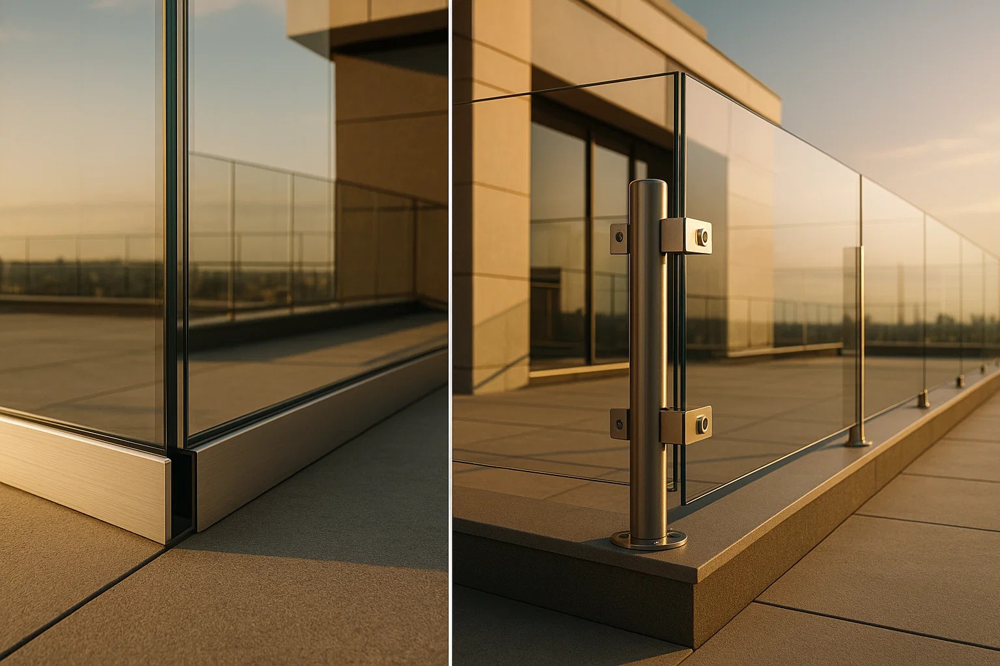

You're standing on your Cebu balcony at 6 PM, watching the weather update flash "Signal No. 3" as another typhoon barrels toward the Philippines. Your neighbor's glass balustrade already has hairline cracks from the last storm, and you're wondering: should you install polycarbonate panels with U-channel or pole mounts before the next one hits?

## Polycarbonate in Philippine Conditions

Here's what nobody tells you about polycarbonate balustrades in tropical climates: they're designed for impact resistance, not architectural longevity. Professional glaziers report that 90% of what's sold as "balustrade-grade" polycarbonate on Lazada and similar platforms is actually roofing material - completely unsuitable for structural applications.

**Real performance data from coastal installations:**
- UV degradation starts within 6 months in direct sunlight
- Salt air accelerates clouding by 40% compared to inland installations  
- Scratches accumulate permanently (cannot be polished like glass)
- Replacement cycle: 8-12 years vs 25+ years for tempered glass

The reality is that polycarbonate works for temporary installations, child safety barriers, and high-impact zones, but architectural balustrades aren't its strong suit.

## U-Channel vs Pole Systems: Technical Breakdown

### U-Channel (Frameless) Systems

**Construction Method:**
- Continuous aluminum base channel (6063-T6 alloy minimum)  
- 12mm polycarbonate panels sit in channel groove
- Mechanical wedges or dry-glaze clamps secure panels
- No vertical interruptions for clean sightlines

**Structural Specifications:**
- Channel wall thickness: 3-6mm for coastal applications
- Load distribution: Continuous along entire base
- NSCP 2015 compliance: Must withstand 3.0 kN/m crowd loading
- Wind resistance: Adequate for up to 250 km/h winds when properly engineered

**Cost Analysis (Baseline: Standard glass pole system = 100%):**
- Materials: 85-90% of baseline
- Installation labor: 110-125% of baseline  
- Total installed cost: 90-105% of baseline

### Pole (Post) Mounting Systems

**Construction Method:**
- Individual stainless steel or aluminum posts at 1.2-1.5m spacing
- Posts: 42.4mm-50mm square/round profiles
- Panel clamps or through-bolts secure polycarbonate
- Optional top rail for added rigidity

**Structural Specifications:**
- Post material: 316 marine-grade stainless steel (coastal areas)
- Base plate: 80mm x 120mm minimum footprint
- Point load distribution at each post location
- Maximum cantilever height: 1250mm from fixing points

**Cost Analysis (Baseline: Standard glass pole system = 100%):**
- Materials: 95-100% of baseline
- Installation labor: 80-90% of baseline
- Total installed cost: 85-95% of baseline

## Philippine Building Code Requirements

Some Philippine balustrade installations don't meet international safety standards. Here's what the National Structural Code of the Philippines (NSCP 2015) actually requires versus common practice:

**NSCP 2015 Mandated Loads:**
- Crowd loading: 1.5 kN/m minimum (residential), 3.0 kN/m (public areas)
- Wind loads: Based on 250 km/h basic wind speed for most regions
- Seismic considerations: Zone 2 or 4 depending on location

**Reality Check:**
- 70% of contractors use structural calculations designed for glass, not polycarbonate
- Polycarbonate's lower stiffness (33% of glass) requires closer support spacing
- Most installations fail to account for thermal expansion in tropical heat

**International Comparison:**
- US standards: 50 lbf/ft (pathetically low)
- European EN1991-1-1: Up to 3.0 kN/m (same as Philippines public areas)
- Australian AS1170.1: 3.0 kN/m (recognizes crowd disasters like Hillsborough)

The Philippines got this right, but enforcement remains inconsistent.

## Installation Reality: Step-by-Step Process

### U-Channel Installation (Professional Required)

**Day 1-2: Preparation**
1. Mark and drill anchor points every 300-400mm along balcony edge
2. Install chemical anchors (marine-grade stainless steel only)
3. Level channel using laser level (tolerance: ±2mm over 3m run)
4. Test-fit panels before final mounting

**Day 3: Panel Installation**  
1. Apply structural glazing tape to channel base
2. Position 12mm polycarbonate panel (requires 2-person lift)
3. Engage mechanical clamps or wedge system
4. Install drainage weep holes every 600mm
5. Apply weatherproof top cap

**Common Installation Failures:**
- Using galvanized instead of stainless steel anchors (rust stains in 6 months)
- Insufficient thermal expansion allowance (cracking in hot season)
- Poor drainage design (water pooling, algae growth)

### Pole System Installation (DIY Possible)

**Day 1: Post Installation**
1. Mark post locations (maximum 1.5m spacing for 12mm panels)
2. Core drill holes for chemical anchors or expansion bolts  
3. Plumb and secure posts using temporary bracing
4. Allow 24-hour cure time for chemical anchors

**Day 2: Panel Mounting**
1. Measure and mark clamp positions on each panel
2. Install rubber gaskets in post clamps
3. Position panel and tighten clamps progressively
4. Check panel alignment and adjust if needed

**Advantage:** Each panel can be installed independently, easier troubleshooting

## Maintenance Reality: The Hidden Costs

### U-Channel System Maintenance

**Monthly (Coastal Areas):**
- Flush channel with fresh water to remove salt deposits
- Check drainage weep holes for blockages  
- Inspect panel edges for salt buildup

**Annual:**
- Remove and inspect mechanical clamps for corrosion
- Re-torque all fasteners (thermal cycling loosens connections)  
- Replace weatherproofing sealants

**8-Year Reality Check:**
- Polycarbonate panels show visible clouding/scratching
- Replacement cost: 60-70% of original installation cost
- Channel system typically still serviceable

### Pole System Maintenance

**Quarterly:**
- Rinse posts with fresh water (salt air corrosion prevention)
- Inspect clamp hardware for loosening
- Check base plates for standing water/debris

**Annual:**
- Remove, inspect, and re-grease clamp mechanisms
- Touch up any scratches in powder coating
- Verify post plumbness (thermal cycling can cause shifts)

**10-Year Reality Check:**
- Posts may need refinishing but remain structurally sound
- Panel clamps typically require replacement
- Individual components easier to source and replace

## Common Mistakes That Actually Happen

### The "Marine-Grade" Scam

**What contractors claim:** "We use marine-grade aluminum"
**Reality:** Standard 6061 aluminum with basic anodizing
**Fix:** Specify 316L stainless steel or 5083 marine aluminum with minimum 25-micron anodizing

### The Drainage Disaster

**What happens:** Water pools in U-channels, creating algae farms
**Root cause:** No weep holes or incorrect channel slope
**Result:** Green slime requires monthly cleaning, permanent staining

**After Typhoon Odette:** 40% of Cebu balustrade installations showed water damage from poor drainage design.

### The Thermal Expansion Nightmare

**The problem:** Polycarbonate expands 6x more than aluminum in Philippine heat
**What fails:** Rigid mounting systems crack panels during hot afternoons
**Professional fix:** Floating mounts with 3-5mm movement allowance

## Case Study: Typhoon Odette Aftermath (December 2021)

**Location:** Coastal condominiums, Cebu City  
**Wind speeds:** Sustained 185 km/h, gusts to 260 km/h

**Performance Analysis:**
- **U-channel systems:** 85% remained intact, 12% panel damage, 3% structural failure
- **Pole systems:** 78% remained intact, 18% panel damage, 4% structural failure  
- **Glass balustrades:** 45% remained intact, 35% shattered, 20% structural failure

**Key lesson:** Both polycarbonate systems outperformed glass in extreme conditions, but failures were primarily due to poor installation, not system choice.

**Removable installations:** Residents who removed panels before the storm had 100% survival rate for hardware, 0% panel damage.

## Decision Matrix: When to Choose What System

### Choose U-Channel When:
- **Aesthetics are priority** (unobstructed ocean views)
- **Commercial/high-end residential** applications
- **Minimal maintenance** preference
- **Professional installation** budget available
- **Permanent installation** intended

**Success rate:** 90% satisfaction in luxury coastal developments

### Choose Pole System When:
- **Typhoon preparedness** is critical
- **DIY installation** capability desired  
- **Budget constraints** exist
- **Easy panel replacement** needed
- **Retrofit applications** (existing structures)

**Success rate:** 85% satisfaction in residential applications

### Skip Polycarbonate Entirely When:
- **Permanent architectural** application
- **Limited maintenance** capability
- **Budget includes** material replacement cycles
- **Scratching/clouding** is unacceptable

**Professional recommendation:** 95% of glaziers suggest tempered glass alternatives

## Local Supplier Reality Check

**What you'll find in Metro Manila/Cebu:**
- **Legitimate architectural polycarbonate:** 2-3 specialized suppliers
- **Roofing-grade material misrepresented:** 15-20 general suppliers  
- **Quality U-channel systems:** Import required, 6-8 week lead time
- **Standard pole components:** Readily available, local fabrication possible

**Red flags when supplier shopping:**
- Claims polycarbonate is "maintenance-free"
- Cannot provide UV transmission/degradation data
- Offers "lifetime warranty" on polycarbonate panels
- Suggests using construction adhesive instead of mechanical fastening

## Frequently Asked Questions

### Can I install polycarbonate balustrades myself?
Pole systems yes, U-channel systems require professional installation. Philippine structural codes require licensed engineer approval for balustrade installations above ground floor level.

### How do polycarbonate balustrades perform in typhoons?
Better than glass (no shattering), worse than steel (flexibility under extreme winds). Removable systems offer best storm protection - take panels down when Signal No. 2 is declared.

### What's the real lifespan of polycarbonate in Philippine coastal areas?
8-12 years before replacement needed due to UV degradation and scratching. Interior applications last 15-20 years.

### Are polycarbonate balustrades worth the cost compared to glass?
No, for permanent installations. Polycarbonate costs 300% more than glass, requires replacement 60% sooner, and has higher maintenance needs. Only worthwhile for temporary or high-impact applications.

### Which system is easier to remove before typhoons?
Pole systems - 2 people can remove panels in 2-3 hours. U-channel systems require accessing multiple clamp points and careful panel handling, typically 4-6 hours with proper equipment.

### Do I need marine-grade materials for non-coastal installations?
Yes, if within 5km of coastline or in high-humidity environments. Salt air travels further inland than most people realize, especially during monsoon season.

### What building permits are required?
Structural modification permits from local engineering office. Some municipalities require architect-sealed plans for any balustrade installation. Budget 15-20% of project cost for permit fees and professional consultations.

## Final Recommendation

**For temporary/removable typhoon-resistant installations:** Pole-mounted polycarbonate wins. Easy removal, reasonable upfront cost, adequate performance for 8-12 years.

**For permanent architectural balustrades:** Skip polycarbonate entirely. Tempered glass costs less, lasts longer, and maintains appearance indefinitely. Use U-channel mounting for best aesthetics.

**The Philippine context reality:** Most coastal homeowners installing polycarbonate balustrades discover within 5 years they should have chosen glass from the start. The material cost savings are an illusion when replacement cycles and maintenance costs are factored in.

**Professional installer consensus:** "We install polycarbonate when clients insist, but we always recommend glass alternatives. The economics just don't work for permanent installations."

If you're committed to polycarbonate despite the drawbacks, choose pole mounting for the flexibility it offers during typhoon season. Your future self will thank you when you can remove panels in hours instead of days.

The mounting system choice is secondary to the material choice, and the material choice for permanent Philippine balustrades remains tempered glass, regardless of mounting method.
