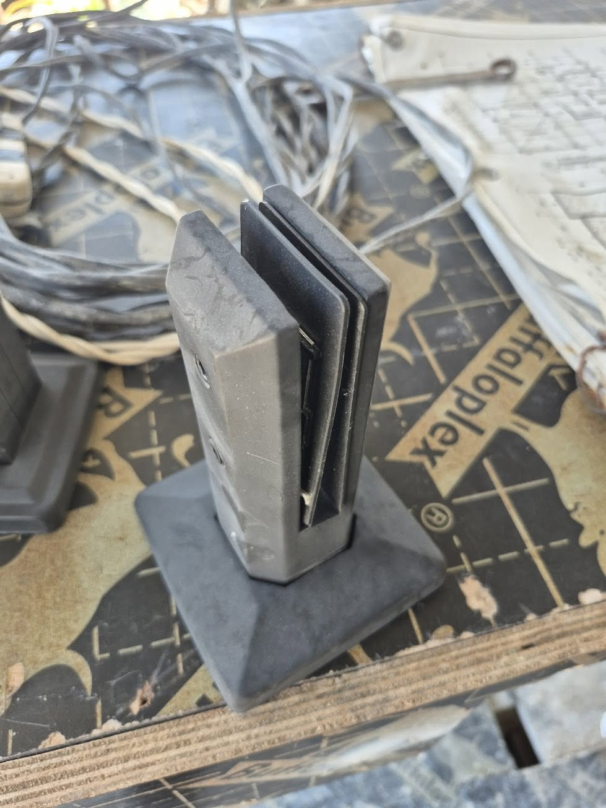
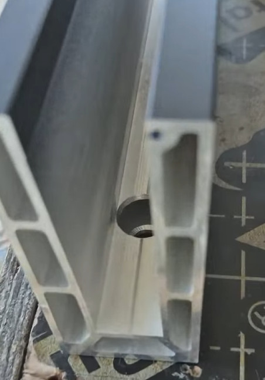
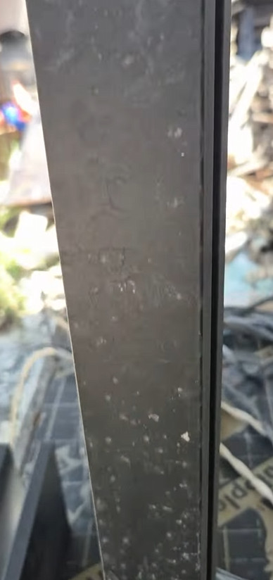

## A Quick Real-World Update on My China Samples

Someone in an old chat group about [importing through Alibaba](/alibaba-sourcing) mentioned **Taizhou Route Metal** because the company was quoting competitive prices for cable balustrades. I saved the name. When I later went to China, I asked the company to send me a few balustrade samples so I could inspect and expose them at the site.

To be completely clear: **this is not a recommendation or endorsement of Taizhou Route Metal**. I only obtained samples. I have not placed a production order with the company, so I cannot judge its consistency, fabrication quality, delivery or after-sales support.

This is exactly why I wrote about [collecting material samples in China and testing them in real Philippine conditions](/material-samples-china-testing). A showroom finish is only the beginning of the evaluation.

## The Three Samples

The supplier identified the samples as:

- A small floor-mounted **spigot in SS 316**
- A taller **post/pole in SS 304**
- An **aluminum U-channel**

Those grades are the supplier's specifications; I have not independently verified the alloys. Before any large order, I would still require documentation and material verification rather than relying only on labels or appearance.

The spigot is the smallest part of the set and was supplied as 316 stainless steel.

The aluminum U-channel is the other system I am seriously considering.

## What They Look Like After Four Months Outside

I left all three samples outdoors near the sea in **April 2026**. I checked them again in late August, after roughly four months of coastal exposure.

There are white spots and a light film on the surfaces. Most of this looks like the normal **salt deposits and site grime** that accumulate near the sea. Salt sitting on metal should not be ignored, but deposits alone are not the same thing as confirmed corrosion.

At this stage, all three samples appear to be holding up well. I did not see anything in the visual inspection that would make me reject them, and my contractor agreed that they look good so far.

That is an encouraging early result, not a durability certificate. Four months outside cannot tell me how the same parts will perform over ten or twenty years, and a visual check cannot verify stainless grade or reveal every early corrosion mechanism. The SS 304 post is the sample I will watch most closely. My earlier [comparison of stainless steel, aluminum and FRP for coastal railings](/coastal-railing-materials-comparison) explains why the exact grade, finish and detailing matter so much here.

## U-Channel or Spigots With Posts?

The samples have survived the first check, but they have not made the design decision for me.

The **U-channel** has a waterproofing advantage because it can reduce the number of separate point penetrations compared with individual spigots or posts. It also gives the glass a clean, continuous base. It is not literally a hole-free installation. The channel still needs properly designed anchors, sealing and drainage, but there are fewer individual exposed fixing points to detail.

The alternative is a combination of **spigots and posts/poles**. That creates a more open appearance and leaves the individual fittings accessible, but every base and fixing becomes its own waterproofing detail. In a coastal location, the fasteners, drainage and isolation between different metals matter just as much as the visible samples.

I discussed these practical differences in more detail in [Balustrades in the Philippines: U-Channel vs Poles](/balustrade-mounting-systems).

## What I Will Do Next

I will leave the samples outside and inspect them again in another **six or seven months**, after more rain, salt exposure and wet-dry cycles. On the next check I want to clean the deposits away and look carefully for staining, pitting, finish damage and deterioration around edges and fixing points.

Only then will I be closer to choosing between the U-channel and the spigot/post arrangement. The final choice will also depend on the drawings, anchorage, waterproofing details, drainage, verified material grades and the complete delivered price, not just which sample looks best today.

## Related Reading

- [Material Samples From China: Why I Test Them in Real Philippine Conditions](/material-samples-china-testing)
- [Sourcing Trip to China: Canton Fair, Foshan, Guangzhou or Shenzhen?](/china-sourcing-trip-where-to-go)
- [Buying Construction Materials in China: My First Trip](/first-trip-china)
- [How to Actually Buy Stuff on Alibaba Without Getting Scammed](/alibaba-sourcing)
- [Coastal Railings: FRP vs 316 Stainless vs Aluminum](/coastal-railing-materials-comparison)
- [Balustrades in the Philippines: U-Channel vs Poles](/balustrade-mounting-systems)
