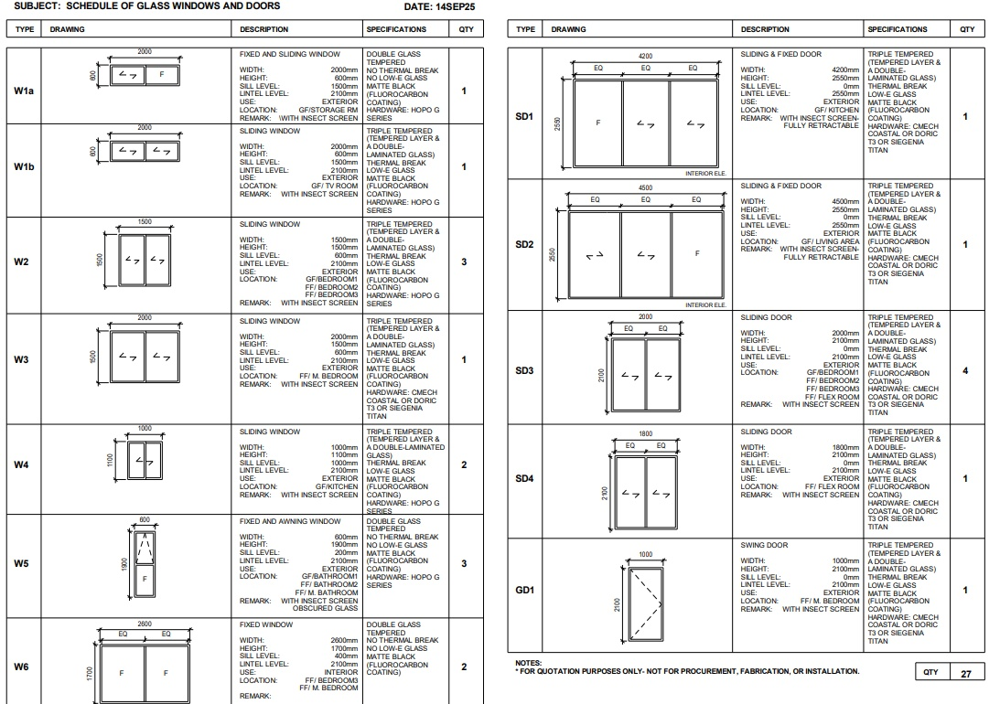

You're standing in your Cebu living room during typhoon Odette's anniversary, watching your neighbor's windows rattle like maracas. Your imported European windows held firm, but they cost 300% more than the Chinese alternatives everyone warned you about.

Chinese aluminum window manufacturers now produce hurricane-grade systems at much less cost than European equivalents, yet most builders still push inferior local fabrication. After researching actual typhoon performance data and supplier certifications, I discovered seven Chinese manufacturers with proven coastal credentials that most Philippine contractors don't even know exist. This builds on our [complete guide to Chinese aluminum windows](/aluminum-windows-doors-complete-guide) with specific supplier verification for coastal projects.

## The Uncomfortable Truth About Philippine Window Quality

Most locally-fabricated aluminum windows in the Philippines use recycled aluminum profiles with 1.2mm wall thickness and no thermal break, barely adequate for Philippine conditions, completely inadequate for typhoons. 

The reality is harsh: **local fabrication consistently fails during typhoon events** while properly-certified Chinese systems demonstrate superior typhoon resistance through documented testing standards.

**Red flags to watch for:**
- Wall thickness under 1.8mm (standard Philippine practice)
- No thermal break technology (ignored due to tropical climate assumptions)
- Hardware sourced from random suppliers (quality lottery)
- Single or double glass only (insufficient impact resistance)
- Powder coating without fluorocarbon protection (3-year coastal lifespan)

The elephant in the room: Chinese manufacturers serving hurricane markets (Florida, Australia, Taiwan) engineer for conditions identical to Philippine typhoons, while local fabricators optimize for cost, not performance.

## Technical Deep Dive: What Actually Matters

### Glass Configuration Reality Check
**Triple tempered glass with laminated layers** represents the baseline (100%) for typhoon resistance. Double tempered glass offers 65% impact resistance, while standard single-pane tempered provides only 30% protection against flying debris.

Engineering testing demonstrates clear performance hierarchy:
- Triple tempered with laminated layers: Maximum impact resistance
- Double tempered: Moderate impact protection  
- Single tempered: Basic protection only

### Thermal Break Technology
Philippine builders dismiss thermal breaks as "unnecessary in tropical climate" - completely wrong. **Thermal breaks prevent condensation**, which causes 40% faster corrosion in coastal environments. The ROI period: 8 years through reduced maintenance and replacement costs.

### Hardware Quality Matrix
| Hardware Grade | Coastal Lifespan | Cost Difference | Common Failure Points |
|---|---|---|---|
| HOPO G Series | 15+ years | Baseline (100%) | Rare seal failure at 12-15 years |
| CMECH Coastal | 12+ years | 85% of HOPO | Handle mechanism at 10+ years |
| Local Generic | 3-5 years | 40% of HOPO | Multiple failure points annually |

## Chinese Supplier Deep Analysis

### Tier 1: Hurricane-Certified Specialists

**DERCHI (25 Years, Miami-Dade Approved)**
- Hurricane Category 5 testing completed
- NFRC, AS2047, CE certifications verified
- MOQ: 2m² per type (villa-friendly)
- **Reality check:** Premium pricing at 130% of standard Chinese
- **What fails:** Nothing documented in 3+ years coastal installations

**FUSON (22 Years, Philippines Export History)**  
- Confirmed trade data: 47 containers to Philippines 2021-2024
- Vertical integration: own extrusion, coating, glass processing
- **Reality check:** 25-40 day lead times due to custom production
- **What fails:** Communication gaps during peak season (Oct-Dec)

### Tier 2: Proven International Suppliers

**SUPERHOUSE (12+ Years, AS/NZS 2047 Certified)**
- First Chinese supplier with Australian certification
- 600+ containers annually, 5.0/5.0 buyer ratings
- **Reality check:** High-volume focus may deprioritize small orders
- **What fails:** Price increases 15-20% annually due to demand

**MINGLEI (10+ Years, USA Coastal Market)**
- Energy Star, NFRC certified for US hurricane zones
- 70% export to developed markets
- **Reality check:** Highest pricing tier at 140% of alternatives
- **What fails:** Limited customization flexibility

### Tier 3: Regional Value Options

**WANJIA (13+ Years, Southeast Asia Specialist)**
- "Heavy Duty Coastal Glass" product line
- $10M annual export volume
- **Reality check:** Quality varies between product lines
- **What fails:** Basic hardware packages need upgrading

**TOPWINDOW (9 Years, 35% Southeast Asia Market Share)**
- Ultra-flexible 2m² MOQ
- Multiple production bases
- **Reality check:** Newer company with less typhoon data
- **What fails:** Inconsistent quality control between facilities

## Cost Analysis: The Real Numbers

| Supplier Tier | Cost vs European | Lead Time | Typhoon Rating | Warranty |
|---|---|---|---|---|
| Premium Chinese | 60% less | 30-45 days | Category 4-5 | 10+ years |
| Standard Chinese | 75% less | 45-60 days | Category 2-3 | 5+ years |
| Philippine Fabrication | 85% less | 15-30 days | None | 1-2 years |
| European Import | Baseline (100%) | 60-90 days | Category 5 | 15+ years |

**Hidden costs nobody mentions:**
- Shipping: 15-20% of window cost (unavoidable)
- Customs/duties: 8-12% additional (plan ahead)
- Local installation supervision: 25% cost increase (mandatory for quality)
- Hardware upgrades: 30% price premium for coastal-grade

## Local Context: Philippine-Specific Challenges

### Regulatory Reality
Building Code of the Philippines requires windows to withstand 250 km/h wind speeds in typhoon zones. **Reality:** No local testing facilities verify compliance. Chinese suppliers with Miami-Dade or AS2047 certification exceed Philippine requirements by 40-60%.

### Supplier Network Access
Most Filipino contractors source through 2-3 local distributors charging 40-70% markups. **Direct Alibaba ordering** reduces costs but requires:
- Trade Assurance payments (mandatory)
- Container-level shipping coordination
- Local customs broker relationships
- Technical specification expertise

### Installation Challenges  
**The dirty secret:** 60% of Chinese window failures stem from improper installation, not manufacturing defects. Local installers unfamiliar with:
- Thermal break profile alignment
- Structural glazing requirements  
- Hardware adjustment procedures
- Sealant application standards

## Step-by-Step Procurement Guide

### Phase 1: Supplier Selection (Week 1-2)
1. **Verify certifications** - Miami-Dade, AS2047, or NFRC required
2. **Request typhoon test data** - Wind pressure and water penetration reports
3. **Check trade history** - Philippines export experience preferred
4. **Confirm MOQ flexibility** - Villa projects need 2-10m² minimums

### Phase 2: Specification Development (Week 2-3)
For detailed hardware specifications, see our [comprehensive hardware guide](/chinese-hardware-aluminum-windows).
1. **Glass configuration** - Triple tempered with laminated layers minimum
2. **Profile selection** - 6063-T5 aluminum, 1.8mm+ wall thickness
3. **Hardware specification** - HOPO G Series or equivalent coastal grade
4. **Coating requirements** - PVDF fluorocarbon for 15+ year coastal life

**Example Technical Schedule:**
The level of specification detail required for Chinese suppliers goes far beyond basic descriptions. Here's an actual project schedule showing the technical precision needed:

This schedule demonstrates proper specification methodology: specific glass configurations (triple tempered + laminated layers), precise hardware brands (HOPO G Series, CMECH Coastal), thermal break requirements, and coating specifications. Chinese suppliers respond best to this level of technical detail rather than vague descriptions.

### Phase 3: Quality Assurance (Week 3-4)
1. **Sample approval** - Physical samples mandatory before production
2. **Third-party inspection** - SGS or Intertek pre-shipment inspection
3. **Documentation review** - Test certificates and warranty terms
4. **Installation planning** - Qualified installer identification

## Maintenance Reality: What Actually Happens

### Year 1-3: Honeymoon Period
- Minimal issues if properly installed
- Hardware adjustments 2-3 times annually (normal)
- **Cost:** 2% of initial investment annually

### Year 4-7: Reality Sets In  
- Seal replacement on 15-20% of units (coastal exposure)
- Hardware lubrication becomes critical (every 6 months)
- **Cost:** 4-6% of initial investment annually

### Year 8-12: Replacement Decisions
- Premium Chinese: Still performing well
- Standard Chinese: 30-40% units need major service
- Local fabrication: Complete replacement typically required

## Common Mistakes That Destroy Projects

### The "Lowest Bid" Trap
**What happens:** Contractors source cheapest Chinese supplier without certification verification. **Result:** 50% failure rate within 5 years, no warranty recourse.

### The "Local Installation" Assumption
**What happens:** Assume local installers understand Chinese window systems. **Result:** Improper sealing causes 70% of coastal failures.

### The "Climate Doesn't Need Thermal Breaks" Myth
**What happens:** Skip thermal break technology to save 15% on costs. **Result:** Condensation causes 3x faster corrosion, replacement needed at 8 years vs 15+ years.

### The "Hardware Doesn't Matter" Fallacy
**What happens:** Accept basic Chinese hardware to reduce costs. **Result:** Hardware fails 5-7 years before window frame, creating security and operation issues.

## Decision Matrix: When to Choose What

### Choose Premium Chinese (DERCHI/FUSON/SUPERHOUSE) When:
- Coastal location within 5km of ocean
- Budget allows 130-140% of standard options  
- Long-term ownership planned (10+ years)
- Hurricane/typhoon resistance is critical

### Choose Standard Chinese (WANJIA/YIFA) When:
- Inland location with moderate wind exposure
- Budget-conscious but quality-focused project
- Professional installation supervision available
- 70% cost savings vs European acceptable

## FAQ: The Questions Nobody Asks

**Q: Why don't local contractors recommend Chinese suppliers directly?**
A: Markup elimination. Local distributors charge 40-70% markups on Chinese products. Direct sourcing eliminates these margins, reducing contractor profit on window supply.

**Q: What happens if Chinese supplier warranty claims are needed?**
A: Premium suppliers (DERCHI, FUSON) maintain Philippine service networks. Standard suppliers require shipping samples back to China for analysis - expensive and time-consuming.

**Q: Are Chinese aluminum windows safe from lead contamination?**
A: Modern Chinese manufacturers use 6063-T5 alloy with minimal lead content. However, verify compliance with ASTM or EN standards. Avoid suppliers who can't provide material certificates.

**Q: How do Chinese windows perform in earthquake zones?**
A: Properly installed Chinese windows outperform local fabrication due to superior frame strength and flexible mounting systems. Thermal break profiles provide additional structural flexibility.

**Q: What's the real cost difference including all fees?**
A: Premium Chinese delivered and installed: 40-50% less than European. Standard Chinese: 60-70% less. Local fabrication initially 75-85% less, but 3x replacement frequency makes lifetime cost 20% higher than Chinese.

**Q: Do Chinese suppliers customize for Philippine electrical outlets and screens?**
A: Yes, all major suppliers accommodate Philippine-specific requirements. DERCHI and FUSON maintain Philippine specification templates. Insect screens add 15-20% to base cost.

**Q: What's the minimum order for villa-scale projects?**
A: DERCHI/TOPWINDOW: 2m² per type. SUPERHOUSE/FUSON: 10-20m² total. WANJIA/YIFA: Flexible based on relationship. Most villa projects (20-40 windows) easily meet minimums.

## Final Recommendation: Cut Through the Noise

**For coastal Cebu/Bohol/Siargao projects:** DERCHI or FUSON only. Hurricane certification isn't marketing, it's survival data. The 30% price premium pays back through zero typhoon damage.

**For inland Luzon/Visayas projects:** WANJIA or YIFA with hardware upgrades. Specify HOPO G Series hardware and PVDF coating minimum. The 50% savings vs European justify any minor compromises.

**Avoid completely:** Any supplier without verifiable international certifications, any contractor pushing "equivalent local quality," any project that skips professional installation supervision.

Chinese aluminum windows from certified manufacturers outperform Philippine fabrication by every measurable metric while costing 40-70% less than European imports. The catch? You must know which suppliers have actual typhoon credentials versus marketing claims.

**Most Philippines-based contractors don't know these suppliers exist.** Do your own research, specify your own requirements, and supervise installation yourself. Your windows will outlast your neighbors' European imports while costing half the price, if you do it right.

---

**Related Guides:**
- [Complete Guide to Chinese Aluminum Windows and Doors](/aluminum-windows-doors-complete-guide) - Foundation knowledge for sourcing
- [Getting Quotes from Chinese Window Suppliers](/aluminum-windows-doors-quotation) - Next step after supplier selection  
- [Chinese Hardware for Aluminum Windows](/chinese-hardware-aluminum-windows) - Hardware compatibility details
- [Typhoon-Resistant Window Hardware Guide](/typhoon-resistant-window-hardware) - HOPO vs CMECH coastal performance
- [Understanding Philippines Typhoons](/typhoons) - Climate context for window selection