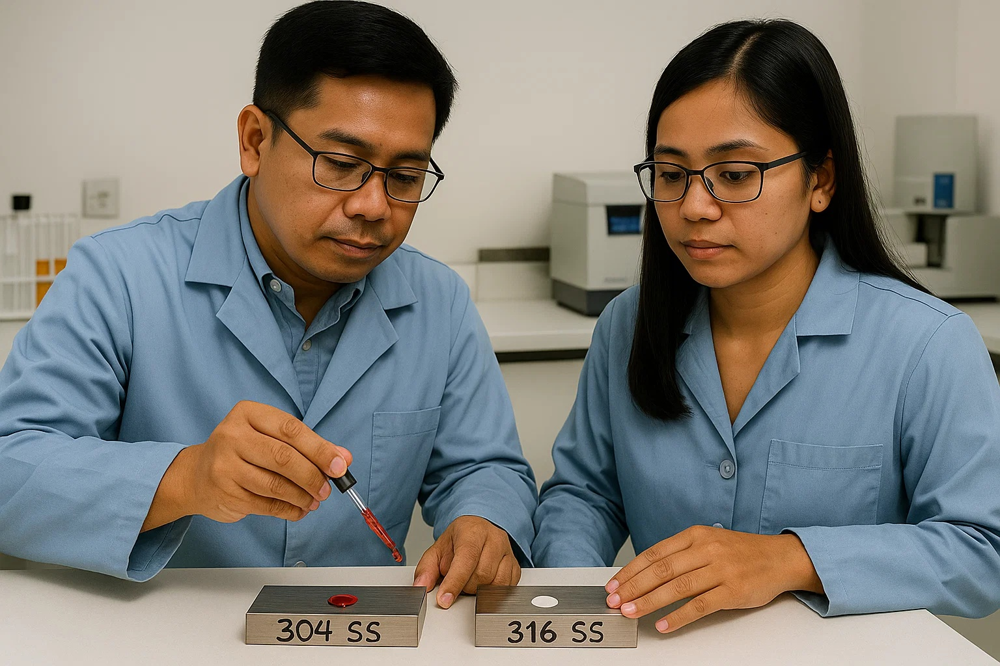

# Coastal Railings & Spiral Stairs: The Honest Material Comparison for Philippine Typhoon Zones

You're designing railings and spiral stairs for a coastal home in typhoon country, and everyone has an opinion about materials. Your contractor pushes 316 stainless steel. The supplier suggests 6063-T5 aluminum. Now someone mentions FRP (fiberglass). Each claims to be "the best choice" while the price tags vary wildly.

**Bottom line upfront:** After researching real-world performance, cost analysis, and Philippine supplier networks, **FRP is the most cost-effective long-term solution** with ₱410,000-820,000 total ownership costs over 20 years per 100 linear feet. 316 stainless steel provides superior structural strength at premium pricing, while aluminum offers a middle ground if properly specified.

Here's the honest breakdown of what actually works in our brutal coastal climate.

## The Reality Check: Philippine Coastal Conditions Are Brutal

Our environment destroys inferior materials ruthlessly. **80%+ year-round humidity**, salt spray traveling 50+ kilometers inland, sustained typhoon winds reaching 315 km/h, and UV levels that bleach car paint in months. This isn't just "marine environment" - it's an accelerated destruction test.

**Recent case studies matter:** Singapore Marina Bay's anodized aluminum demonstrates proper marine specification, while Taiwan's typhoon infrastructure showcases stainless steel performance under extreme conditions. Malaysian building failure analysis shows **52% of premature failures trace to inadequate surface preparation** across all materials.

**The fluorocarbon question for 316 stainless steel:** My research shows fluorocarbon coatings are unnecessary for 316 stainless steel railings in most marine applications. The molybdenum content provides sufficient chloride resistance. Save the coating cost unless you're in extreme splash zones.

## Material Performance Rankings: What Actually Survives

### 316L Stainless Steel: The Structural Champion

**Real-world pricing update (September 2025):** A supplier near Shanghai quoted me directly for balcony railings:
- **0.8m height SS316 railings:** USD 24 per piece (black powder-coated)
- **6+0.76+6mm laminated safety glass:** USD 36 per square meter
- **Note:** I'll personally verify these specifications and molybdenum test the "316" material during my December 2025 visit and update this article with findings

**Why it dominates critical applications:**
- **Tensile strength:** 515-690 MPa (double aluminum's 160-200 MPa)
- **Corrosion resistance:** No measurable degradation after 1,000+ hours ASTM B117 salt spray testing
- **Service life:** 50+ years documented in marine environments
- **Typhoon performance:** Superior strength handles extreme wind loads

**Technical requirements that matter:**
- **Grade:** 316L specifically (lower carbon prevents sensitization)
- **Surface finish:** Mirror polish Ra ≤ 0.5 μm reduces salt accumulation
- **Post-fabrication treatment:** ASTM A380 + A967 passivation mandatory
- **Design:** Natural rainwater washing, avoid crevice details

**Local pricing reality:** ₱500-700/kg versus ₱180-250/kg for aluminum - a 250-300% premium that's justified for critical structural applications.

**Import pricing comparison:** Chinese suppliers quote significantly lower (USD 24/piece for complete railings vs local fabrication at ₱500-700/kg raw material). However, factor in:
- Shipping costs (20-30% additional)
- Import duties and taxes (12% VAT + duties)
- Quality verification costs
- No recourse for defects
- 45-60 day lead times

**Critical verification:** Always perform molybdenum testing (see detailed test section below) to confirm you're receiving genuine 316/316L grade, not cheaper 304 substitutes.

### How to Verify 316 Stainless Steel: The Molybdenum Test

**Why verification matters:** With 316 stainless commanding a 20-30% premium over 304, and unscrupulous suppliers sometimes substituting cheaper grades, verification is essential. The molybdenum test provides a simple, cost-effective method to confirm you're getting what you paid for.

#### How the Molybdenum Test Works

**The chemistry behind it:** The test detects molybdenum content (2-3% in 316 vs 0% in 304) through a chemical reaction that produces a distinctive color change. When the reagent contacts molybdenum, it forms a colored complex - the higher the molybdenum content, the more intense the color.

**Two testing methods available:**

**1. Chemical Drop Test (Simple Method):**
- **Clean the surface:** Remove any oils, coatings, or oxidation with emery paper
- **Apply reagent:** Place a single drop of molybdenum test solution on the cleaned metal
- **Wait and observe:** Within 30 seconds to 5 minutes:
  - **316 stainless:** Solution turns dark brown/chocolate brown and stays
  - **304 stainless:** Solution remains clear/yellowish or turns green
  - **High-moly alloys (Hastelloy):** Intense brown color develops quickly

**2. Electrolytic Test (More Accurate):**
- **Equipment needed:** Test solution + 9V battery with electrode tips (often included in kits)
- **Process:** Apply solution drop, touch positive electrode to metal surface, negative to the drop
- **Apply current:** 2-4 seconds maximum (longer can damage surface)
- **Results:**
  - **316 stainless:** Red/pink color appears and persists
  - **304 stainless:** No color or color disappears immediately
  - **202 stainless:** Green color or no reaction

#### Test Kit Options and Costs

**Commercial test kits available:**
- **Koslow Scientific 1542C Kit:** Professional grade, $45-65 USD (₱2,500-3,500)
  - Tests 200-300 samples
  - Includes electrode for electrolytic testing
  - Reference samples included
- **Generic molybdenum test solutions:** $15-30 USD (₱800-1,700)
  - 50-100ml bottles
  - 70-100 tests per bottle
  - Chemical drop method only
- **Indian/Asian suppliers:** ₹650-850 INR (₱450-600 PHP)
  - Available on Lazada, Shopee (limited)
  - 2-week delivery to Philippines typical

**DIY chemical preparation (for experienced users only):**
- **Warning:** Involves hazardous chemicals - proper safety equipment mandatory
- **Basic reagent formula:** 
  - Stannous chloride (SnCl₂): 10g
  - Concentrated hydrochloric acid (HCl): 100ml
  - Distilled water: 150ml
  - Potassium rhodanate/thiocyanate (KSCN): 2g
- **Approximate cost:** ₱200-400 for chemicals (makes 250ml solution)
- **Safety requirements:** Gloves, goggles, ventilation essential
- **Note:** Commercial kits are safer and more consistent

#### Philippine Availability

**Where to source test kits locally:**
- **Industrial suppliers:** Contact welding supply shops in Manila/Cebu
- **Online platforms:** Limited availability on Lazada/Shopee
- **Direct import:** Order from US/India suppliers (allow 2-3 weeks)
- **Alternative:** Request testing from certified labs (₱500-1,500 per test)
- **Chinese supplier verification tip:** When importing, bring your own test kit or use Shanghai/Guangzhou testing labs before shipping

**Local chemical suppliers (for reagents):**
- **RTC Chemical Corporation** (Manila): Industrial chemicals
- **Belman Laboratories** (Quezon City): Lab reagents
- **Note:** May require business registration for purchase

#### Important Testing Considerations

**Test limitations:**
- Cannot distinguish between 316 and 316L (both contain molybdenum)
- Surface contamination can cause false results
- Cold-worked areas may react differently
- Test damages polished surfaces slightly (requires re-polishing)

**Best practices:**
- Test in inconspicuous area
- Clean surface thoroughly before testing
- Compare with known samples when possible
- Rinse tested area immediately after to prevent staining
- Use multiple test points for large installations

**When to demand testing:**
- Any coastal installation claiming 316 grade
- Projects where material certification is unclear
- Suspiciously low-priced "316" quotes
- Critical structural applications
- **Chinese imports:** Always verify - USD 24/piece for 316 railings (September 2025 quote) requires verification as genuine 316 typically costs more

### FRP: The Corrosion-Proof Game Changer

**Complete immunity advantages:**
- **Zero metal corrosion:** Non-metallic composition eliminates traditional degradation
- **UV resistance:** Vinyl ester resin systems with proper gel coat protection
- **Typhoon resilience:** Flexibility provides resilience against ground movement
- **Weight advantage:** 75% lighter than steel, 30% lighter than aluminum

**Philippine market reality:**
- **F.R.P Philippines Corporation:** Local manufacturing with nationwide supply
- **HPS Philippines:** Taguig-based with Cebu service capability  
- **Chinese imports:** 15-30 day lead times, verified suppliers like Hengshui Jiubo

**Critical specifications:**
- **Resin system:** Vinyl ester minimum (not polyester)
- **UV protection:** Gel coat systems with TiO₂ enhancement
- **Load rating:** OSHA/IBC compliance for guardrail applications
- **Fire rating:** ASTM E84 Class 1 flame spread for building codes

### 6063-T5 Aluminum: The Balanced Compromise

**When properly specified:**
- **Alloy requirement:** 6063-T5 minimum for structural applications
- **Surface treatment:** 25-micron minimum anodizing (not standard 12 microns)
- **Coating upgrade:** Fluorocarbon for 20-30 year coastal service life
- **Maintenance reality:** Cleaning every 2-3 years, refinishing every 10-15 years

**Philippine supplier network:**
- **Mercure Intertrade Inc:** Mactan Island, Cebu - stocks 6063 grades
- **Various Metro Manila suppliers:** Established networks with provincial distribution
- **Cost advantage:** Readily available, established fabrication expertise

## Economic Analysis: 20-Year Total Cost Reality

| Material | Initial Cost¹ | Maintenance² | Total 20-Year Cost³ | Service Life |
|----------|---------------|--------------|-------------------|--------------|
| **FRP (Vinyl Ester)** | ₱500,000-750,000 | ₱30,000-70,000 | **₱530,000-820,000** | 25-50 years |
| **316L Stainless** | ₱700,000-1,000,000 | ₱50,000-150,000 | **₱750,000-1,150,000** | 50+ years |
| **6063-T5 Aluminum⁴** | ₱400,000-600,000 | ₱200,000-400,000 | **₱600,000-1,000,000** | 15-25 years |

*¹ Per 100 linear feet including materials and installation*  
*² Cleaning, inspection, refinishing costs over 20 years*  
*³ Philippine coastal environment assumptions*  
*⁴ With enhanced marine treatments*

**FRP's economic advantage:** Despite higher initial costs, minimal maintenance creates best lifecycle value. No painting, no rust, no corrosion repairs for first 20+ years.

**Hidden costs matter:** Aluminum requires specialized marine treatments adding ₱150-300 per linear foot. Without proper treatment, maintenance costs reach ₱200-400 per linear foot every 5 years.

## Practical Application Guide: When to Choose What

### Critical Structural Applications → 316L Stainless Steel

**Choose stainless steel when:**
- Main structural spiral stair supports
- High-traffic commercial railings  
- Extreme exposure (oceanfront, rooftop)
- Building codes require specific strength ratings
- 50+ year design life requirements

**Specification requirements:**
- 316L grade with mill test certificates
- Mirror polish surface finish
- Post-fabrication passivation treatment
- Proper drainage design to prevent salt accumulation

### Cost-Effective Long-Term Solution → FRP

**Choose FRP when:**
- Residential railing applications
- Corrosion immunity is priority
- Low maintenance is essential
- Color matching requirements (integral pigments)
- Non-conductive properties needed

**Critical specifications:**
- Vinyl ester resin matrix (not polyester)
- UV-stabilized gel coat system
- OSHA/IBC load rating compliance
- Local fabrication capability verification

### Balanced Performance Budget → Enhanced Aluminum

**Choose aluminum when:**
- Moderate exposure environments
- Established local fabrication preference
- Standard architectural applications
- 15-20 year design life acceptable

**Mandatory upgrades for coastal use:**
- 25-micron minimum anodizing thickness
- Fluorocarbon coating for extended life
- Nickel acetate sealing for micropore protection
- Annual cleaning and 10-year refinishing schedule

## Philippine Regulatory Requirements

**National Building Code (PD 1096) minimums:**
- **Load capacity:** 100 kg horizontal force any direction
- **Height requirements:** 1.00m minimum for protective applications
- **Spiral stair loads:** 490 kg/m² live load with safety factor of 4

**NSCP 2015 typhoon design:**
- **Wind resistance:** 200-250 km/h coastal zone requirements
- **Enhanced factors:** 1.5-2× safety margins for extreme weather
- **Seismic considerations:** Zone 4 ductile connection requirements

**Material approval processes:**
- **Stainless steel:** Established acceptance through standards
- **Aluminum:** Standard engineering certification pathways
- **FRP systems:** May require special engineering review (₱50,000-150,000 additional documentation)

## Supplier Network Analysis

### Cebu-Based Options (Strong Local Presence)

**For all materials:**
- **SatoGlassCebu:** Fabrication for aluminum and stainless systems
- **Mercure Intertrade Inc:** Mactan Island aluminum stock
- **Multiple stainless suppliers:** Tri-ron, Power Steel with Cebu operations

**For FRP systems:**
- **F.R.P Philippines Corporation:** Laguna-based with nationwide shipping
- **HPS Philippines:** Taguig headquarters, Cebu service area
- **Chinese verified suppliers:** 15-30 day import lead times

### Quality Control Standards

**Philippine Standard (PS) certification:** Required for local manufacturers
**Import Commodity Clearance (ICC):** Required for imported products  
**Processing time:** 15 working days for complete documentation
**Regional pricing:** Manila commands 20-30% premiums over provincial markets

## Installation and Fabrication Realities

**Labor cost considerations:**
- **Welders:** ₱535-550/day Manila rates
- **Stainless steel:** Requires specialized TIG welding techniques
- **FRP installation:** Demands composite-trained fabricators (limited Philippine availability)
- **Aluminum:** Established local fabrication expertise

**Installation complexity:**
- **FRP:** Lightweight modular assembly, no hot work required
- **Stainless:** Heavy equipment needs, specialized welding
- **Aluminum:** Standard techniques, fastest installation time

## Latest Material Innovations

**Advanced aluminum treatments:**
- **Pulse anodizing:** 40% energy reduction, improved consistency
- **Nano-enhanced coatings:** Self-cleaning surfaces with TiO₂ particles
- **Hybrid fluorocarbon systems:** Extended service life beyond traditional limits

**FRP matrix improvements:**
- **Vinyl ester formulations:** Superior moisture resistance vs polyester
- **Carbon fiber reinforcement:** Better property retention in tropical marine
- **Nano-enhanced gel coats:** Improved UV protection and surface integrity

**Digital monitoring capabilities:**
- **IoT sensor integration:** Real-time performance monitoring
- **Predictive maintenance:** Schedule before failure occurs
- **Particularly valuable:** High-access installations where inspection is challenging

## Common Mistakes to Avoid

**Specification errors that kill performance:**
- Using standard 12-micron anodizing instead of 25-micron marine grade
- Choosing polyester FRP instead of vinyl ester for marine use
- Skipping post-fabrication passivation on stainless steel
- Inadequate surface preparation (causes 52% of premature failures)

**Supplier selection pitfalls:**
- Choosing cheapest quote without specification verification
- Ignoring local fabrication capability for FRP systems
- Not confirming actual alloy grades and certifications
- Underestimating total delivered costs including duties and installation

**Design mistakes:**
- Creating crevice details that trap salt accumulation
- Insufficient drainage planning for tropical rainfall
- Ignoring thermal expansion in long runs
- Poor anchorage design for typhoon loads

## Real-World Performance Data

**Southeast Asian case studies:**
- **Singapore Marina Bay:** Anodized aluminum performing well with proper marine specification
- **Taiwan typhoon infrastructure:** 316 stainless steel maintaining integrity under Category 4 storms
- **Malaysian project analysis:** 56 public projects identified material quality as primary failure factor

**Philippine-specific challenges:**
- **80%+ humidity:** Accelerates moisture-related degradation
- **Wet-dry monsoon cycles:** Create particularly aggressive corrosion conditions
- **Typhoon debris impact:** FRP flexibility helps survival, metals can deform permanently

## The Honest Recommendation

**For most Philippine coastal residential applications:** FRP with vinyl ester resin provides the best value proposition. Complete corrosion immunity, minimal maintenance, and competitive lifecycle costs make it the smart choice despite higher initial investment.

**For critical structural needs:** 316L stainless steel justifies the premium through superior strength and proven 50+ year performance. Specify properly and maintain minimally.

**For budget-conscious projects:** Enhanced 6063-T5 aluminum with marine treatments offers acceptable performance with established supply chains, but plan for regular maintenance.

**The key to success:** Climate-specific specifications exceeding general marine standards, rigorous quality control during fabrication (including molybdenum testing for 316 verification), and preventive maintenance programs tailored to tropical coastal conditions.

Don't just choose the cheapest material - choose the one that matches your performance needs, maintenance tolerance, and long-term value expectations. In typhoon country, the right material choice determines whether your railings look great for decades or become an expensive maintenance headache.
