Daniel here. So besides kitchens (which got its own article because it's such a big topic), I sourced a bunch of other materials during my China trips. WPC panels, aluminum windows, LED lighting, polycarbonate roofing, composite panels, tiles... a lot of stuff. Some from factory visits, some from samples delivered to my hotel. Let me go through each one.

## WPC - Wood Plastic Composite

This is the material I'm most excited about for the Philippine build. If you haven't heard of WPC, it's basically wood fibers mixed with plastic polymers. Looks like wood, feels somewhat like wood, but doesn't rot, doesn't need painting, doesn't attract termites, handles humidity and rain without problems.

For a coastal build in the Philippines? This stuff is a no-brainer.

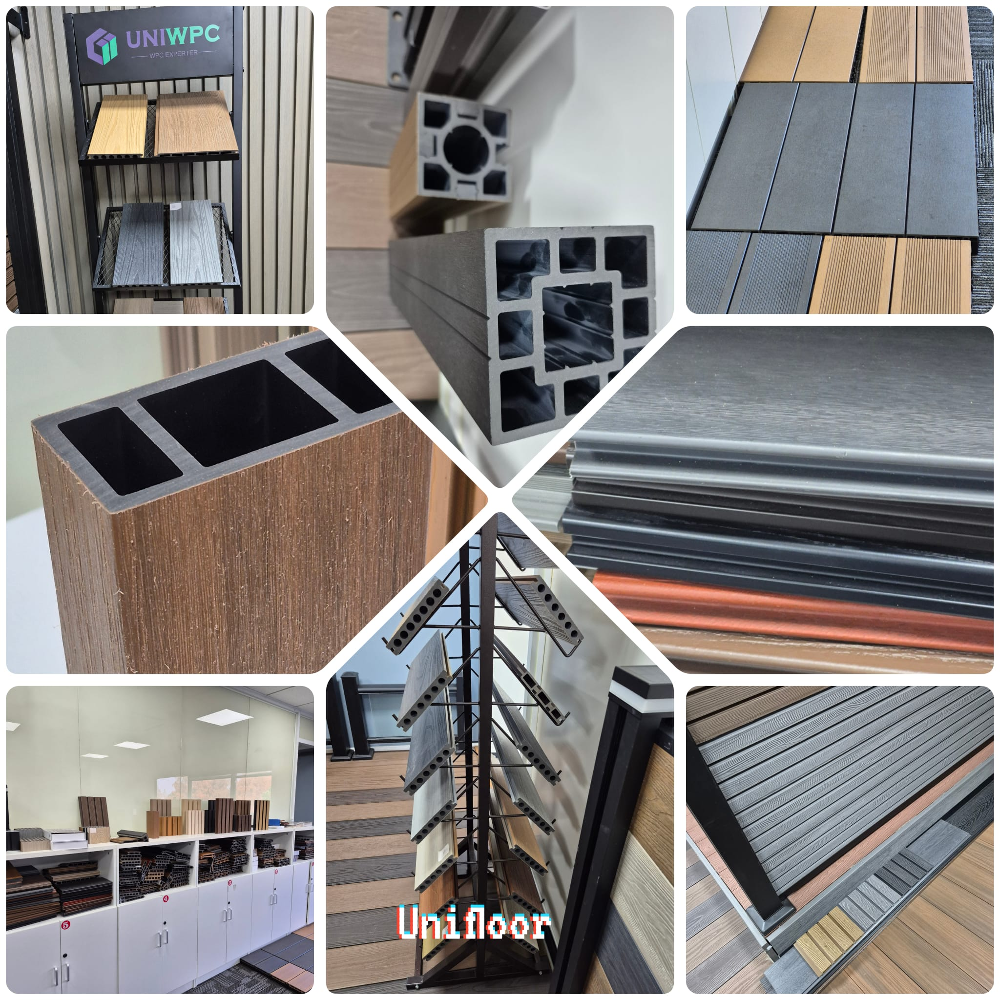

Met with Unifloor and looked at a few other WPC manufacturers around the Shanghai area. The product range is massive. Decking planks for outdoor floors, slatted fencing for privacy screens, wall panels for both interior and exterior, and hollow square profiles for structural stuff like pergolas and screening supports.

### Decking and Fencing

The decking planks come in all kinds of wood-look finishes. Teak color, walnut, grey, charcoal. Some have wood grain texture on the surface, some are smooth. For outdoor decking in the Philippines where you get heavy rain and intense sun, WPC just makes more sense than real wood. No warping, no splintering, no annual re-staining.

The slatted fencing is what I'm probably going to use for privacy screens around the property. Clean modern look, available in different spacings, and you just never have to maintain it.

### Wall Panels

These fluted wall panels are super popular in modern interior design right now. The ribbed profile catches light in interesting ways. And for the Philippines specifically, they handle moisture way better than MDF or gypsum alternatives.

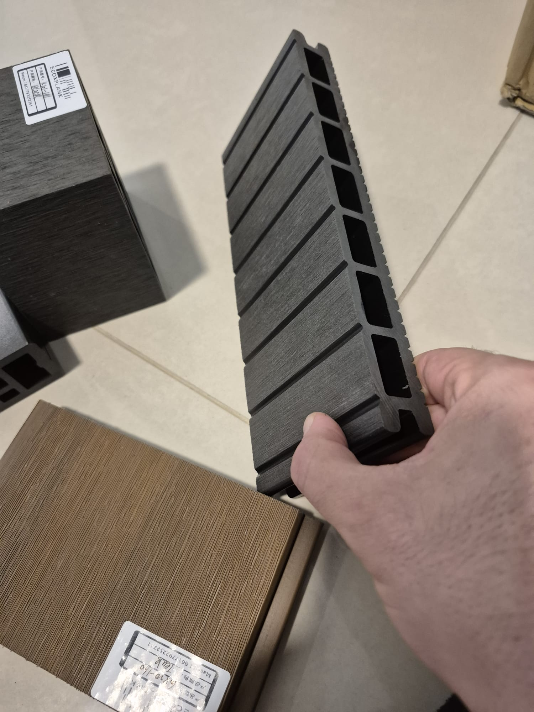

Got this sample in hand and the quality is solid. Good weight to it, clean edges, consistent color throughout. Not cheap feeling at all.

### Structural Profiles

These hollow square tube profiles are what you'd use for pergola posts, structural supports for decking, screening frames. Basically the skeleton that everything else attaches to.

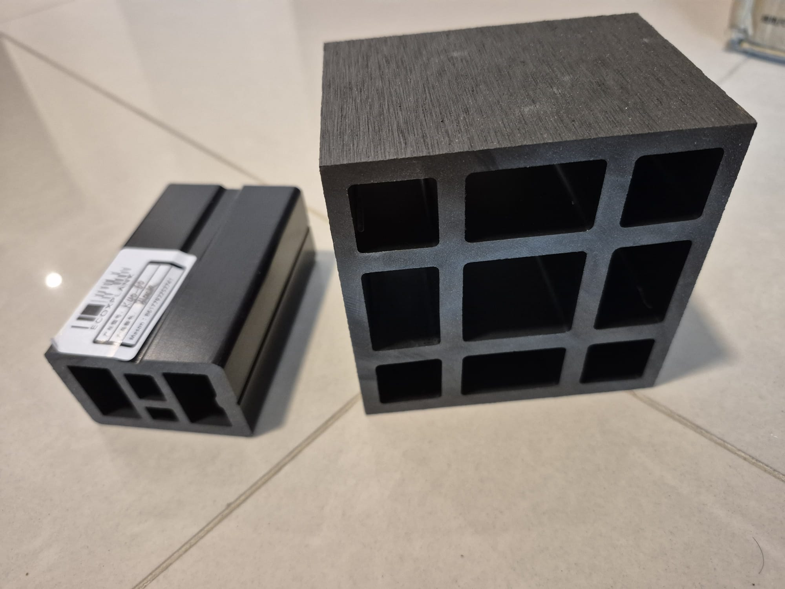

They're lighter than steel, don't rust, don't need painting. For a pergola in a salty coastal environment where steel would corrode fast, WPC profiles are interesting. Not sure about the structural load capacity for larger spans though, need to check that with an engineer.

### WPC Samples

Also got some small sample blocks to compare different densities, colors and surface treatments.

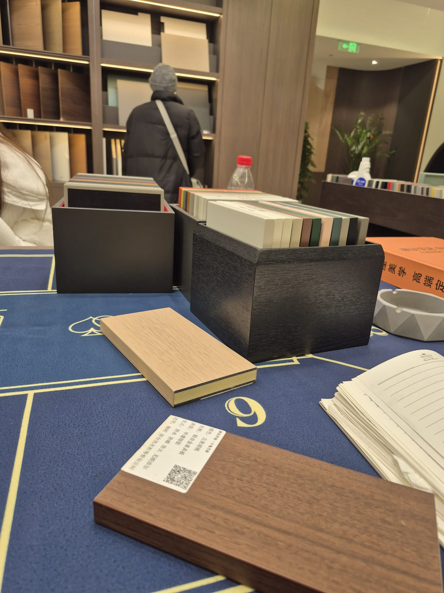

The co-extruded ones (outer shell is a different material than the core) seem to be the premium option. Better UV resistance and the color lasts longer apparently.

## Aluminum Windows and Doors

Already covered windows extensively in my first trip to Foshan article, but on this Shanghai trip I visited Superhouse. They're the top-rated aluminum window supplier on Alibaba with the most certifications, especially for hurricane and typhoon rated windows.

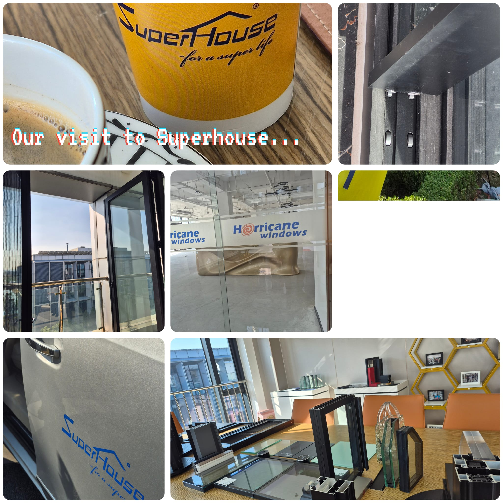

They picked us up from the hotel, brought us to their modern offices. Showed us videos of their fully automated factory. Their portfolio is impressive, very luxury oriented. Lots of large format sliding doors, folding systems, casement windows.

But honestly? Not super impressed for our needs. The products look great and the certifications are solid, especially the hurricane ratings which matter for our typhoon zone build. But there were practical issues. Fluorocarbon coating (PVDF) was only available for high minimum order quantities. That's a dealbreaker when you're building one house and need maybe 20-30 window units.

We'll stick with our Foshan suppliers for windows. Better flexibility, they'll do small batches, and the pricing worked out better.

### Aluminum Extrusion Profiles

Also looked at raw aluminum extrusion profiles. These are the cross-section shapes that make up window frames, door tracks, roller shutters etc.

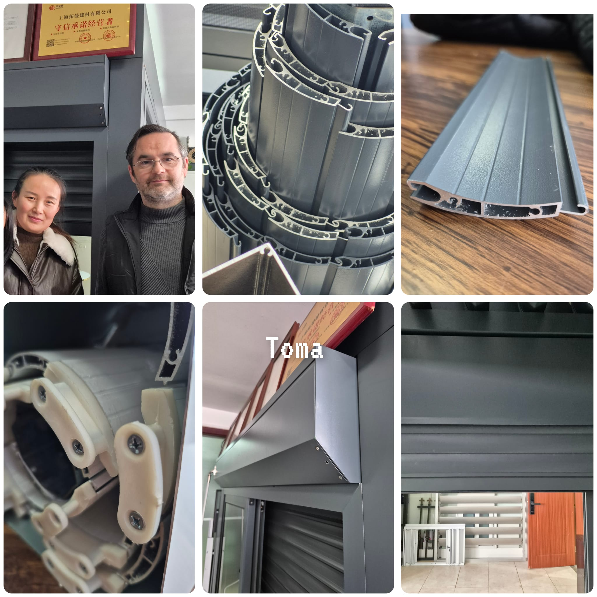

The variety of profile shapes is wild. Each window system uses a specific profile design. Understanding these profiles matters because it determines things like how many chambers the frame has (more chambers = better insulation), how thick the walls are (thicker = stronger for typhoons), and what kind of hardware fits.

Most profiles are Series 6063-T5 aluminum which is the standard for architectural use. Good corrosion resistance, good strength to weight ratio.

## Composite Panels - The Experimental Stuff

This is where things get interesting. Had some samples delivered to the hotel of materials I hadn't really seen before in the Philippine market.

### Aluminum Honeycomb Boards

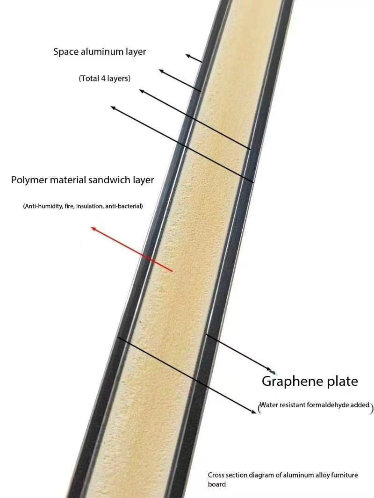

These are sandwich panels with an aluminum honeycomb core between two surface layers. The diagram shows the structure: space aluminum layer on outside, polymer material sandwich in middle, graphene plate. Super lightweight but incredibly rigid and strong. Used in high end facades, interior walls, elevator panels, that kind of thing.

For a Philippine build these could work for feature walls or ceiling panels where you want something lightweight and modern. Not cheap though and I'm not sure about availability of installers who know how to work with this stuff.

### Carbon Charcoal Composite and Flexible Stone

Also got my hands on some layered composite board samples. Carbon charcoal composite is a newer material, very lightweight, good thermal properties.

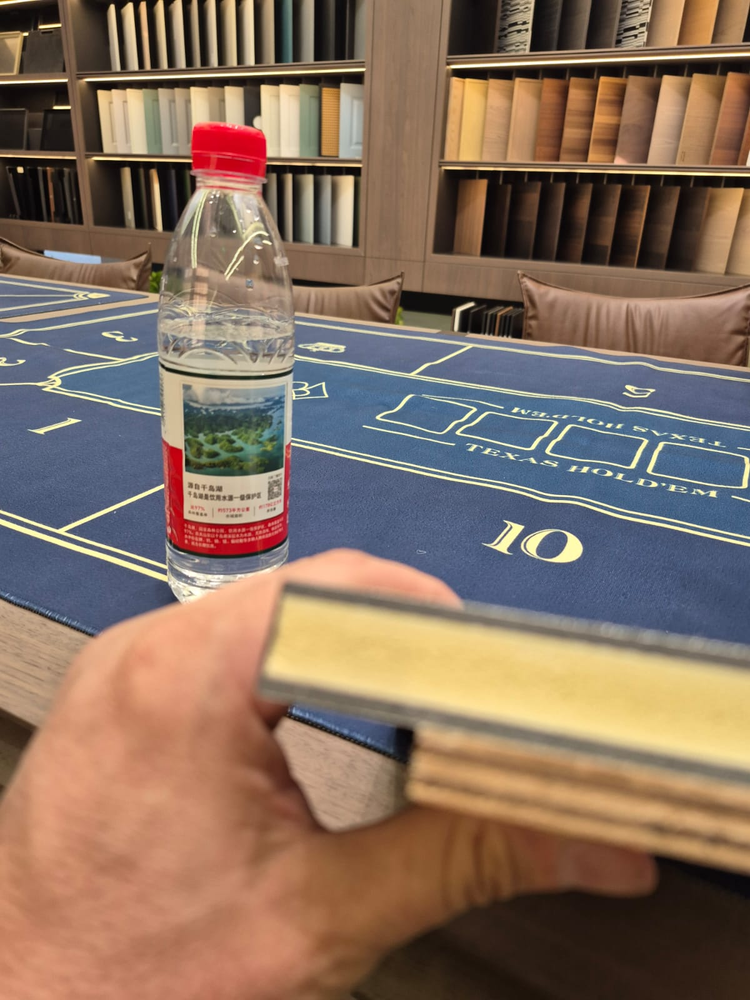

And flexible stone is exactly what it sounds like. Real stone but in thin flexible sheets that you can bend around curves and apply like wallpaper. Interesting for accent walls and columns but not sure about long term performance in high humidity.

These are experimental choices for me. Not committing to anything yet. Need to research more about how they hold up in tropical climates before using them on an actual build. Cool materials though.

## LED Lighting

Visited a LED factory in the Shanghai area. I already wrote about LED strip installations for villas in a previous article but seeing the manufacturing side was eye opening.

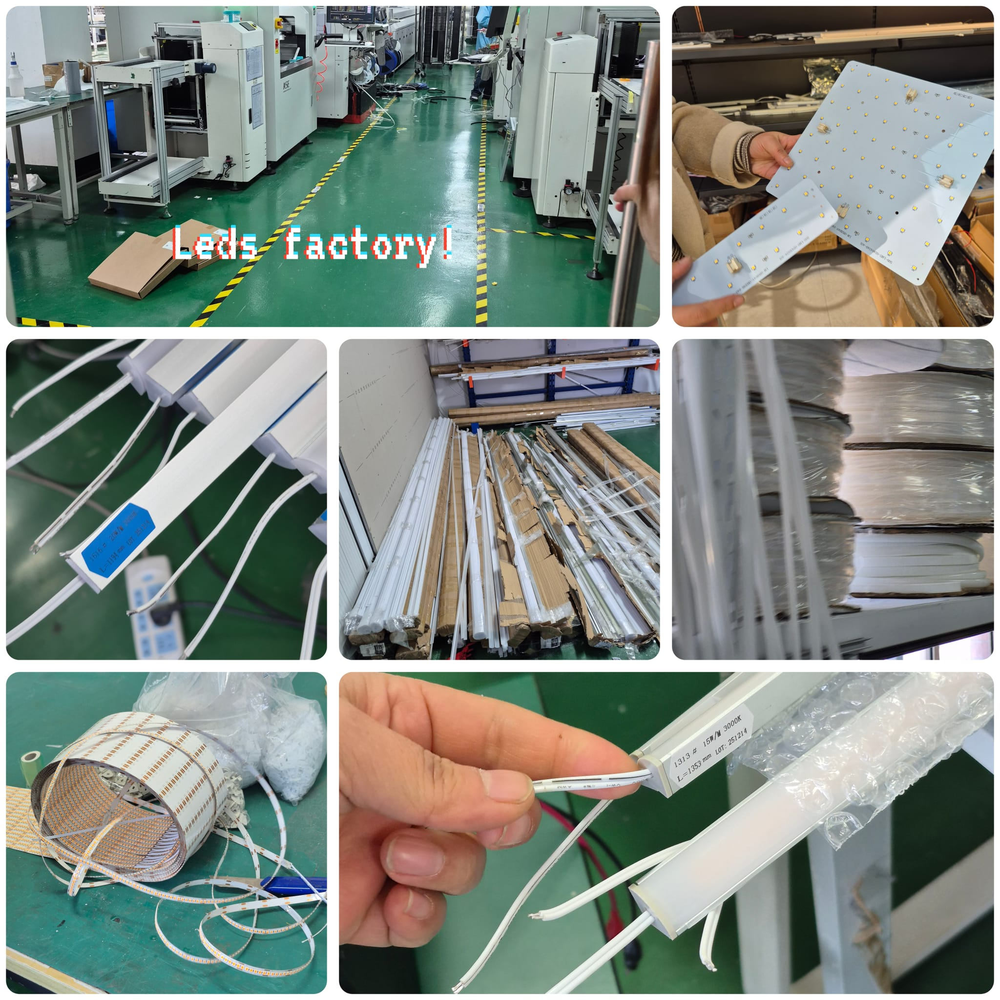

The factory does everything from the SMD chip placement to the final roll packaging. Strip lights, tube lights, panel lights. The production line is mostly automated with quality check stations throughout.

For my project I'm planning extensive LED strip lighting (indirect cove lighting, under cabinet lights, outdoor landscape lighting). Buying direct from a Chinese manufacturer versus buying locally in the Philippines saves... a lot. And the quality is the same because guess where the Philippine stores source their LEDs from? yep.

The factory can do custom color temperatures, custom lengths, different IP ratings for indoor vs outdoor vs underwater. And they'll do relatively small orders compared to what I expected.

## Polycarbonate Roofing

For covered outdoor areas, patios, carport, balcony covers... polycarbonate sheets are the go-to in tropical builds. You want natural light coming through but without the heat and UV of direct sun.

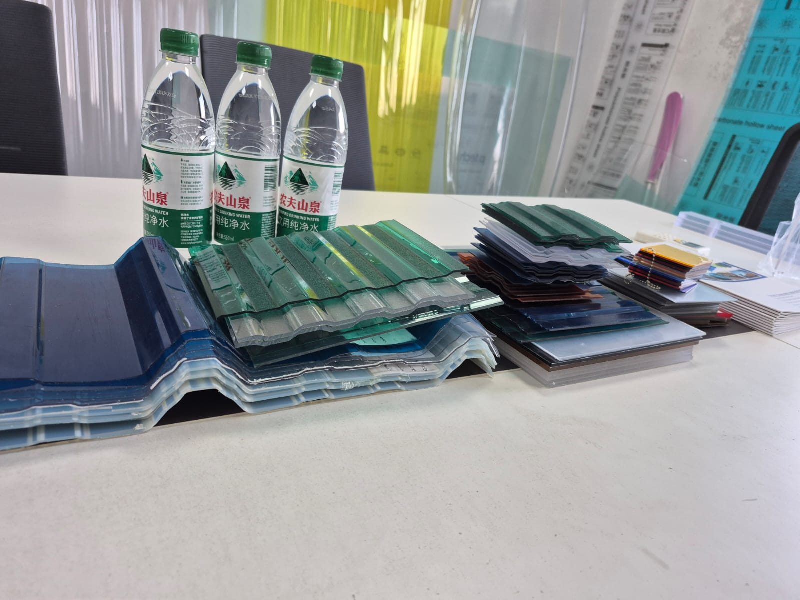

Visited Suzhou New Highlight Precision Technology in Suzhou (covered in my tips article with the factory photos). They do corrugated sheets, flat sheets, all the standard stuff. But the interesting one was their scratch-resistant polycarbonate. Regular polycarbonate scratches pretty easily and over time that haze kills the transparency. Scratch-resistant coating is a big deal for roofing panels that need to stay clear for years in tropical conditions.

The sheets come in clear, translucent, and tinted versions. Different thicknesses for different applications.

For the Philippines the important specs are UV coating (must have, the sun will destroy uncoated polycarbonate in a couple years), scratch resistance (keeps it looking clear long term), and light transmission percentage. You want enough light to feel open but not so much that it turns into a greenhouse.

The wavy/corrugated profile matches standard metal roofing profiles so you can use them alongside metal roof sheets. That's handy for adding natural light sections to an otherwise solid roof.

## Tiles and Surface Materials

Didn't visit tile factories on this trip but had samples delivered to the hotel for free. Working with Bolande out of Foshan, they sent us a bunch of material to evaluate. Planning to visit them and George (our contact there) in person on the March trip.

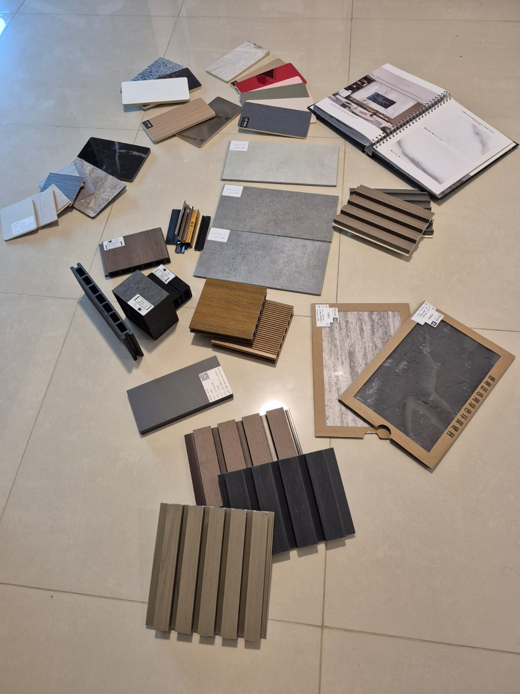

The range of samples they sent is honestly overwhelming. Floor tiles, wall tiles, wood-look planks, large format slabs, WPC panels, laminates. When you see it all laid out on the hotel room floor it's like... how do you even choose.

### Grey Stone Look Tiles

These caught my eye. Large format tiles with a grey speckled stone finish. Modern, clean, works for both indoor and outdoor if you get the right slip rating.

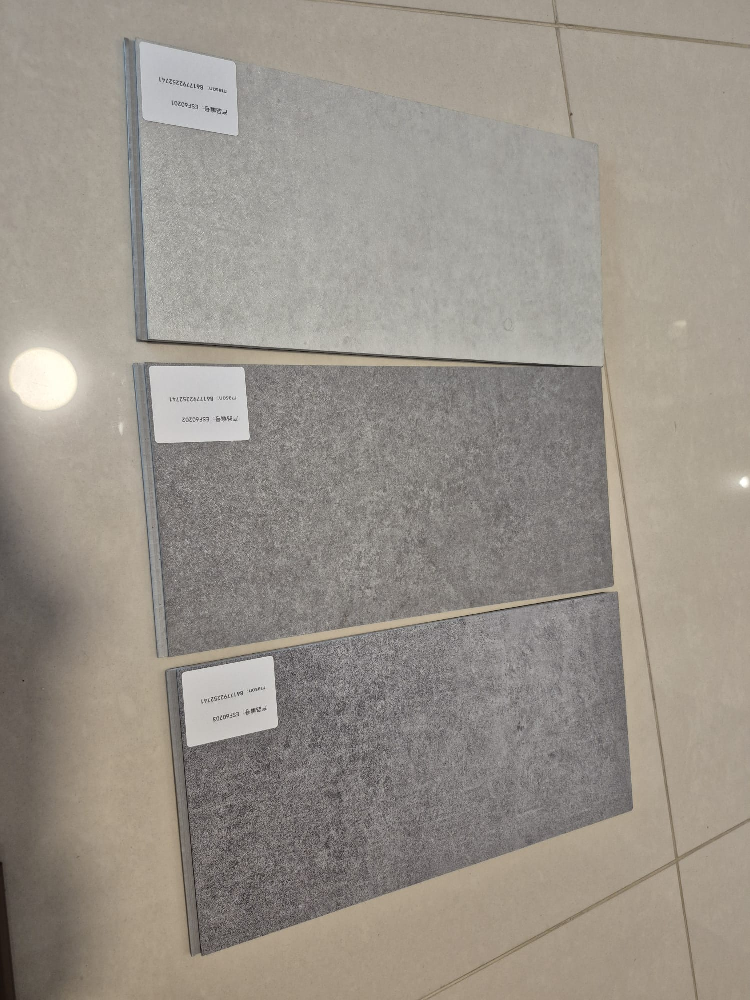

For a Philippine build I lean towards larger tiles (less grout lines = less mold issues in humid climates) and lighter colors (doesn't absorb as much heat as dark tiles, important for outdoor areas).

### Laminates and Veneers

Also got a deck of laminate and veneer color samples. These are for cabinet doors, wall panels, furniture surfaces. The color range is wild.

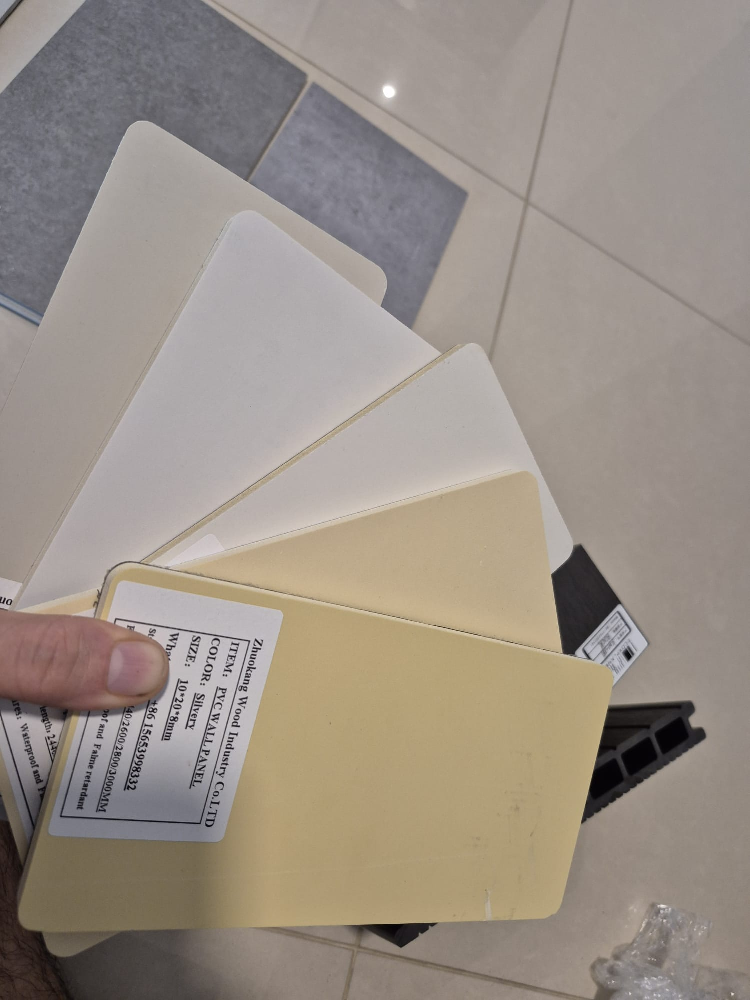

Having physical samples in hand matters so much more than looking at photos online. The color you see on your screen is never what you get in real life. Touch the surface too, some have texture, some are glossy, some are matte. You can't evaluate that from Alibaba product photos.

## What's Coming Next

Going to Foshan in March 2026. That's the final sourcing trip before we start placing actual purchase orders. Will visit Bolande and George for tiles in person, compare kitchen options with what we saw in Hangzhou, and finalize decisions on windows, WPC quantities, and everything else.

Most materials will probably end up being sourced from Foshan since that's where the majority of construction material factories are. But the Shanghai/Hangzhou trip was essential for kitchens and for discovering materials like WPC and composites that I wouldn't have found otherwise.

Will update after the Foshan trip with final comparisons and decisions.
