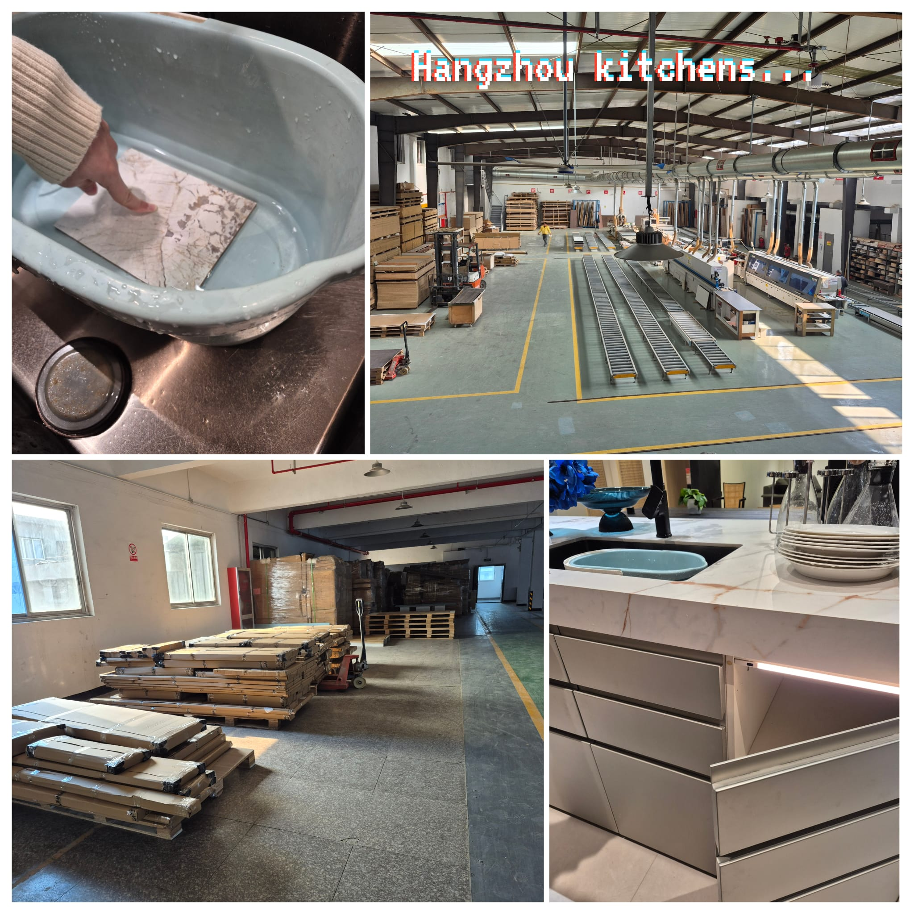
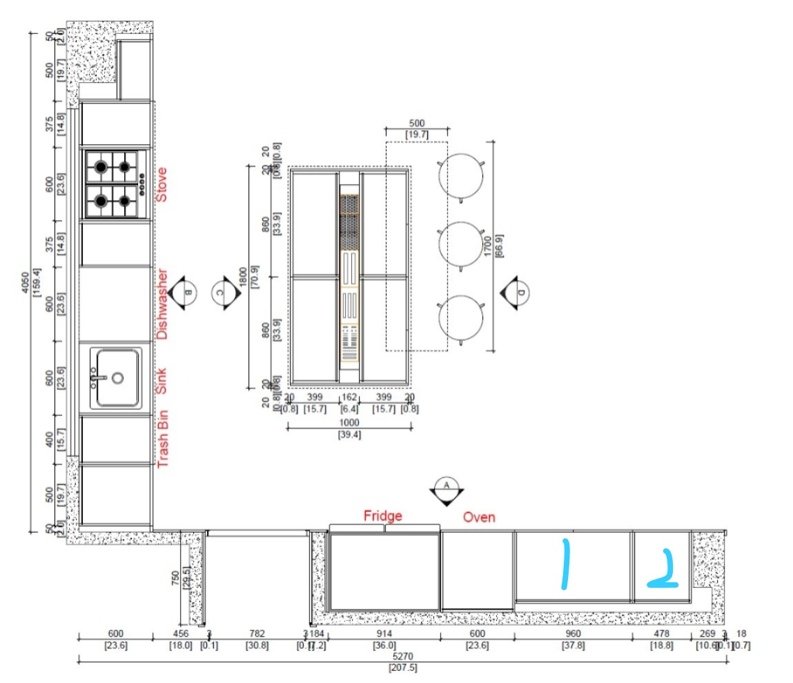
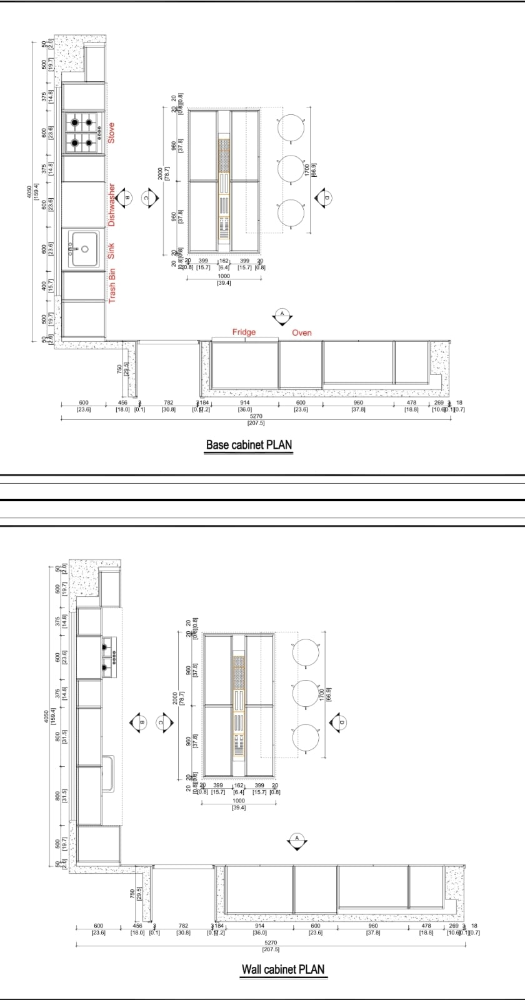
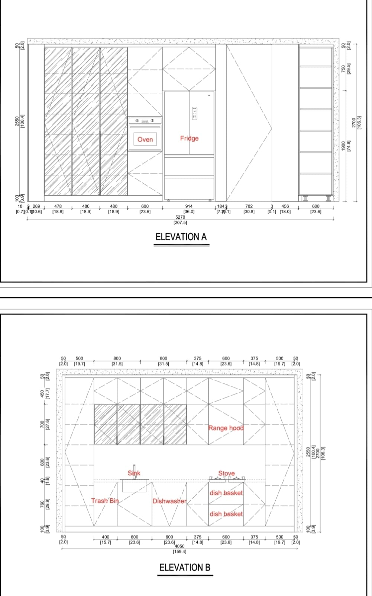
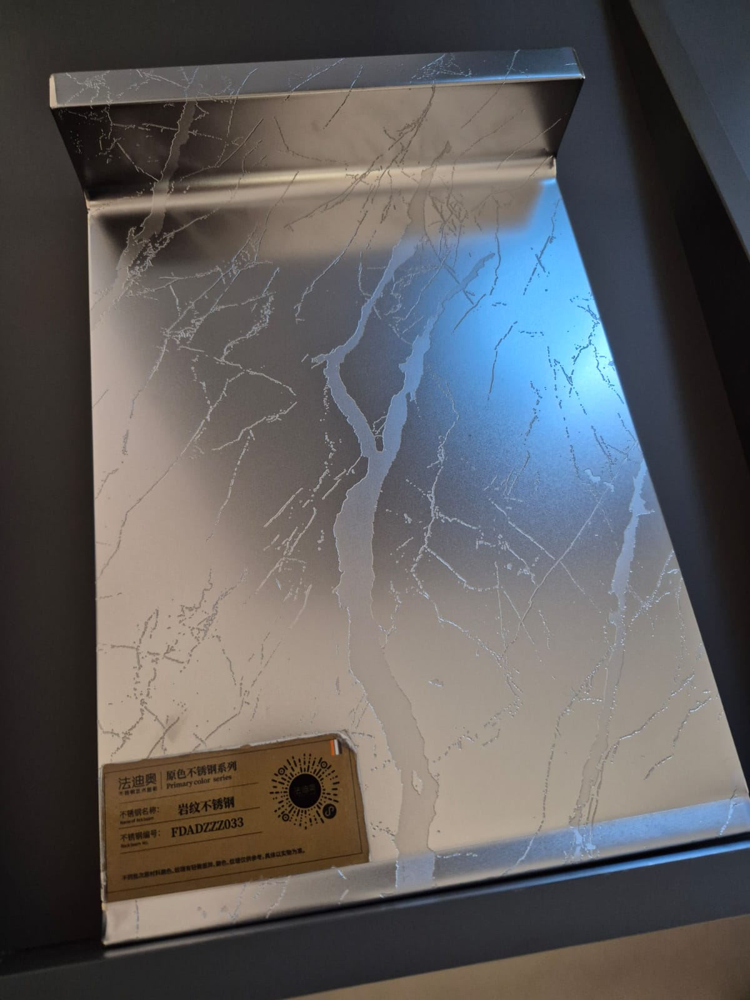
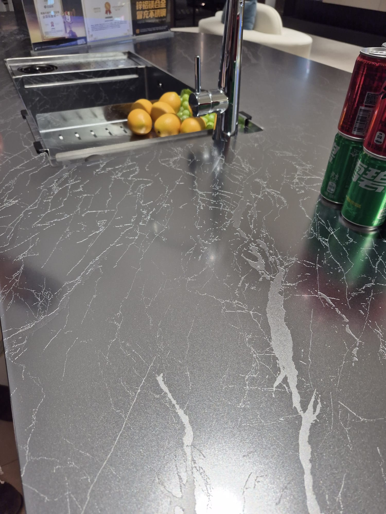
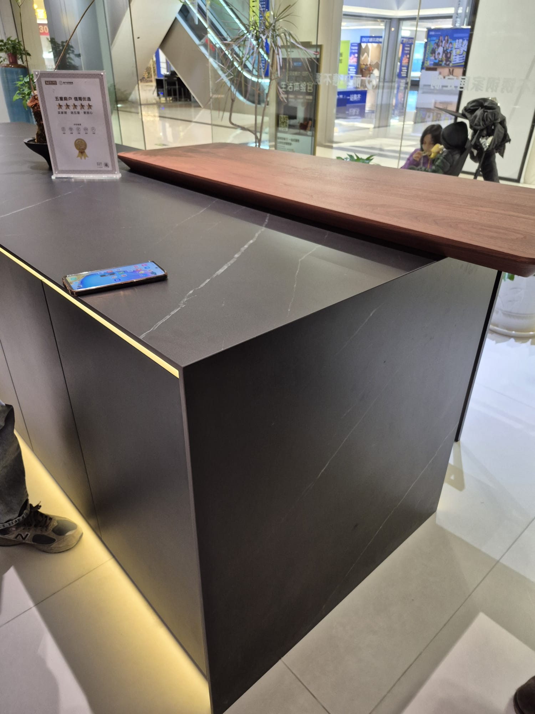
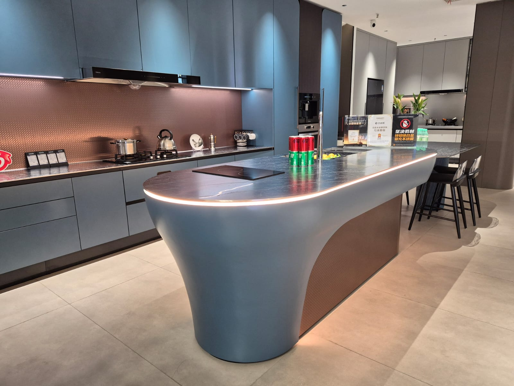

Daniel here. This is probably the single most important article I'll write about sourcing from China because the kitchen is the most expensive and complex item in the whole house. And honestly after visiting two factories in Hangzhou I'm pretty confident we can get something amazing for a fraction of what it would cost locally.

## Why Hangzhou for Kitchens

So on my Shanghai trip I specifically went to Hangzhou for kitchens. The area around Linping has a cluster of kitchen cabinet manufacturers. Getting there is dead easy, from Shanghai Hongqiao station its about 30 minutes by high speed train to Linping. That's it.

The kitchen manufacturers here aren't small operations. The two companies I visited, AisDecor and Refor, each employ 60-70 people. Full factories with CNC machines, edge banding, assembly lines, paint rooms, everything. These aren't workshop guys making cabinets in a garage. It's proper industrial manufacturing.

## AisDecor

AisDecor, officially Hangzhou Aisen Furniture Co., they've been around for over 10 years doing custom kitchens, bathroom cabinets, wardrobes. Located right in Linping. They do everything from design to manufacturing to shipping.

They picked us up from the hotel in Shanghai, drove us to their offices, showed us the factory. The whole process end to end. Raw boards come in, CNC cutting, edge banding, drilling, painting or laminating, assembly, quality check, packing. Super organized.

The design process is what really impressed me though. They have a team doing 2D and 3D renders. Send them your kitchen measurements and they'll have a proposal back in 48 hours. Free. And I'm not talking about a rough sketch. I mean detailed technical drawings with every single measurement, material specification, hardware placement.

## Refor

Refor, officially Hangzhou Refor Furniture Co., has even more experience with overseas clients. Over 15 years exporting to like 15 different countries. They have a 40% reorder rate which tells you something about quality. 5.0 rating on Alibaba.

One interesting thing about Refor is they have their own proprietary material. Not just using standard boards from third parties, they actually developed their own stuff. That's a big deal because it means they control quality from the material level up.

Both companies were incredibly professional. Conference rooms, detailed catalogs, sample rooms with every material option you can think of. And they both invited us for lunch which in Chinese business culture means they're taking you seriously as a client.

## The Design Process - This Blew Me Away

OK so the thing that really got me was the documentation they produce for each client project. I'm talking 100+ page PDFs per project. Every single measurement, every cabinet detail, hardware specifications, countertop edge profiles, sink cutout positions, electrical outlet placements. Everything.

They actually made custom technical drawings for my specific kitchen layout. Here's what that looks like:

Compare this to what you get from a local kitchen supplier in the Philippines. Usually its a rough sketch on paper, maybe some basic measurements, and a prayer that it all fits when they install it. These guys are operating on a completely different level.

They can do flat pack shipping (you assemble on site) or fully assembled shipping. Both options have pros and cons but flat pack saves a ton on shipping volume.

## Countertop Materials

Both suppliers work with all the main countertop materials. Sintered stone, quartz, natural marble, granite, you name it. But both of them specifically recommended sintered stone for tropical climates.

Why sintered stone? It's basically ceramic particles fired at extremely high temperatures. Super hard, doesn't stain, heat resistant, UV resistant, doesn't absorb moisture. Perfect for a Philippine kitchen where humidity is a constant battle.

At Macalline mall I saw some incredible countertop displays. Dark marble patterns with integrated sinks, really high end stuff:

These look like natural marble but they're sintered stone. The veining patterns they can do now are insane. You can't really tell the difference from real marble unless you touch it, and the sintered stone actually performs way better for kitchens.

## Cabinet Materials - Why Acrylic for the Philippines

This is super important for anyone building in a tropical climate. The two big enemies of kitchen cabinets in the Philippines are termites and moisture. Regular MDF or particle board? Termites will eat through it. Solid wood? Moisture warping plus termites. Plywood is better but still not ideal.

Acrylic cabinet fronts and panels are the way to go. Termites cant eat them, moisture doesn't affect them, they clean up easily, and they look modern and sleek. Both factories offer acrylic as a material option and they specifically recommend it for Southeast Asian climates.

The cost difference between acrylic and traditional materials isn't huge when you're already going custom from China. And the longevity difference in a tropical environment is massive.

## What I Saw at Macalline

Before going to the factories I spent time in the Macalline mall kitchens sections. Worth doing just for inspiration even though you shouldn't buy there.

Some of the kitchen islands on display were incredible. I saw these stainless steel ones that were very interesting. And then at the Hangzhou factory showroom there was this curved island that I keep thinking about:

The curved design is something you basically can't get from a standard kitchen supplier in the Philippines. Custom shapes, integrated lighting, waterfall edges, curved panels... the factories can do whatever you design. That's the whole point of going custom from China. You're not limited to standard catalog options.

I'm definitely going to check more kitchen options in Foshan before making final decisions. Want to compare what the Guangzhou area manufacturers offer versus Hangzhou.

## The Turnkey Thing

Both AisDecor and Refor offer full turnkey service. That means:

- You send your kitchen measurements and preferences
- They design the layout with 3D renders
- You approve (or go through revision rounds)
- They manufacture everything
- They pack for shipping (flat pack or assembled)
- They arrange shipping to Philippines
- Some even offer installation coordination

So you're basically getting a full service from design to your door. The 100+ page documentation means your local installer knows EXACTLY where everything goes. No guessing.

## Pricing

I'm not going to give exact numbers because pricing varies wildly depending on materials, size, complexity. And honestly prices change. But I will say that even with international shipping, a custom kitchen from Hangzhou is going to be significantly cheaper than getting the same quality locally in the Philippines. And the quality is honestly not comparable. The Chinese factories are just operating at a different level of precision and finish.

Different material combos put you in different price ranges. Sintered stone countertops with acrylic cabinets is mid-to-upper range. Basic laminate with particle board is budget. They'll quote you for whatever combo you want.

## What's Next for My Kitchen

Not making final decisions yet. Going to Foshan in March 2026 to see what the kitchen manufacturers there offer. Want to compare Hangzhou quality and pricing with Guangzhou area before committing. Both AisDecor and Refor were amazing so the bar is set high.

If you're building in the Philippines and thinking about kitchen options, I'd strongly recommend at least getting quotes from Chinese manufacturers. Send them your floorplan, get a 3D render back, compare with local quotes. The difference might surprise you.

Will update this after the Foshan trip with comparison notes.
