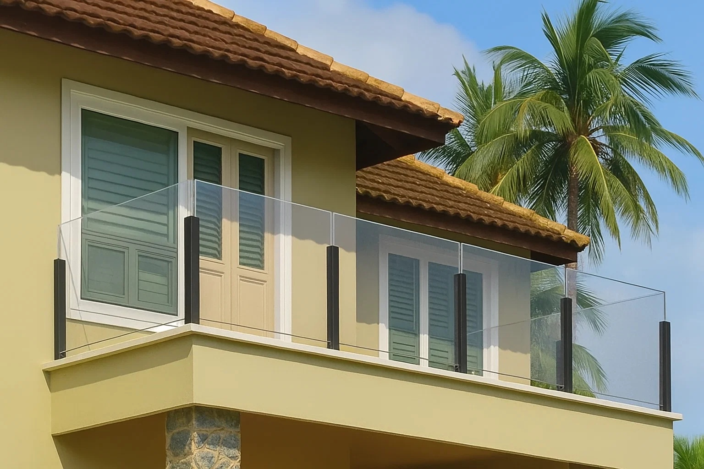
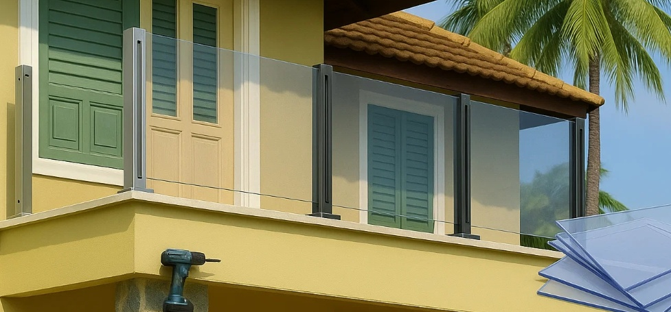

# Polycarbonate Balustrades vs Glass Railings: The Ultimate Philippine Typhoon Protection Guide

You're standing on your coastal balcony in Cebu, watching another typhoon warning scroll across your phone. Your beautiful tempered glass balustrade suddenly feels less like a design feature and more like a liability. One flying coconut at 200 km/h, and you're facing massive replacement costs, if you can even get glass delivered during storm season.

**Here's what nobody tells you:** Polycarbonate balustrades offer **250 times the impact resistance of glass** at comparable initial investment, yet they're unknown in the Philippine residential market. After researching actual typhoon performance data and local supplier networks, I discovered why this material deserves serious consideration for tropical coastal properties.

## Why Tempered Glass Balustrades Fail in Philippine Typhoons

**Tempered glass balustrades are a risky choice for typhoon-prone areas**. Yes, they look nice. Yes, they're the default luxury option. But when Typhoon Odette hit Cebu with 195 km/h winds in 2021, glass panels became projectiles, not protection.

**Recent typhoon damage statistics:**
- **Typhoon Rai (2021):** 90% of coastal glass installations damaged or destroyed
- **Typhoon Haiyan (2013):** Wind speeds reached 315 km/h, turning debris into missiles
- **Insurance claims:** Glass damage represents 45% of typhoon-related structural claims

**The physics problem:** Tempered glass, once compromised, fails catastrophically. A single impact point creates complete panel failure. In typhoon conditions with multiple debris impacts, this means total system failure when you need protection most.

## What is Polycarbonate Balustrade? Understanding Hurricane-Rated Protection

**Why Miami-Dade County approves polycarbonate for hurricane protection:**
- **Impact resistance:** Withstands 9-pound lumber projectiles at 60+ mph
- **Flexibility:** Absorbs impact energy through deformation, not shattering
- **Multi-hit capability:** Maintains integrity after multiple impacts
- **Weight advantage:** 50% lighter than glass, reducing structural loads

### Marine-Grade Polycarbonate Specifications for Philippines

**Minimum requirements for Philippine coastal applications:**
- **Thickness:** 16mm five-wall marine-grade polycarbonate minimum
- **UV protection:** Co-extruded 50+ micrometers (not surface coating)
- **Wind load rating:** 250 kph sustained, 300 kph gusts
- **Impact rating:** Class A per ASTM D256
- **Light transmission:** 80-85% (comparable to glass)

**Critical distinction:** Not all polycarbonate is equal. Garden-variety 6mm twin-wall roofing sheets won't cut it. You need **marine-grade structural panels** specifically engineered for balustrade applications.

## Polycarbonate vs Glass Balustrade Cost Comparison Philippines

### Initial Investment Comparison (Relative Costs)

| Material | Cost vs Basic Glass | Installation Complexity | Hardware Premium | ROI Period |
|----------|-------------------|------------------------|------------------|------------|
| **16mm Marine Polycarbonate** | 60-70% of tempered glass | Standard | Same as glass | 3-5 years |
| **12mm Tempered Glass** | Baseline (100%) | Standard | Baseline | N/A |
| **Laminated Safety Glass** | 130-170% of tempered | Complex | 20% premium | Never in typhoon zones |

### 20-Year Total Ownership Cost Analysis

**Polycarbonate balustrade system:**
- Initial investment: 35% less than tempered glass
- Maintenance costs: 60% higher (UV protection)
- Replacement frequency: Once at 12 years
- **Total ownership: 45% less than glass systems**

**Tempered glass balustrade system:**
- Initial investment: Baseline
- Maintenance costs: Minimal
- Typhoon replacements: Average 2-3 complete replacements
- **Total ownership: 180% of polycarbonate systems**

**The hidden savings:** Insurance premiums drop 15-25% with impact-resistant materials in typhoon zones. Factor in avoided injury liability from shattered glass, and polycarbonate's value proposition strengthens further.

## Philippine Building Code Requirements for Balustrades

**PD 1096 National Building Code requirements:**
- **Height:** 1.0 meter minimum above floor level
- **Load capacity:** 100 kg horizontal force at any point
- **Gaps:** Maximum 100mm between balusters
- **Top rail:** Continuous, graspable profile

**NSCP 2015 wind load specifications for coastal areas:**
- **Basic wind speed:** 200-250 kph depending on zone
- **Importance factor:** 1.15 for residential
- **Exposure category:** D (coastal, unobstructed)
- **Design pressure:** 2.4-3.2 kPa depending on height

**The regulatory gap:** Philippine codes don't specifically address polycarbonate balustrades. Professional engineer certification demonstrating equivalent performance to glass systems is required. Most LGUs accept this with proper documentation.

## Where to Buy Polycarbonate Sheets for Balustrades in Philippines

### Established Philippine Polycarbonate Suppliers

**SEA Olympus Marketing Inc. (Mandaue City, Cebu)**
- **Stock availability:** Sunshield brand 16mm panels
- **Lead time:** 5-7 days for standard sizes
- **Coverage:** Visayas region
- **Technical support:** On-site consultation available

**Polylite Industrial Corporation (National)**
- **Product line:** Lexan Thermoclear Plus (Sabic)
- **Marine certification:** Available on request
- **Custom fabrication:** CNC cutting services
- **Provincial delivery:** 7-10 days nationwide

**Wilcon Depot (Multiple Locations)**
- **Limited options:** Basic twin-wall only
- **Not recommended:** Lacks marine-grade specifications
- **Use case:** Temporary installations only

### Import Options for Premium Polycarbonate Systems

**Direct importers offering German/Israeli panels:**
- **Lead time:** 45-60 days
- **Minimum order:** 100 square meters
- **Cost premium:** 40-60% above local options
- **Warranty:** 10-15 years versus 5-7 years local

## How to Install Polycarbonate Balustrade Systems

### Structural Framework Options for Coastal Philippines

**Marine-grade stainless steel (316L) posts:**
- **Dimensions:** 50x50mm minimum, 3mm wall thickness
- **Spacing:** 1.2m maximum centers
- **Anchoring:** Chemical anchors with 150mm embedment
- **Cost vs mild steel:** 280% premium but zero corrosion

**Alternative aluminum framework:**
- **Alloy:** 6063-T5 minimum specification
- **Surface treatment:** 25-micron anodizing plus fluorocarbon
- **Cost savings:** 65% of stainless steel
- **Maintenance:** Annual cleaning, 10-year recoating

### Critical Polycarbonate Installation Details

**Thermal expansion management:**
- **Expansion gaps:** 6-8mm per meter length mandatory
- **Oversized holes:** 2mm larger than fastener diameter
- **Flexible gaskets:** EPDM or silicone, UV-resistant
- **Mounting system:** Float-mount essential, never rigid

**Edge sealing requirements:**
- **Exposed edges:** Aluminum H-channel or U-channel
- **Sealant type:** Neutral-cure silicone only
- **Drainage:** Weep holes every 600mm
- **Anti-rattle:** Rubber bumpers at all contact points

## Polycarbonate Balustrade Maintenance Guide

### Regular Maintenance Schedule for Tropical Climate

**Monthly tasks (5 minutes):**
- Fresh water rinse removing salt spray
- Visual inspection for impact damage
- Check for debris accumulation

**Quarterly tasks (30 minutes):**
- Mild detergent wash (never use ammonia)
- Fastener tightness verification
- Drainage channel clearing

**Annual tasks (2 hours):**
- Deep clean with specialized plastic cleaner
- UV protectant application (Novus or equivalent)
- Complete hardware inspection and lubrication

### Glass Balustrade Maintenance Comparison

**Weekly during typhoon season:**
- Stress crack inspection (safety critical)
- Immediate replacement of damaged panels

**Post-typhoon requirements:**
- Professional structural inspection mandatory
- Potential complete system replacement

## UV Resistance and Lifespan of Polycarbonate in Philippines

**Degradation timeline in tropical conditions:**

**Years 0-5:** No visible change with marine-grade panels

**Years 5-8:** Slight hazing, 5-10% light transmission reduction

**Years 8-12:** Yellowing begins at stress points

**Years 12-15:** Aesthetic replacement recommended

**Extending polycarbonate lifespan:**
- **UV film application:** Adds 3-5 years service life
- **Orientation optimization:** North-facing lasts 30% longer
- **Quality differential:** German panels outlast Chinese by 5-7 years

## Common Polycarbonate Installation Mistakes

### Specification Errors to Avoid

**Using roofing-grade instead of balustrade panels:**
- Roofing: 6-10mm twin-wall, basic UV
- Structural: 16mm+ multi-wall, co-extruded UV
- **Cost difference:** Only 20-30% more for proper spec

**Clear vs tinted polycarbonate selection:**
- Clear shows scratches and yellowing
- Bronze tint hides aging, reduces glare
- Solar heat gain reduction: 40% with tinting

### Installation Mistakes That Cause Failure

**Critical errors:**
- Drilling without pilot holes causes cracking
- Over-tightening creates stress failure points
- Missing expansion gaps causes heat buckling
- Wrong cleaners cause immediate clouding

## Polycarbonate Performance in Marine Environments

### Salt Spray Exposure Zones Philippines

**Zone 1 (Beachfront to 500m):**
- Extreme salt exposure
- Daily washing mandatory
- 316L stainless required
- 10-year polycarbonate life

**Zone 2 (500m to 5km):**
- High salt exposure
- Weekly washing minimum
- 316 stainless acceptable
- 12-15 year polycarbonate life

**Zone 3 (Beyond 5km):**
- Moderate exposure
- Monthly washing sufficient
- Aluminum framework viable
- 15-20 year polycarbonate life

### Regional Weather Considerations

**Amihan season (November-May):**
- Northeast winds, less salt inland
- Reduced maintenance frequency

**Habagat season (June-October):**
- Southwest winds carry salt 50km inland
- Increased washing essential
- Typhoon preparation critical

## Professional Installation vs DIY Polycarbonate Balustrades

### Experienced Contractors in Philippines

**Specialized installers:**
- Glass contractors can typically handle polycarbonate
- Requires detailed specification sheets
- Supervision critical during installation
- Budget 20% extra for learning curve

### DIY Installation Feasibility

**Required tools:**
- Fine-tooth circular saw
- Step drill bits
- Silicone application guns
- Complete safety equipment

**Skill requirements:** Intermediate to advanced

**Time estimate:** 2-3 days per 10 linear meters

**Risk factors:** Thermal expansion miscalculation

## Design Options for Polycarbonate Balustrade Systems

### Premium Aesthetic Enhancements

**Frame finishing options:**
- Brushed stainless with hidden fasteners
- Black anodized aluminum modern style
- Wood-grain aluminum traditional look

**Panel enhancement treatments:**
- Frosted sections for privacy zones
- Custom printed graphics available
- LED edge lighting integration

### Hybrid Balustrade Systems

**Polycarbonate with cable railings:**
- Impact protection plus openness
- 30% cost reduction versus full panels
- Maintains critical view corridors

**Lower polycarbonate, upper glass:**
- Protection where most needed
- Premium appearance maintained
- Insurance benefits retained

## Future Trends in Impact-Resistant Balustrades

### Emerging Polycarbonate Technologies

**Next-generation materials:**
- Self-healing surface technology
- Photochromic auto-tinting panels
- Nano-coating UV protection
- Anti-microbial surfaces

### Climate Change Implications

**Typhoon intensification projections:**
- 15% stronger winds by 2040
- 30% more Category 4-5 storms
- Glass specifications becoming obsolete

**Polycarbonate advantages increasing:**
- Multi-hit capability essential
- Flexibility handles movement
- Lower replacement costs critical

## Making the Right Choice: Polycarbonate vs Glass Balustrades

**Choose polycarbonate balustrades when:**
- Typhoon resistance is top priority
- Property within 5km of coastline
- Safety for children and elderly crucial
- Insurance cost reduction important
- 10-12 year replacement acceptable

**Stay with tempered glass when:**
- Aesthetics override all concerns
- Location is sheltered inland
- Budget allows storm replacements
- Comprehensive insurance coverage
- Temporary installation planned

## Frequently Asked Questions

### Is polycarbonate balustrade legal in Philippines?
Yes, with proper engineering certification. The material meets all PD 1096 load requirements when properly specified and installed.

### How long does polycarbonate last in Philippine climate?
Marine-grade panels with co-extruded UV protection last 10-15 years in coastal areas, 15-20 years inland before aesthetic replacement is needed.

### Can polycarbonate balustrades break?
They can crack under extreme impact but won't shatter into dangerous shards like glass. The material deforms to absorb energy rather than failing catastrophically.

### What thickness polycarbonate for balcony railing?
Minimum 16mm five-wall construction for structural balustrade applications. Never use roofing-grade 6-10mm sheets for safety barriers.

### Does polycarbonate yellow in the sun?
Quality marine-grade panels with co-extruded UV protection show minimal yellowing for 8-10 years. Budget panels yellow within 3-5 years.

## Conclusion: Why Polycarbonate Makes Sense for Philippine Properties

Polycarbonate balustrades represent the smart choice for 80% of Philippine coastal properties. While not the prettiest option initially, they're the most practical for our challenging climate. When the next Category 5 typhoon makes landfall, you'll appreciate panels that bend but don't break.

Stop defaulting to glass just because "that's what everyone does." In typhoon country, impact resistance isn't a luxury, it's survival. At 35% less total cost than tempered glass over 20 years, polycarbonate deserves serious consideration for your next balustrade project.
