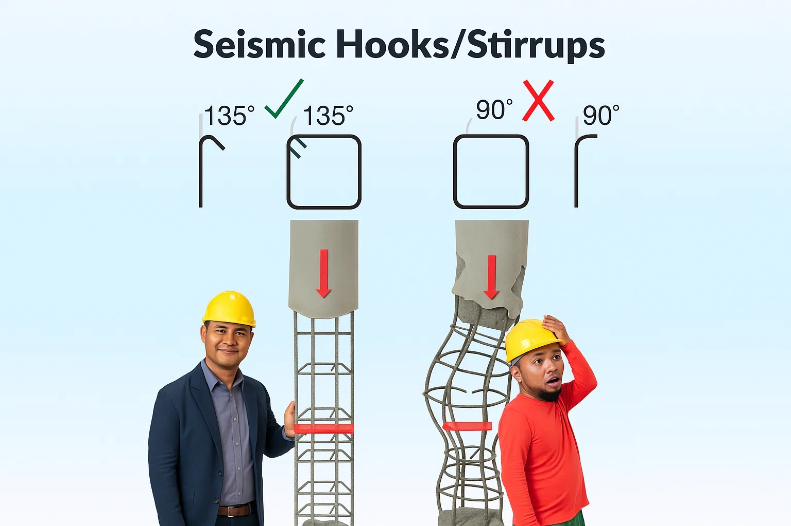

# Rebar and Stirrups Inspection: Essential Quality Control for Cebu Villa Footings

You're at the construction site of your villa in Cebu, and the workers have just finished placing the steel reinforcement for your footings. The foreman assures you everything is "okay lang," but with your family's safety and investment at stake in this seismic zone, how do you actually verify the reinforcement meets standards?

**Critical fact:** The Philippines sits in Seismic Zone 4, making proper reinforcement detailing not just important but life-critical. Poor rebar installation has been identified as a primary failure factor in 56% of structural collapses during earthquakes. This guide provides specific, actionable inspection criteria based on the [National Structural Code of the Philippines (NSCP 2015)](https://www.asep.org.ph/nscp-2015/) and proven field practices.

## What You Must Verify: Size, Spacing, and Quality Checklist

### 1. Rebar Size Verification

**Standard sizes for residential footings:**
- **Main reinforcement:** 12mm to 16mm diameter deformed bars (never plain/smooth)
- **Column dowels:** Match column vertical bars (typically 16-20mm)
- **Stirrups/ties:** Minimum 10mm diameter, 12mm for larger columns

**How to verify:**
- Use calipers or a rebar gauge to measure actual diameter
- Check bar markings against structural plans
- Verify Grade 415 (60 ksi) designation for structural members

**Red flag:** Substitution of 10mm bars where 12mm specified reduces strength by 30%. This is a serious violation requiring immediate correction.

### 2. Critical Spacing Requirements

**NSCP-mandated spacing (Section 407):**
- **Clear spacing between bars:** Minimum 1 bar diameter or 25mm, whichever is larger
- **Maximum spacing:** 3 times footing thickness or 450mm, whichever is less
- **Typical residential footing:** 150-200mm center-to-center spacing

**Field verification method:**
1. Count bars across footing width
2. Measure 3-5 representative gaps
3. Calculate: A 2m footing with bars @200mm should have 10 bars
4. Tolerance: ±10mm is acceptable, larger deviations require correction

**Example from Cebu practice:** A 2.2m × 2.2m × 0.4m thick footing typically uses 16mm bars @150mm spacing, providing reinforcement ratio >0.0018 (code minimum).

## Concrete Cover: The 75mm Rule

**NSCP requirements for footings cast against earth:**
- **Bottom cover:** 75mm minimum (3 inches)
- **Side cover (against soil):** 75mm minimum
- **Top cover (if exposed):** 50mm minimum

**How to check cover:**
1. Measure from excavation bottom to bottom steel
2. Verify concrete spacers ("dobies") are present every 1-1.5m
3. Check spacers are concrete (not bricks or stones)
4. Ensure steel cage doesn't touch soil anywhere

**Common violation:** Rebar placed directly on soil with inadequate spacers. This causes premature corrosion and must be corrected before pouring.

## Seismic Detailing: Non-Negotiable Requirements

### Column-to-Footing Connection

**Mandatory in Seismic Zone 4 (Cebu):**
- **Column dowels:** Must have 90° standard hooks extending to footing bottom
- **Hook extension:** 12 × bar diameter past the bend
- **Orientation:** Hooks turn inward, overlapping with footing mat

**Verification steps:**
1. Check every column bar has a hook (not just straight dowels)
2. Measure hook tail length (e.g., 16mm bar needs 192mm tail)
3. Confirm hooks reach near footing bottom
4. Verify hooks are tied to footing bottom mat

### Stirrup/Tie Requirements

**For columns at footing interface:**
- **First tie location:** Within 50mm of footing top
- **Seismic hooks:** 135° bends with 6db extension (not 90°)
- **Spacing at base:** 100mm for first 600mm height (plastic hinge zone)
- **Tie diameter:** Minimum 10mm for columns with bars ≤25mm

**Inspection checklist:**
- [ ] All ties have 135° seismic hooks
- [ ] Hook tails extend 6 × bar diameter minimum
- [ ] Ties completely enclose column bars
- [ ] No welding used for assembly (unless engineer-approved)

## Material Quality Red Flags

### Acceptable vs Reject Conditions

**ACCEPTABLE:**
- Light brown surface rust (improves bond)
- Mill scale present
- Deformed bar pattern clearly visible
- No reduction in cross-section

**REJECT/CLEAN:**
- Flaking rust with pitting
- Oil, grease, or paint coating
- Mud or clay contamination
- Visible diameter reduction
- Heat damage from bending

**Field test:** Wire-brush a sample area – if base metal is sound and dimensions within ASTM tolerances, bar is acceptable.

## Common Problems and Solutions

### 1. Insufficient Lap Splices

**NSCP requirement:** Minimum 40 × bar diameter for tension laps
- 16mm bar needs 640mm lap minimum
- All laps must be tightly tied
- Stagger laps (not all at same location)

**If found short:** Reject and replace bars – welding extensions requires special approval and testing.

### 2. Missing or Improper Hooks

**Problem:** 90° hooks instead of 135° seismic hooks on stirrups
**Solution:** Rebend on-site if possible, replace if material is compromised

**Problem:** Hook tails too short (<6db)
**Solution:** Cannot be fixed – replace stirrups

### 3. Cage Movement Risk

**Prevention measures:**
- Minimum 6-8 spacers for 2m × 2m footing
- Tie every alternate intersection minimum
- All perimeter intersections tied
- Temporary bracing during pour

### 4. Unauthorized Field Modifications

**Never allow without engineer approval:**
- Bar size substitutions
- Spacing changes
- Elimination of bars
- Welding of crossing bars
- Heat-assisted bending

## Pre-Pour Inspection Protocol

### Step-by-Step Verification

**1. Document Review (before site visit):**
- [ ] Structural plans with rebar schedule
- [ ] NSCP requirements for seismic zone
- [ ] Mill certificates for steel grade

**2. Size and Quantity Check:**
- [ ] Measure bar diameters with caliper
- [ ] Count bars in each direction
- [ ] Verify against rebar schedule

**3. Layout Verification:**
- [ ] Spacing measurements (5+ locations)
- [ ] Column dowel positions (±25mm tolerance)
- [ ] Mat alignment with footing edges

**4. Cover Confirmation:**
- [ ] Bottom cover 75mm minimum
- [ ] Side covers adequate
- [ ] Sufficient spacers installed

**5. Connection Details:**
- [ ] Column hooks properly formed
- [ ] Stirrup hooks 135° for seismic
- [ ] All laps meet length requirements

**6. Material Quality:**
- [ ] No excessive rust or contamination
- [ ] All bars are deformed type
- [ ] No heat damage or improper bends

**7. Stability Check:**
- [ ] Cage doesn't shift when touched
- [ ] Adequate ties at intersections
- [ ] Spacers secure and won't dislodge

## When to Stop Work

**Immediately halt concrete pouring if:**
- Wrong bar sizes discovered
- Missing reinforcement
- Cover less than code minimum
- Contaminated bars (oil/mud)
- Cage unstable or shifting
- Seismic details missing

**Remember:** Once concrete is poured, reinforcement errors cannot be corrected. The cost of delay is minimal compared to structural failure or expensive retrofitting.

## Cost of Getting It Wrong

**Real consequences of poor reinforcement:**
- **Structural failure:** Collapse risk during earthquakes
- **Durability issues:** Corrosion starts in 3-5 years vs 50+ year design life
- **Legal liability:** Non-compliance with NSCP voids insurance
- **Repair costs:** Foundation retrofit costs 10-20× initial construction

**Investment in proper inspection:**
- Professional inspector: ₱5,000-10,000 per day
- Rebar corrections before pour: ₱10,000-50,000
- Foundation failure repair: ₱1,000,000+

## Key Takeaways

**For homeowners:**
1. Demand NSCP compliance documentation
2. Hire independent inspector for critical pours
3. Take photos of reinforcement before concrete
4. Keep inspection reports for insurance/resale

**For contractors:**
1. Never substitute materials without approval
2. Maintain 75mm cover religiously
3. Use 135° seismic hooks in all stirrups
4. Document compliance with photos

**For inspectors:**
1. Bring measuring tools and NSCP references
2. Check every critical dimension
3. Document non-compliance in writing
4. Never approve substandard work under pressure

## Additional Resources

- [National Structural Code of the Philippines 2015](https://www.asep.org.ph/nscp-2015/)
- [ACI 318 Building Code Requirements](https://www.concrete.org/store/productdetail.aspx?ItemID=318U19)
- [Association of Structural Engineers of the Philippines](https://www.asep.org.ph/)
- [Philippine Institute of Civil Engineers](https://pice.org.ph/)

## Conclusion

Proper reinforcement inspection isn't just bureaucracy – it's the difference between a foundation that protects your family for generations and one that fails when tested by nature. In Seismic Zone 4, every hook, every spacing, and every millimeter of cover matters.

The few hours spent verifying reinforcement before concrete placement is the most important quality control investment in your entire project. Use this guide, demand compliance, and document everything. Your future self will thank you when the next earthquake hits and your home stands strong.

**Remember:** In construction, what you can't see matters most. Make sure it's right before it disappears forever into concrete.