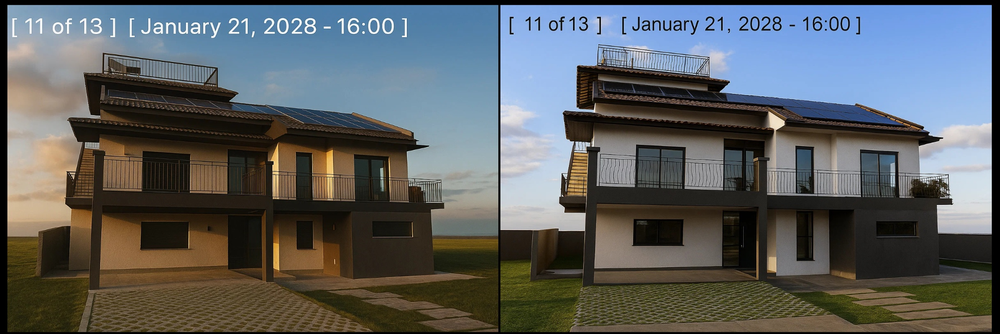

# Using Sun Simulation Videos to Choose the Right Window Glass - LOW-E, Thermal Break, and Tinting Decisions

Your architect hands you a 3D sun simulation video showing shadows dancing across your future home throughout the day and seasons. It looks impressive, but how do you actually use this data to make smart decisions about LOW-E coatings, thermal breaks, and glass tinting? Most homeowners get these expensive simulations, nod appreciatively, then still guess on window specifications.

**Bottom line upfront:** Sun simulation videos reveal the precise solar gain patterns that determine which windows need premium LOW-E coatings, where thermal breaks matter most, and whether tinting is worth the cost. Used correctly, these simulations can save you ₱100,000-300,000 in unnecessary upgrades while ensuring comfort where it matters.

Here's how to translate pretty animations into practical window specifications that work.

## The Sun Study Video: Your Data-Rich Design Tool

<video width="100%" controls>
  <source src="sun-simulation.mp4" type="video/mp4"/>
  Your browser does not support the video tag.
</video>

*3D sun simulation showing seasonal shadow patterns and solar exposure analysis throughout different times of day and year*

The video above demonstrates a comprehensive sun study analysis showing:
- **Front and back elevations** with seasonal sun position changes
- **Summer vs winter sun angles** affecting different window orientations  
- **Daily shadow progression** from sunrise to sunset
- **Thermal load visualization** indicating peak solar gain periods

Your architect's simulation captures four key seasonal scenarios: front view summer sun, back view summer sun, front view winter sun, and back view winter sun. Each scenario reveals critical data for window specification decisions.

## What Your Sun Simulation Actually Shows

Your architect's 3D model tracks the sun's path across your building envelope, showing exact shadow patterns, direct solar exposure, and thermal loads on each surface. But the key insights aren't obvious from just watching the video.

**Critical data points in the simulation:**
- **Direct solar exposure hours** per window orientation
- **Seasonal variation** in sun angles and intensity  
- **Shadow protection** from overhangs, neighboring buildings, landscaping
- **Thermal load timing** - when each window receives maximum heat gain
- **Glare patterns** throughout different times of day

**What the video reveals that specifications must address:**
- West-facing windows getting hammered by afternoon sun (need maximum LOW-E protection)
- North windows with minimal direct exposure (standard glass acceptable)
- East windows with morning sun but afternoon shade (moderate LOW-E sufficient)
- South windows with seasonal variation (thermal break critical for year-round comfort)

The simulation shows you where to invest in premium glass technologies and where standard specifications work fine.

## Decoding Solar Exposure Patterns for Glass Selection

### High Solar Gain Windows → Maximum Protection Required

**Identification markers in the video:**
- Direct sunlight for 6+ hours daily
- Bright white/yellow coloring in sun path analysis
- Minimal shadow protection from overhangs
- West and southwest orientations in tropical climates

**Required specifications:**
- **LOW-E coating:** Mandatory, preferably double LOW-E
- **Glass configuration:** Triple glazing with wide spacer (19A minimum)
- **Thermal break:** Essential for preventing heat transfer
- **Tinting consideration:** Light tinting for glare control without blocking views

**Example from simulation:** West-facing living room windows showing direct exposure from 1 PM to sunset need maximum protection to prevent overheating and furniture fading.

### Moderate Solar Gain Windows → Balanced Approach

**Identification markers:**
- 3-6 hours direct sunlight with some shade periods
- Mixed shadow patterns throughout the day
- East and southeast orientations typically
- Some overhang protection visible

**Optimized specifications:**
- **LOW-E coating:** Standard single LOW-E adequate
- **Glass configuration:** Double glazing with 12A spacer acceptable
- **Thermal break:** Recommended for year-round comfort
- **Tinting:** Usually unnecessary, save the cost

### Low Solar Gain Windows → Standard Specifications Sufficient

**Identification markers:**
- Mostly shaded throughout the day
- North-facing orientations
- Significant overhang or building protection
- Cool colors in thermal analysis

**Cost-effective specifications:**
- **LOW-E coating:** Optional, consider for consistency
- **Glass configuration:** Standard double glazing
- **Thermal break:** Nice to have but not critical
- **Tinting:** Not needed, focus budget elsewhere

## Seasonal Analysis: Summer vs Winter Implications

### Summer Pattern Analysis (April-October Philippines)

**High sun angle characteristics:**
- Overhangs provide better protection
- East/west windows receive most direct exposure
- North windows stay relatively protected
- South windows get some direct morning/afternoon sun

**Window specification priorities:**
- **West windows:** Maximum LOW-E protection essential
- **East windows:** Moderate LOW-E for morning comfort
- **South windows:** Thermal break prevents afternoon heat buildup
- **North windows:** Standard specifications usually adequate

### Winter Pattern Analysis (November-March Philippines)

**Lower sun angle characteristics:**
- Reduced overhang effectiveness
- South windows receive more direct exposure
- East/west patterns remain significant
- Longer shadow periods on north elevations

**Specification adjustments needed:**
- **South windows:** Upgrade LOW-E for additional winter sun
- **East/west:** Maintain high protection levels
- **North windows:** Standard specifications still work

### Year-Round Decision Framework

**Consistent high exposure (both seasons):** Premium specifications mandatory
**Seasonal variation:** Balance protection with cost-effectiveness
**Consistently protected:** Save money with standard specifications

## Thermal Break Analysis: When It Actually Matters

Your simulation shows not just solar gain but thermal bridging potential through window frames. This data determines where thermal breaks provide real value versus unnecessary cost.

### High Thermal Load Conditions → Thermal Break Essential

**Simulation indicators:**
- Frame temperatures exceeding glass temperatures
- Continuous direct exposure for 4+ hours
- Air conditioning zones requiring consistent temperatures
- Humid climate condensation risk areas

**Thermal break specifications:**
- **Material:** Polyamide strips minimum 14mm width
- **Application:** All frame members, not just horizontal
- **Quality:** Verify with thermal imaging if possible
- **Integration:** Must work with chosen LOW-E system

### Moderate Thermal Conditions → Cost-Benefit Analysis

**Consider thermal breaks when:**
- Frames show moderate temperature elevation
- Comfort sensitive areas (bedrooms, offices)
- Future AC installation planned
- Premium aesthetic requirements

### Low Thermal Impact → Standard Frames Acceptable

**Skip thermal breaks when:**
- Minimal frame heating visible in simulation
- Natural ventilation primary cooling strategy
- Budget constraints require prioritization
- Consistent shade protection throughout day

## LOW-E Coating Selection Based on Simulation Data

### Double LOW-E for Maximum Protection

**Required when simulation shows:**
- Direct exposure exceeding 6 hours daily
- High thermal loads on multiple orientations
- Critical spaces requiring temperature control
- Furniture/flooring protection needs

**Specifications:**
- **Position:** Surface 2 and surface 5 (in triple glazing)
- **Type:** Silver-based for maximum performance
- **Light transmission:** 70%+ for adequate daylighting
- **Solar heat gain coefficient:** 0.30 or lower

### Single LOW-E for Balanced Performance

**Appropriate when simulation indicates:**
- Moderate exposure with some protection
- Standard comfort requirements
- Good overhang design reducing peak loads
- Cost-effectiveness priority

**Specifications:**
- **Position:** Surface 3 (inner pane of double glazing)
- **Performance:** SHGC 0.40-0.60 range
- **Light transmission:** 75-80% typical
- **Cost savings:** 30-40% versus double LOW-E

### Standard Glass for Protected Areas

**Acceptable when simulation confirms:**
- Consistent shade throughout day
- Minimal thermal loading
- Non-critical spaces (storage, mechanical)
- Maximum budget efficiency needed

## Tinting Decisions: Glare vs Views vs Cost

### When Tinting Makes Sense

**Simulation-based indicators:**
- Bright glare periods visible in analysis
- Direct sun on computer/TV viewing areas
- Consistent high exposure despite LOW-E protection
- Privacy requirements for ground floor windows

**Tinting specifications:**
- **Light tinting:** 15-25% reduction for glare control
- **Neutral colors:** Avoid blue/green tints that distort views
- **Quality grades:** Ceramic tints for durability
- **Integration:** Works with LOW-E coatings

### When to Skip Tinting

**Avoid tinting when:**
- Good overhang protection shown in simulation
- LOW-E coating handles thermal loads adequately
- Natural lighting important for space function
- Views are primary window purpose

## Practical Application: Room-by-Room Analysis

### Living Areas (High Priority)

**Use simulation to identify:**
- Peak exposure times for seating areas
- Glare patterns on TV/computer locations
- Furniture placement relative to sun patterns
- Thermal comfort requirements

**Specification strategy:**
- Premium LOW-E where family spends most time
- Thermal breaks for consistent comfort
- Light tinting only if glare analysis confirms need

### Bedrooms (Comfort Focused)

**Simulation analysis for:**
- Morning sun wake-up patterns
- Afternoon overheating potential
- Privacy requirements
- Sleep quality impacts

**Balancing approach:**
- Moderate LOW-E for comfort without over-darkening
- Thermal breaks if AC planned
- Consider blackout treatments vs tinting

### Kitchen/Dining (Heat Management)

**Critical simulation data:**
- Cooking area thermal loads
- Morning breakfast lighting
- Evening dining ambiance
- Food storage area temperature control

**Specification priorities:**
- Focus on actual cooking area exposure
- Standard glass for dining if protected
- Thermal breaks where combining with cooking heat

### Service Areas (Cost Optimization)

**Simulation shows:**
- Utility room exposure patterns
- Storage area thermal requirements
- Stairwell lighting needs
- Bathroom privacy/ventilation integration

**Budget approach:**
- Standard specifications unless extreme exposure
- Focus premium upgrades on occupied spaces

## Common Mistakes in Simulation Analysis

### Over-Engineering Based on Peak Conditions

**Problem:** Specifying maximum protection for brief peak exposures
**Solution:** Analyze typical daily patterns, not worst-case scenarios
**Cost impact:** Unnecessary premium upgrades costing ₱50,000-150,000

### Ignoring Microclimate Factors

**Problem:** Not accounting for landscaping, neighboring buildings, local weather
**Solution:** Verify simulation assumptions against site conditions
**Reality check:** Existing trees, future construction, seasonal vegetation

### Uniform Specifications Across All Windows

**Problem:** Using same glass specifications for all orientations
**Solution:** Customize based on each window's specific exposure pattern
**Savings opportunity:** Standard glass for protected windows saves 30-40%

### Forgetting Future Changes

**Problem:** Not considering landscape maturity, adjacent development
**Solution:** Plan for 10-20 year evolution of site conditions
**Example:** Shade trees growing, neighboring construction blocking views

## Cost-Effectiveness Framework

### High-Impact Investments (Best ROI)

1. **LOW-E on west-facing windows:** Immediate comfort improvement
2. **Thermal breaks in AC zones:** Energy savings plus comfort
3. **Premium glass in living areas:** Daily quality of life impact

### Medium-Impact Investments (Consider Carefully)

1. **Uniform LOW-E throughout:** Aesthetic consistency vs cost
2. **Tinting for glare control:** Comfort vs view quality trade-off
3. **Triple glazing upgrades:** Performance vs budget limitations

### Low-Impact Investments (Usually Skip)

1. **Premium glass on protected windows:** Minimal benefit
2. **Tinting without glare issues:** Unnecessary view restriction
3. **Thermal breaks in naturally ventilated areas:** Limited value

## Integration with Philippine Climate Considerations

### Humidity Management

**Simulation insight:** Windows with thermal bridging risk condensation
**Solution:** Thermal breaks prevent frame cooling below dew point
**Critical areas:** Air-conditioned spaces with high outdoor humidity

### Typhoon Season Preparation

**Simulation shows:** Solar loads during typhoon season (different angles)
**Specification impact:** Thermal performance during extended indoor periods
**Backup considerations:** Generator-powered AC efficiency with better glass

### Monsoon Considerations

**Wet season patterns:** Reduced solar gain, increased humidity challenges
**Dry season impacts:** Maximum solar exposure, critical glass performance
**Year-round balance:** Specifications must work in both extremes

## The Implementation Strategy

### Phase 1: Simulation Analysis (Week 1)

- Review video with architect for orientation-specific exposure data
- Identify high/medium/low solar gain windows
- Note seasonal variations and thermal bridge risks
- Document glare patterns for major living spaces

### Phase 2: Specification Development (Week 2)

- Match window technologies to exposure levels
- Prepare budget for different specification tiers
- Get quotes for standard vs premium options
- Verify supplier availability for chosen specifications

### Phase 3: Optimization and Purchasing (Week 3-4)

- Balance performance needs with budget constraints
- Prioritize upgrades for highest-impact windows
- Coordinate with contractor for proper installation
- Schedule delivery to match construction timeline

## Real-World Validation

**Post-installation monitoring:**
- Compare actual performance to simulation predictions
- Document comfort levels throughout different seasons
- Measure energy consumption patterns
- Note any unexpected glare or thermal issues

**Typical accuracy:** Well-calibrated simulations predict reality within 10-15%
**Common discrepancies:** Landscaping changes, actual vs specified glass installation
**Optimization opportunities:** Learn for future projects or additions

## The Bottom Line

Sun simulation videos provide the precise data needed to optimize window specifications, but only if you know how to interpret the results. **Focus premium upgrades on windows with genuine high solar loads** while using standard specifications for protected areas.

**The smart approach:**
1. **Analyze exposure patterns** by orientation and season
2. **Prioritize specifications** based on actual thermal loads
3. **Balance performance with budget** using simulation data
4. **Customize by room function** and comfort requirements

**Typical savings from simulation-based optimization:** ₱100,000-300,000 versus uniform premium specifications across all windows, while achieving better actual performance through targeted upgrades.

Your simulation video isn't just a pretty marketing tool, it's a precise engineering analysis that can guide smart investment decisions. Use it to put premium glass technologies exactly where they provide maximum benefit, and standard specifications where they're adequate.

The result: optimal comfort, energy efficiency, and cost-effectiveness based on your specific building's solar exposure patterns rather than generic recommendations.
