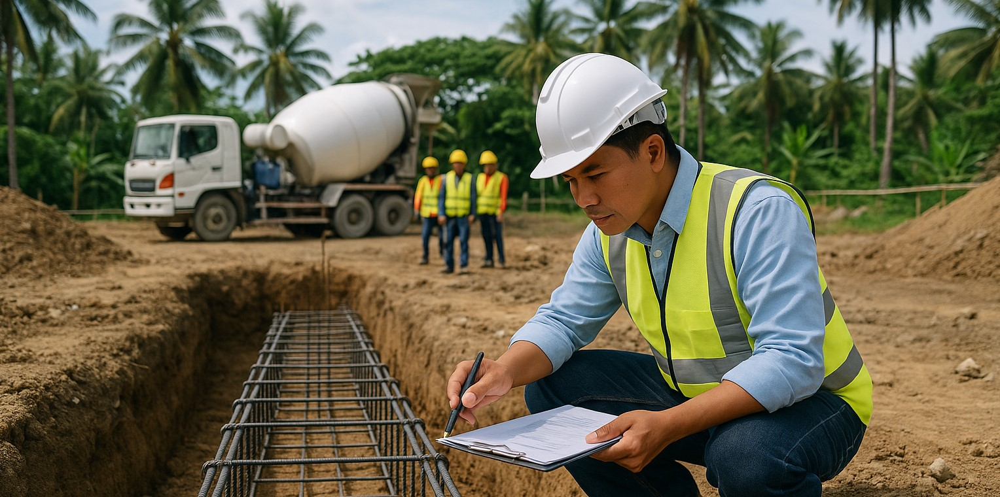

When you're standing at a construction site watching workers dig into Philippine soil, you know that what happens next will determine whether that building stands for decades or becomes a costly failure. Spread footing foundations might look straightforward, but they're where most foundation problems start—and where smart supervision saves both money and lives.

After years of seeing what goes wrong when nobody's watching the details, I've learned that supervising spread footing construction isn't just about checking boxes. It's about knowing what to look for when the concrete truck arrives, when the rebar goes in, and especially when things don't go according to plan.

## Pre-Excavation: Setting the Stage for Success

Before any soil gets moved, your first job is verifying that everyone's working from the same playbook. I've seen too many projects where the excavation crew had different dimensions than the structural drawings, leading to expensive corrections later.

**Site Layout Verification**
Walk the layout with your surveyor and mark every footing location. In the Philippines' variable soil conditions, even a few centimeters off can mean the difference between hitting good bearing soil and ending up in a soft spot. Use spray paint to mark not just the corners, but also the centerlines—this helps the excavation crew stay oriented even when the stakes get moved.

**Soil Testing Coordination**
Schedule your geotechnical engineer to be on-site during excavation. I can't stress this enough: the soil report from six months ago might not match what you'll find when you dig. Monsoon seasons, nearby construction, and even changes in groundwater can alter soil conditions significantly.

**Utility Clearance**
Before any excavation begins, verify that all utilities have been marked and cleared. Philippine construction sites often have unmarked water lines, electrical conduits, or septic systems that aren't on the drawings. A damaged utility line can shut down your project for days and cost thousands in repairs.

## Excavation Phase: Reading the Ground

The excavation phase reveals the truth about your site conditions. This is where your supervision skills really matter, because what you find in the ground determines everything that follows.

**Excavation Depth and Dimensions**
Every footing must reach the specified depth, but more importantly, it must reach competent bearing material. In areas with limestone soil (common in many Philippine locations), you might encounter cavities or very soft zones that require special attention. Don't accept "close enough" when it comes to depth—undersized footings can't be fixed easily once concrete is poured.

Mark your tape measure at key depths before starting. I use colored tape at 90cm, 100cm, and 110cm to quickly verify that we're hitting the minimum 1-meter depth required by Philippine building codes.

**Soil Bearing Verification**
When your excavation reaches design depth, examine the soil carefully. Competent bearing soil should feel firm underfoot and show consistent color and texture. Red flags include:
- Sudden changes in soil color (indicating different layers)
- Wet or spongy areas (potential water infiltration)
- Obvious organic matter (leaves, roots, or dark soil)
- Rock cavities or loose stones (especially in limestone areas)

If you find questionable bearing material, stop excavation and call your geotechnical engineer. It's far cheaper to extend a footing deeper or add soil improvement now than to deal with settlement problems later.

**Water Management**
Philippine construction happens during rainy seasons, and water in excavations is a common challenge. Establish drainage procedures before you need them. Pumping water out just before concrete placement isn't enough—the soil must be stable and properly drained.

For excavations that consistently collect water, consider installing temporary drainage systems or scheduling concrete pours for dry periods. Wet soil conditions can reduce bearing capacity significantly.

## Formwork: Building the Boundaries

Formwork for spread footings seems simple, but poor formwork leads to geometric problems that affect everything built above.

**Dimensional Accuracy**
Measure formwork dimensions multiple times during setup. Focus on:
- Overall length and width (tolerance: ±6mm)
- Squareness (diagonal measurements should be equal)
- Level (especially important for stepped footings)
- Alignment with column centerlines

**Stability and Bracing**
Philippine weather can change quickly, and wind or rain can shift poorly braced formwork. Secure all forms with adequate stakes and bracing, especially for larger footings. I've seen crews skip bracing to save time, only to have forms shift during concrete placement, creating footings with one corner 10cm out of position.

**Form Release and Cleanup**
Apply form release agent to prevent concrete from bonding to the forms, but be careful not to get release agent on areas where reinforcement will be placed. Clean forms of debris, standing water, or loose soil just before concrete placement.

## Reinforcement: The Steel Skeleton

Reinforcement placement is where quality control becomes critical. Unlike concrete problems that you might catch during placement, reinforcement errors are usually hidden until it's too late to fix them economically.

**Bar Placement and Spacing**
Verify that reinforcement matches the structural drawings exactly. Common errors include:
- Wrong bar sizes (16mm bars instead of 20mm bars)
- Incorrect spacing (200mm centers instead of 150mm)
- Missing corner bars or inadequate lap splices
- Improper hook development lengths

Use a simple gauge made from rebar scraps to quickly check spacing. For 150mm spacing, cut a 150mm piece of rebar and use it as a measuring stick.

**Concrete Cover Requirements**
In Philippine construction, proper concrete cover is essential for durability, especially in coastal areas. The minimum 75mm cover for foundations isn't just a suggestion—it's what protects the steel from corrosion in our humid climate.

Use plastic spacers or concrete dobies to maintain cover, not wooden blocks or stones. I carry a small ruler specifically for checking cover distances, and I check both bottom and side cover at multiple locations around each footing.

**Development Length and Hooks**
Column dowels extending from footings must have adequate development length into the footing and proper hooks at the bottom. For Grade 60 steel in 21 MPa concrete, development length is typically 40 bar diameters. A 20mm bar needs at least 800mm of embedment into the footing.

Verify that hooks are oriented correctly—typically 90° hooks pointing toward the center of the footing. Hooks pointing outward can interfere with concrete placement and don't provide proper anchorage.

## Concrete Placement: Getting It Right the First Time

Concrete placement is your moment of truth. Everything you've supervised up to this point comes together during the few hours when concrete goes from truck to finished footing.

**Pre-Placement Inspection**
Before the first concrete truck arrives, do a final walkthrough:
- Formwork secure and properly aligned
- Reinforcement positioned and tied properly
- Excavation clean and at proper bearing level
- All utilities marked and protected
- Concrete pump or buggy paths clear

Document this inspection with photos—they're invaluable if questions arise later.

**Concrete Quality Control**
Philippine concrete quality can vary significantly between suppliers and even between batches from the same supplier. Don't assume the concrete meets specifications just because it's from a reputable supplier.

**Slump Testing**
Test slump on every load, especially the first few. For footing concrete, slump should typically be 75-100mm. Higher slump might indicate excess water, which reduces strength. Lower slump makes placement difficult and can lead to honeycomb or voids.

**Temperature Considerations**
Philippine heat affects concrete significantly. During hot weather (above 32°C), take extra precautions:
- Schedule pours for early morning or late afternoon
- Consider using chilled water or ice in the mix
- Have shade and misting equipment ready
- Plan for faster initial set times

**Placement Technique**
Place concrete in layers, especially for deep footings. Don't dump entire loads in one spot—this can displace reinforcement and create segregation. Use mechanical vibration to consolidate concrete around reinforcement, but don't over-vibrate as this can cause segregation.

Watch for signs of reinforcement displacement during placement. If bars move out of position, stop placement and reposition them before continuing.

## Quality Control During Construction

Effective supervision means catching problems early when they're still fixable. Develop inspection routines that cover critical aspects at each stage.

**Documentation Standards**
Keep detailed records of:
- Soil conditions encountered vs. design assumptions
- Any changes to excavation depth or dimensions
- Reinforcement placement verification
- Concrete test results (slump, cylinders taken)
- Weather conditions during placement
- Any problems encountered and corrections made

Digital photos with timestamps are extremely valuable. Take photos of:
- Excavated bearing surface before reinforcement
- Reinforcement placement before concrete
- Concrete placement process
- Finished surface before curing

**Testing and Sampling**
Follow a consistent testing schedule:
- Soil bearing tests (if specified by geotechnical engineer)
- Concrete cylinder samples (minimum 1 set per 50 cubic meters)
- Slump tests on every load
- Air content tests (if specified)

Label all samples clearly with date, time, location, and truck number. Poor sample tracking can invalidate test results.

**Communication Protocols**
Establish clear communication with:
- Structural engineer (for any design questions)
- Geotechnical engineer (for soil condition issues)
- Concrete supplier (for mix design questions)
- General contractor (for scheduling coordination)

Don't wait for weekly meetings to report problems. Critical issues should be communicated immediately.

## Common Problems and Solutions

After supervising hundreds of footings, certain problems come up repeatedly. Knowing what to watch for helps prevent these issues.

**Soft Spots in Bearing Surface**
**Problem**: Excavation reveals soft or questionable soil in part of the footing area.
**Solution**: Don't try to "work around" soft spots. Options include:
- Excavating deeper to reach competent soil
- Using controlled low-strength material (CLSM) to replace soft material
- Widening the footing to reduce bearing pressure
- Installing stone columns or other ground improvement

**Water in Excavations**
**Problem**: Persistent water accumulation affecting soil stability.
**Solutions**:
- Install wellpoint dewatering system
- Schedule concrete placement during dry periods
- Use rapid-set concrete for underwater placement (if approved by engineer)
- Install temporary drainage and allow soil to drain before placement

**Reinforcement Displacement**
**Problem**: Bars shift during concrete placement, ending up with inadequate cover or wrong position.
**Prevention**:
- Use adequate ties and spacers
- Place concrete in controlled lifts
- Assign someone specifically to watch reinforcement during placement
- Stop placement immediately if displacement occurs

**Concrete Segregation**
**Problem**: Rock and sand separate, creating weak areas.
**Prevention**:
- Control drop height (maximum 1.5 meters)
- Use proper vibration techniques
- Maintain proper slump
- Place concrete in controlled layers

## Post-Placement Activities

Your supervision responsibilities don't end when the concrete truck leaves. Proper curing and protection are essential for achieving design strength.

**Initial Curing**
In Philippine heat and humidity, concrete loses water rapidly from the surface. Begin curing measures within 30 minutes of finishing:
- Cover with wet burlap or curing compound
- Provide shade from direct sunlight
- Protect from rain (especially first 24 hours)
- Maintain moisture for minimum 7 days (preferably 14 days)

**Strip Time and Early Loading**
Don't remove formwork too early, especially in hot weather where concrete may seem hard but hasn't gained sufficient strength. Minimum strip times:
- Normal weather: 12-24 hours
- Hot weather (above 35°C): 24-48 hours
- Cool weather (below 20°C): 48-72 hours

Protect footings from construction traffic and equipment loads until concrete reaches sufficient strength (typically 7 days minimum).

**Final Inspection and Documentation**
Before covering footings with backfill or moving to the next construction phase:
- Verify final dimensions and elevations
- Check for any surface defects requiring repair
- Confirm column dowel positions and projections
- Document any as-built conditions that differ from drawings
- Take final photos for project records

## Special Considerations for Philippine Construction

Philippine construction conditions present unique challenges that affect footing supervision strategies.

**Monsoon Season Construction**
During rainy season, adjust supervision practices:
- Schedule concrete placement around weather forecasts
- Have temporary covers ready for unexpected rain
- Allow extra time for excavation dewatering
- Consider using rapid-hardening concrete mixes
- Plan material deliveries to avoid delays due to flooding

**Coastal Area Considerations**
For projects near coastlines:
- Specify marine-grade concrete mixes
- Use epoxy-coated or stainless steel reinforcement
- Increase concrete cover requirements
- Plan for higher groundwater levels
- Consider corrosion monitoring systems for critical structures

**Remote Site Challenges**
For projects in remote areas:
- Plan concrete deliveries carefully (limited truck access)
- Have backup plans for equipment breakdowns
- Stock adequate materials on-site
- Train local workers in quality control procedures
- Establish communication protocols for engineering support

## Conclusion

Supervising spread footing construction successfully comes down to preparation, attention to detail, and knowing when to stop work to address problems. Every shortcut taken during foundation construction will cost far more to fix later than doing it right the first time.

The key is developing systematic inspection routines and sticking to them, even when schedules are tight or weather is challenging. Your role as supervisor is to be the advocate for quality construction—the person who ensures that what gets built matches what was designed.

Remember that foundations are permanent. Once concrete is placed and the structure is built above, fixing foundation problems becomes extremely expensive and disruptive. The time and effort you invest in careful supervision during construction pays dividends for the entire life of the building.

Good supervision isn't about being the "construction police"—it's about being the experienced professional who helps the construction team deliver quality work that everyone can be proud of.