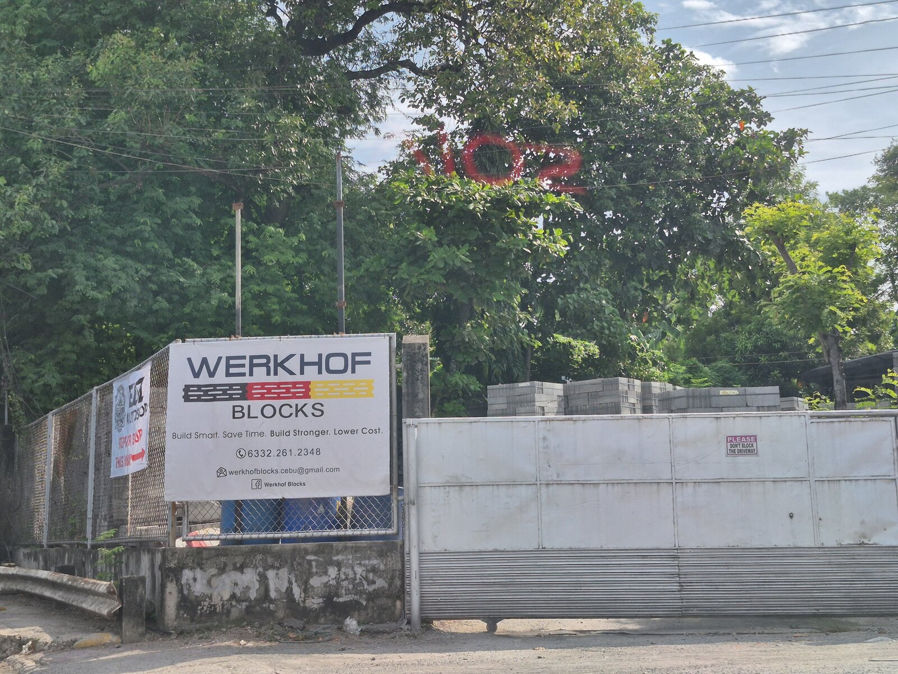
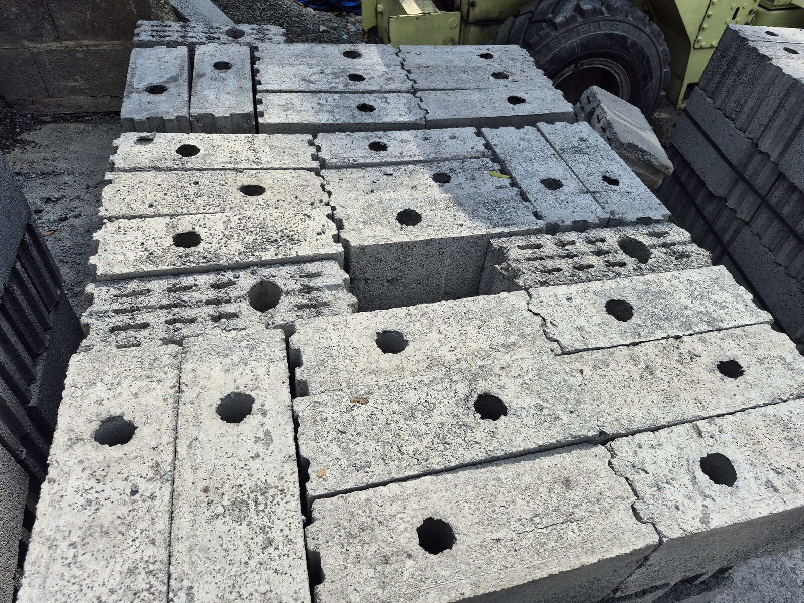
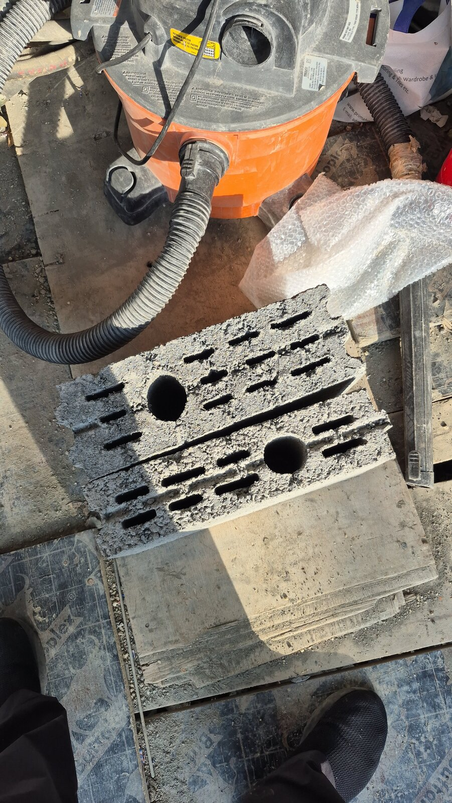

# Werkhof Blocks vs 700 PSI and Regular Hollow Blocks in Cebu

I was looking again at wall materials for our house in Cebu, and my architect suggested I take a closer look at Werkhof Blocks.

At first I thought this was mostly a question of block strength. Werkhof advertises more than 2,100 psi, a good CHB can be specified at 700 psi, and cheap traditional hollow blocks can be much weaker.

After looking into it more, I think that is the wrong way to compare them.

The bigger difference is the complete wall system: how much grout goes inside the wall, how much rebar is needed, how thick the plaster is, how much the finished wall weighs, how easy it is to install correctly, and what happens when electricians and plumbers start cutting it.

There is no obvious winner for me yet.

## What is a Werkhof block?

Werkhof is a Cebu-based concrete masonry system. Their two basic blocks are:

| Product | Size |
|---|---:|
| WRK100 | 225 × 100 × 400 mm |
| WRK140 | 225 × 140 × 400 mm |

The blocks use tongue-and-groove vertical joints. The manufacturer says the blocks are over 2,100 psi and are made from high-density concrete.

The internal shape is quite different from a normal CHB. Werkhof has one core intended for the vertical reinforcing bar and additional narrow slots. According to Werkhof, only the reinforced core normally needs to be grouted while the other slots stay hollow.

That is important because the hollow slots reduce grout use and wall weight, while also leaving air spaces inside the wall.

Werkhof also uses thin-bed adhesive between courses instead of the relatively thick mortar joints normally used with CHB.

Source: [Werkhof Blocks product system](https://www.werkhofblocks.com/products)

## The first thing I would not do: compare 2,100 psi directly with 700 psi

Werkhof advertises its blocks as more than 2,100 psi and describes them as around three times stronger than typical CHB.

Mathematically, 2,100 is three times 700. Structurally, the comparison is not automatically that simple.

The Philippines changed its concrete masonry standards. DTI-BPS adopted PNS ASTM C90 for loadbearing concrete masonry units, PNS ASTM C129 for non-loadbearing units, and PNS ASTM C140/C140M for testing. These replaced the old PNS 16:1984 standard.

Mandatory certification for loadbearing CMUs under the current regulation started in July 2023.

At the same time, 700 psi is still commonly written into Philippine project specifications. This makes the number confusing because two suppliers can quote a PSI value using different product classes or test methods.

For any block I am considering, including Werkhof, I would ask for the current laboratory test report and the exact standard used for the test. I would also ask for the current BPS product certification documents.

I would not accept only "700 psi" or "2,100 psi" written on a quotation.

Sources:

- [DTI-BPS adoption of international standards on masonry units](https://bps.dti.gov.ph/index.php/press-releases/23-2019/183-dti-bps-adopts-international-standards-on-masonry-units)
- [DTI-BPS mandatory certification for loadbearing CMUs](https://bps.dti.gov.ph/component/content/article?Itemid=111&id=303)

## The part my architect pointed out: the grout core

This is probably the most interesting advantage of the Werkhof design.

With a normal reinforced CHB wall, grout consumption depends heavily on the structural detail. Some specifications require every cell to be filled. Other designs only require the cells containing reinforcing bars to be filled.

Werkhof is designed around a smaller dedicated reinforcing core while the other internal slots stay hollow.

That means you can potentially use much less grout per square meter of wall.

My architect's point was that if the grout volume is much smaller, spending more on a stronger grout mix is not necessarily expensive. For example, using a properly designed 3,500 psi grout around the reinforcing bars may still use less concrete material overall than filling large CHB cavities with a lower-strength mix.

There is one important correction here: I would specify this as **masonry grout**, not just "3,500 psi concrete."

Masonry grout needs to flow through a relatively small core and completely surround the rebar. ASTM C476 masonry grout has a minimum 28-day compressive strength of 2,000 psi, and higher specified strengths are allowed when required by the engineer. A 3,500 psi grout is therefore perfectly realistic, but the mix, aggregate size, slump and installation method still need to be designed for the actual Werkhof core.

Putting a stiff 3,500 psi structural concrete mix into a narrow masonry core is not automatically better.

Also, a 2,100 psi block plus 3,500 psi grout does not create a "5,600 psi wall." The engineer designs the masonry assembly as a system.

Source: [Concrete Masonry & Hardscapes Association masonry grout requirements](https://www.cmha.org/resource/tek-09-04a/)

## Leaving the other slots hollow

Werkhof specifically says the non-reinforced slots are intended to remain hollow.

There are three possible benefits.

First is weight. Less grout means less dead load on the structure. In an earthquake-prone country, reducing non-structural wall mass can be useful because a lighter wall generates less inertial force when the building moves.

Second is thermal performance. Air spaces reduce direct solid-concrete paths through the wall. Werkhof says this helps reduce heat transfer.

Third is material cost because you are not buying cement, sand and aggregate simply to fill cavities that the structural design does not require.

I would still be careful with the insulation claim. I could not find a published independent R-value or thermal-conductivity test for the Werkhof wall system. The air-gap idea makes sense physically, but I would not publish a specific energy-saving percentage without test data.

The comparison also depends on the CHB design. A fully grouted CHB wall will normally be heavier and have fewer insulating air spaces than a partially grouted CHB wall.

## Weight is more complicated than the marketing number

Werkhof says its wall can be **up to 250 kg per square meter lighter than a 6-inch CHB wall**.

That sounds excellent, especially for a multi-storey house, but I would not use that figure in structural calculations yet.

I could not find the individual WRK100 and WRK140 block weights or the exact CHB wall build-up used for that comparison on the current public product pages.

Was the comparison against fully grouted 6-inch CHB? Did it include plaster on both sides? What rebar spacing was assumed?

Those details can change the result a lot.

Before deciding, I would ask Werkhof for these four numbers:

| Wall system | Weight I want from the supplier |
|---|---|
| WRK100, unreinforced finish | kg/m² |
| WRK100 with specified rebar and grout | kg/m² |
| WRK140, unreinforced finish | kg/m² |
| WRK140 with specified rebar and grout | kg/m² |

Then I would compare those with the exact CHB wall in my structural drawings.

Source: [Werkhof Blocks](https://www.werkhofblocks.com/)

## Fewer blocks per square meter

There is another small difference that is easy to miss.

A typical CHB has a nominal face of around 200 × 400 mm. That works out to about **12.5 blocks per square meter** before waste.

Werkhof uses a 225 × 400 mm face, which works out to about **11.1 blocks per square meter**.

So even before considering the tongue-and-groove system, roughly 11% fewer individual blocks are needed for the same wall area.

This is also why comparing only the price per block can be misleading.

## Cutting and chasing: normal CHB is simpler

This is one area where traditional CHB has an advantage.

Every mason in Cebu knows how to cut, chip and modify normal hollow blocks. If an electrical outlet moves or a plumbing route changes, nobody needs special training.

Werkhof is much denser.

That is good for strength and for fixing windows, cabinets and other items directly to the wall, but it also means you do not casually attack it with a chisel.

Werkhof recommends a diamond cutting wheel or pipe chaser. The idea is to cut through the outer concrete wafer until the internal slot is reached, then use that slot as the chase.

So I would describe Werkhof as **harder to modify with normal hand tools, but designed to be easy with the correct cutting tools**.

This matters on a real construction site because MEP changes happen all the time.

## Their site support is a real advantage

One thing I like about Werkhof is that they do not appear to just drop the blocks at the site and disappear.

Their website says they provide on-site training, stone splitters and stone cutting tools for customers, service the tools, and continue visiting the project during construction. They say their staff normally visit at least once a week until the masonry work is completed.

For a different wall system, that support has real value.

A technically good product can perform badly when a crew installs it like ordinary CHB. Having the supplier train the masons and check the first walls reduces that risk.

This also helps with the biggest disadvantage of Werkhof: your workers probably have much less experience with it than with CHB.

Source: [Werkhof Blocks installation features and site support](https://www.werkhofblocks.com/features)

## Plaster and finishing

Traditional CHB normally needs relatively thick plaster to correct uneven blocks, mortar joints and walls that are not perfectly straight.

Werkhof says its blocks are manufactured to tighter dimensions and that finished walls normally need only a thin render or skim coat of around 2 to 5 mm.

If that works on the actual project, this can save a surprising amount of cement, sand and labor.

It can also reduce another annoying problem: thick plaster hiding a bad wall.

I would still build a test wall first. A manufacturer can produce a very accurate block, but the final wall is only as straight as the crew installing it.

Source: [Werkhof Blocks installation and finishing features](https://www.werkhofblocks.com/features)

## What about price?

This is where I cannot give a perfect Cebu comparison yet.

Werkhof does not publish a current per-piece price list on its website. Their own marketing says the **finished wall system** can cost up to 30% less than CHB because it uses less mortar, less rebar, less plaster and less labor.

That is a manufacturer claim, not a price guarantee.

For normal CHB, I found current 2026 Philippine market ranges from AEDO Engineering:

| CHB | Factory/bulk | Hardware retail |
|---|---:|---:|
| 4-inch | ₱13–15/pc | ₱18–24/pc |
| 6-inch | ₱19–23/pc | ₱22–30/pc |

For a 6-inch wall at 12.5 blocks per square meter, that is roughly **₱238–288/m² in blocks when buying bulk**, or **₱275–375/m² at retail**, before grout, mortar, rebar, plaster, labor and delivery.

Source: [AEDO Engineering 2026 CHB prices](https://aedoconstruction.com/blog/chb-hollow-blocks-price-philippines-2026/)

I also found a strength-specific Philippine price list for 700 psi CHB, but it was published in 2024 and is based on Metro Manila prices, not Cebu:

| 700 psi CHB | Published price |
|---|---:|
| 4-inch | ₱29/pc |
| 5-inch | ₱30/pc |
| 6-inch | ₱33/pc |
| 8-inch | ₱38/pc |

At ₱33 each, a 6-inch 700 psi wall is about **₱413/m² in blocks alone** before the other wall materials.

I would not use those numbers as a 2026 Cebu quotation. They are useful only to show that a tested higher-strength CHB can cost noticeably more than an ordinary commodity block.

Source: [Construct PH strength-specific CHB prices](https://constructph.com/concrete-hollow-blocks-chb-construction-material-philippines-prices/)

For Werkhof, the useful number is:

**Werkhof block price × about 11.1 blocks/m²**

But I would not stop there.

The correct comparison is finished cost per square meter.

## The comparison I actually want from the contractor

I would ask for two quotations for the same 10 or 20 m² sample wall.

One would use the Werkhof system. The other would use the exact 700 psi or certified CHB system proposed for the house.

Both quotations should include:

- Blocks
- Rebar
- Grout
- Mortar or thin-bed adhesive
- Plaster or skim coat
- Labor
- Cutting and chasing
- Waste
- Delivery

Then compare the finished wall, not the price of one block.

That is the only comparison that matters to me.

## Werkhof vs 700 psi CHB vs normal CHB

| Item | Werkhof | 700 psi CHB | Ordinary commodity CHB |
|---|---|---|---|
| Advertised / specified strength | >2,100 psi manufacturer claim | 700 psi specification | Varies; do not assume |
| Typical block face | 225 × 400 mm | About 200 × 400 mm | About 200 × 400 mm |
| Blocks per m² | ~11.1 | ~12.5 | ~12.5 |
| Vertical joints | Tongue and groove | Mortar | Mortar |
| Bed joint | Thin adhesive | Conventional mortar | Conventional mortar |
| Grout use | One reinforced core; slots normally hollow | Depends on engineer's detail | Depends on engineer's detail |
| Thermal air gaps | Yes, when slots remain hollow | Possible if cells remain hollow | Possible if cells remain hollow |
| Plaster | Manufacturer says thin render/skim coat | Normally plastered | Normally plastered |
| Cutting | Diamond wheel/pipe chaser preferred | Easy with common masonry tools | Easy with common masonry tools |
| Worker familiarity | Lower | Very high | Very high |
| Supplier support | Strong local training/tool support | Depends on supplier | Usually little |
| Availability | Mainly supplier system | Very easy to source | Everywhere |
| Block price | Quote required | Higher than commodity CHB | Usually cheapest |
| Finished wall price | Could be competitive due to lower labor/material use | Predictable but grout/plaster add cost | Cheap blocks can become expensive if quality is poor |

## Where I think Werkhof makes sense

Werkhof becomes interesting when the goal is not simply to buy the cheapest block.

I can see it making sense for a multi-storey house where wall weight matters, where I want straighter walls with less plaster, and where a smaller amount of properly designed grout can be concentrated around the reinforcement.

Their Cebu presence is also important. The company can train the workers, inspect the work and provide the cutting equipment.

That reduces some of the risk of using a less familiar system.

## Where I still prefer conventional CHB

Good CHB has one massive advantage: everybody knows it.

Materials are available almost anywhere. Any experienced mason can work with it. Future renovations are easy. If I need twenty extra blocks tomorrow, I am not dependent on one proprietary supplier.

A properly tested and reinforced CHB wall is also a proven system. There is nothing wrong with CHB simply because it is old technology.

The problem is bad CHB.

Cheap blocks with unknown strength, poor curing and inconsistent dimensions can save money when they arrive at the site and then lose it again through breakage, thick plaster, more labor and repairs.

## My current conclusion

I am not ready to say Werkhof is better than a good 700 psi or standards-compliant CHB wall.

I also would not dismiss it as an expensive special block.

The design solves some real problems with Philippine masonry: inconsistent block dimensions, heavy plaster, large grout volumes, wall weight and poor site workmanship.

The part I find most convincing is actually not the 2,100 psi number. It is the combination of a strong dense block, a small reinforced grout core, hollow slots, thin finishing and supplier support.

The main disadvantages are dependence on a specific supplier, less familiarity among workers, and the need for proper diamond cutting tools when modifying the wall.

Before choosing, I want three things from Werkhof:

1. A current quotation for WRK100 and WRK140 delivered to the project.
2. Current third-party compressive-strength and product-certification documents.
3. A wall-system calculation showing kg/m² and grout consumption for the exact rebar layout my structural engineer approves.

Then I can compare it against a certified CHB wall on **finished cost per square meter, finished weight per square meter and actual construction time**.

That should give a much more useful answer than simply asking whether 2,100 psi is better than 700 psi.

## Sources

- [Werkhof Blocks — Product system](https://www.werkhofblocks.com/products)
- [Werkhof Blocks — Features, installation and site support](https://www.werkhofblocks.com/features)
- [Werkhof Blocks — Strength, weight and cost claims](https://www.werkhofblocks.com/)
- [DTI-BPS — Philippine masonry standards](https://bps.dti.gov.ph/index.php/press-releases/23-2019/183-dti-bps-adopts-international-standards-on-masonry-units)
- [DTI-BPS — Mandatory certification for loadbearing CMUs](https://bps.dti.gov.ph/component/content/article?Itemid=111&id=303)
- [Concrete Masonry & Hardscapes Association — Masonry grout requirements](https://www.cmha.org/resource/tek-09-04a/)
- [AEDO Engineering — 2026 CHB prices](https://aedoconstruction.com/blog/chb-hollow-blocks-price-philippines-2026/)
- [Construct PH — Published strength-specific CHB prices](https://constructph.com/concrete-hollow-blocks-chb-construction-material-philippines-prices/)
