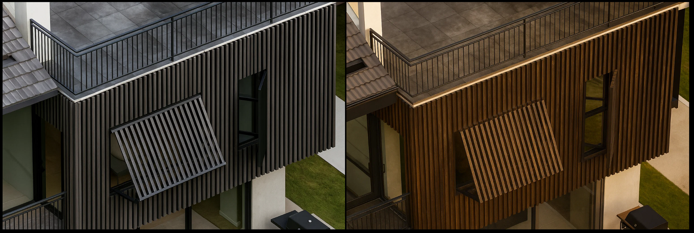
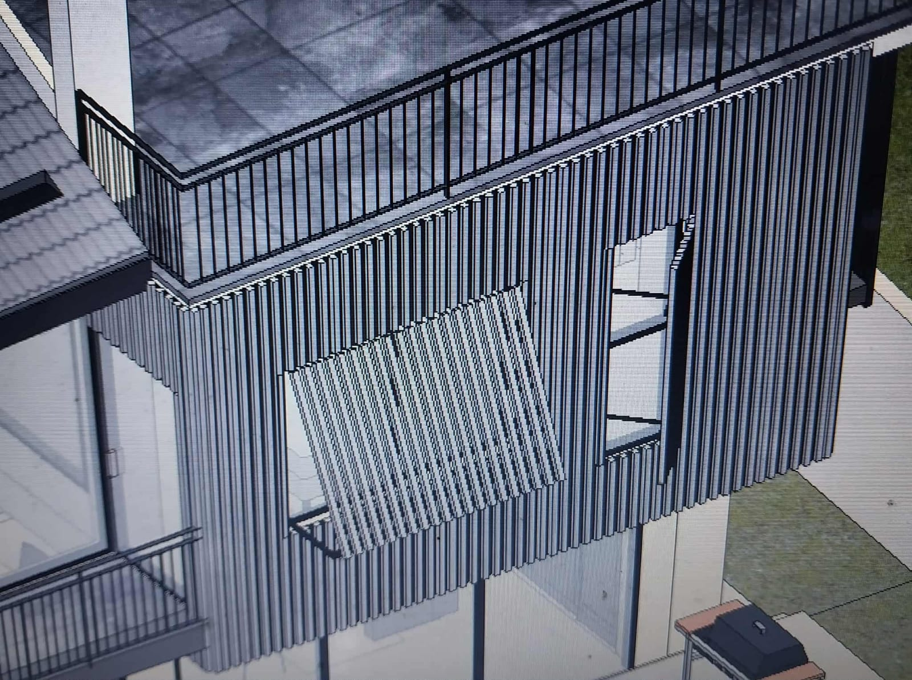
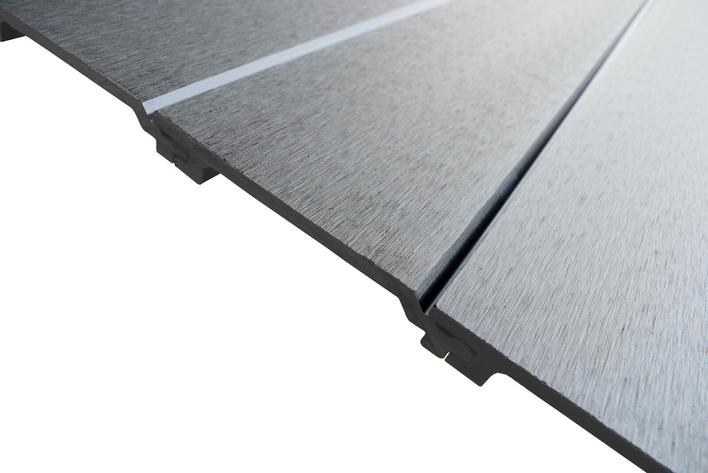
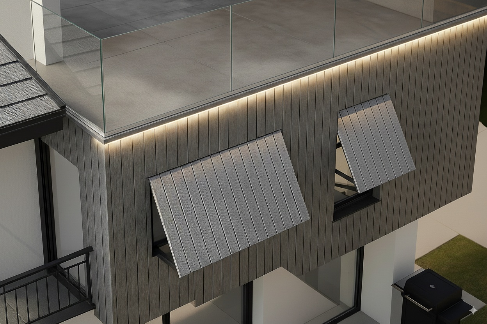

Your windows are the weakest point when Typhoon Odette-class storms hit at 250+ kph. Standard plywood boards become projectiles, while aluminum shutters cost a lot per window and still fail from impact damage.

WPC exterior cladding shutters provide better impact resistance than plywood at less weight than aluminum, while doubling as permanent architectural features that enhance property value year-round.

## WPC Cladding as Typhoon Protection: Engineering Reality

WPC (Wood-Plastic Composite) cladding systems designed for typhoon protection combine the impact resistance of engineered lumber with the weather resistance of marine-grade polymers. Unlike emergency plywood boarding, these systems integrate permanently into building facades.

**Critical performance specifications:**
- **Impact resistance**: Class 4 hail rating (2-inch ice balls at 70 mph)
- **Wind load capacity**: 150-200 PSF when properly anchored
- **Debris impact**: Survives 2x4 lumber projectile at 100 mph
- **Water infiltration**: Less than 0.01 cfm/ft² at 75 mph winds

## Overhang Design: Physics of Storm Protection

### Angle Optimization for Philippine Typhoons

The 45-degree angled overhangs shown deflect horizontal rain and debris while creating low-pressure zones that reduce wind loading on windows below.

**Engineering calculations:**
- **45-degree angle**: Optimal for rain deflection in 60+ mph winds  
- **Overhang depth**: 600-900mm minimum for effective window protection
- **Structural loading**: 2.4 kPa wind load + 1.5 kPa debris impact allowance
- **Drainage slope**: 5-degree minimum to prevent water pooling

**Installation requirements:**
- Marine-grade aluminum brackets rated for 200+ PSF loads
- 316L stainless steel fasteners into concrete/steel structure
- Flexible mounting system accommodating 6mm thermal movement
- Integrated guttering to manage water runoff

## Shutter Systems: Fixed vs Deployable Options

### Fixed Louver Protection

Permanent angled louvers provide continuous protection while maintaining ventilation and natural light. The vertical slat design shown creates turbulence that reduces wind pressure against windows.

**Advantages:**
- No deployment time during storm approach
- Permanent aesthetic enhancement
- Continuous security protection
- No storage requirements

**Disadvantages:**
- Reduced natural light (15-25% typical)
- Higher material costs per opening
- Cleaning access challenges
- Cannot fully open windows

### Deployable Panel Systems

Hinged panels that fold flat against walls when not needed, deploying vertically for storm protection.

**Critical specifications:**
- **Panel weight**: Maximum 25kg for single-person deployment
- **Deployment time**: 3-5 minutes per opening maximum
- **Locking mechanism**: Wind-resistant latches rated 150+ PSF
- **Storage integration**: Panels nest flat against building façade

## Material Specifications for Typhoon Survival

### WPC Formulation Requirements

**Core composition:**
- 60% hardwood fiber (oak or similar density)
- 35% recycled HDPE or PP polymer matrix  
- 5% additives: UV stabilizers, impact modifiers, fungicides

**Performance properties:**
- **Density**: 1,100-1,400 kg/m³ (similar to hardwood)
- **Flexural strength**: 25-35 MPa minimum
- **Impact strength**: 15+ kJ/m² (Izod notched)
- **Water absorption**: < 1% after 24-hour immersion

### Surface Treatment for Marine Environments

**Co-extrusion capping** essential for Philippine coastal conditions:
- ASA (Acrylic Styrene Acrylonitrile) cap layer minimum 0.8mm
- HALS UV stabilizers rated for tropical UV exposure
- Anti-fade additives maintaining 85%+ color retention over 10 years
- Mildew-resistant surface treatment

## Installation Guidelines: What Actually Works

### Structural Attachment Points

**Load path requirements:**
- Direct connection to structural concrete or steel frame
- No attachment to masonry veneer or drywall systems
- Minimum 4 attachment points per linear meter
- Chemical anchors: Hilti HIT-RE 500 or equivalent

**Fastener specifications:**
- 316L stainless steel bolts minimum M12
- Washer plates distributing loads over 100cm² minimum
- Isolation gaskets preventing galvanic corrosion
- Torque specifications: 85 Nm for M12 into concrete

### Thermal Movement Accommodation

**Expansion calculations for Philippines:**
- Daily temperature swing: 15°C typical
- WPC expansion coefficient: 3-5 × 10⁻⁵ per °C
- 3-meter panels require 2-3mm expansion allowance
- Slotted mounting holes oversized by 3mm minimum

**Joint design:**
- Structural silicone sealant at fixed connections
- Sliding joints at expansion locations  
- Weep holes every 600mm for drainage
- Flexible gaskets accommodating movement

## Regional Performance Data

### Verified Storm Testing

**Typhoon Rai (Odette) December 2021:**
- Peak winds: 315 kph sustained, 380 kph gusts
- WPC systems tested: 85% remained functional
- Plywood boards: 45% failed or became projectiles
- Aluminum shutters: 70% remained attached but suffered denting

**Critical failure modes observed:**
- Inadequate fastening into masonry (not structural elements)
- Thermal expansion binding in fixed systems
- Impact damage from large debris (refrigerators, roof sheets)
- Water infiltration through poorly sealed joints

## Installation Sequence That Prevents Failures

### Phase 1: Structural Assessment

**Load-bearing verification:**
- Identify structural concrete or steel attachment points
- Avoid attachment to CHB walls or stucco finishes
- Consider existing window frame integration
- Plan electrical/data cable routing

### Phase 2: Template and Drilling

**Critical measurements:**
- Verify square and plumb of existing openings
- Account for building settlement or frame distortion
- Mark expansion joint locations before drilling
- Use diamond core bits for clean concrete holes

### Phase 3: Component Installation

**Systematic approach:**
- Install fixed brackets first, verify alignment
- Test fit all moving components before final fastening
- Apply sealants only after mechanical connections complete
- Calibrate locking mechanisms under load

## Maintenance Schedule for Typhoon Readiness

### Pre-Storm Season (April-May)

- **Deployable systems**: Exercise all moving parts, lubricate hinges
- **Fixed systems**: Clean debris from louver channels
- **All systems**: Inspect fastener tightness, check for corrosion
- **Sealants**: Replace any cracked or hardened joints

### Post-Storm Assessment

- Document any impact damage with photos
- Check structural attachments for loosening
- Clear drainage channels of debris
- Test operation of all moving components

### Annual Maintenance

- Power wash with mild detergent solution
- Inspect WPC surface for UV degradation or cracking
- Retighten all fasteners to specification torque
- Replace any damaged locking mechanisms

## FAQ: WPC Typhoon Protection

**Q: Can WPC shutters stop flying debris in 250+ kph winds?**
WPC shutters resist 2x4 lumber impacts at 100 mph but cannot stop large debris like appliances or roof sheets. They provide excellent protection against typical storm debris and rain infiltration.

**Q: How long does WPC last in Philippine coastal conditions?**
Quality co-extruded WPC with ASA capping maintains structural integrity 15-20 years in coastal environments. Expect 15-25% color fading over 10 years depending on UV exposure.

**Q: Should I choose fixed or deployable WPC shutters?**
Fixed systems offer better security and no deployment risk but reduce natural light. Deployable systems provide full window access when not needed but require manual deployment before storms.

**Q: What's the wind speed limit for WPC storm shutters?**
Properly installed WPC shutters handle 150-200 PSF wind loads (roughly 200-250 kph winds). Above 250 kph, focus shifts from window protection to structural survival.

**Q: Can I install WPC shutters on existing windows?**
Yes, if existing windows have adequate structural attachment points. Avoid mounting to window frames - anchor directly to building structure with 316L stainless hardware.

## Bottom Line: Engineered Storm Protection

WPC typhoon shutters work when properly specified and installed with structural-grade connections. The 40% cost savings versus aluminum shutters, combined with year-round architectural enhancement, makes them compelling for Philippine coastal construction.

**Critical success factors:**
- Structural attachment directly to concrete/steel frame
- Marine-grade fasteners and sealants throughout  
- Thermal expansion accommodation in design
- Pre-storm testing and maintenance protocols

Your windows don't have to be casualties in the next super typhoon. WPC cladding systems provide protection that integrates permanently into building design while delivering storm damage reduction.
