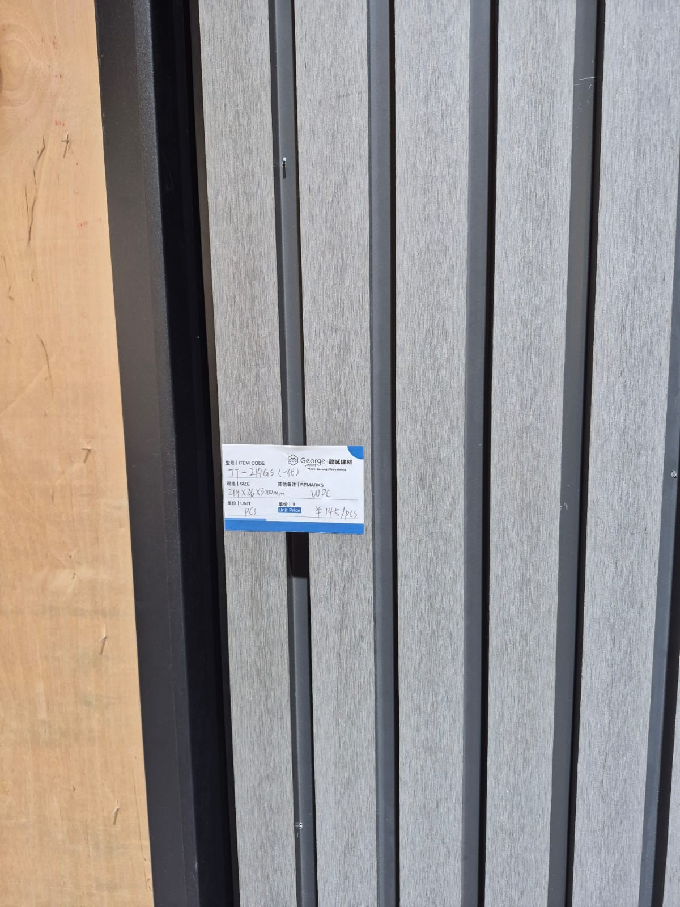

## WPC wall panels for a beach villa. Sounds great until you start researching.

Daniel here. So I went down a rabbit hole on WPC (Wood Plastic Composite) wall panels for the Camotes Island villa project. 150 meters from the sea, 80%+ humidity year round, typhoons, equatorial UV... basically everything that hates building materials.

And here's my honest take after weeks of research: **WPC wall panels are a defensible choice ONLY when you get third-generation co-extruded panels, install them with marine-grade hardware behind a ventilated cavity, and limit them to protected interior walls.**

The material has only been used in tropical environments for like 5-7 years. That's not enough to validate the "25 year lifespan" that manufacturers promise. Fiber cement and porcelain tile have decades of proven coastal performance in the Philippines. Those are the workhorses.

But WPC has real advantages for specific applications - aesthetic versatility, zero-paint maintenance, warm wood-look feel without actual wood. The trick is knowing exactly what to spec and where to use it.

Let me dump everything I found.

## The four generations of WPC - this is where most people get screwed

Chinese suppliers sell ALL generations simultaneously. The cheapest quote? Almost always first-generation garbage. Understanding the evolution is critical because they won't tell you which generation you're getting unless you ask the right questions.

**First-gen (1990s-2000s)** - single layer extrusion. Wood flour (40-70%) mixed with plastic (PE, PP, or PVC at 30-50%), barely any additives. The wood fiber sits right on the surface, exposed to everything. Water absorption: 2-5% in 24 hours, climbing to 18-22% after months. Colors fade in 1-3 years. Mold colonizes the exposed wood particles. Surface cracks, chalks, stains. Needs resealing every 1-2 years and still fails within 5-10. Should NEVER be used near the coast. Still widely available from budget Chinese factories at $3-5/m² FOB. If someone quotes you that price range for "WPC wall panels" this is what you're getting.

**Second-gen (~2010s)** - introduced co-extrusion. They wrap a high-density polyethylene (HDPE) shell around the traditional WPC core during manufacturing. That 360-degree encapsulation was a big deal. Scratch resistance improved 5x. The non-porous surface blocked staining, water absorption dropped below 1.5%. UV fading improved by about 30%. Lifespan jumped to 15-20 years in temperate climates. B1 fire rating became possible. But the HDPE cap still degrades under intense equatorial UV faster than you'd want.

**Third-gen (current state of the art)** - replaced HDPE with **ASA (Acrylonitrile Styrene Acrylate)**. This is the magic material. ASA has an acrylic rubber backbone with no unsaturated double bonds, which makes it basically immune to UV photodegradation at the molecular level. ASA-capped panels have passed 6,000+ hours of accelerated weathering tests. Colors stay stable for 15-20 years outdoors. Water absorption in boiling water averages just 1.8% (EN limit is 7%). The ASA cap is typically 0.2-0.3mm thick and bonds molecularly to the core - it CAN'T delaminate like a film because there's no film, it's fused to the core during extrusion.

For Camotes Island, **third-gen ASA co-extruded is the minimum acceptable product.** Period.

There's also a "fourth generation" from a Foshan manufacturer called MexyTech - aluminum core wrapped in ASA co-extrusion. Eliminates moisture absorption entirely. Engineering-grade strength. But $25-45/m² FOB. Might make sense for exterior cladding or structural accent walls in extreme typhoon exposure. Overkill for protected interior walls.

| Parameter | 1st Gen (uncapped) | 2nd Gen (HDPE cap) | 3rd Gen (ASA cap) | 4th Gen (Al-core) |
|---|---|---|---|---|
| Water absorption (24hr) | 2-5%+ | <1.5% | <1% | Near zero |
| UV color stability | 1-3 years | 10+ years | **15-20 years** | 15-20+ years |
| Fire rating | B2 or lower | B1 achievable | B1 achievable | B1+ |
| Lifespan (tropical coastal) | 3-7 years | 10-15 years | **15-20 years** | 20-25+ years |
| FOB China price/m² | $3-5 | $8-15 | **$15-25** | $25-45 |

## What's inside a WPC panel and why the formulation matters so much

A premium WPC panel and a budget one can look identical. Then two monsoon seasons later one is fine and the other is rotting from the inside. The difference is what's in them.

### The wood fiber problem

Wood flour makes up 25-50% of the mix and it's the Achilles heel in tropical humidity. Poplar sawdust is the industry standard.

Bamboo powder? Despite the marketing hype, a 2014 study by Jing Feng et al. found bamboo actually shows **higher mold susceptibility** than wood flour in WPC. Both absorb water at similar rates but bamboo's higher sugar content literally feeds the fungus. So much for "premium bamboo WPC."

Rice husk has natural silica (~15-20%) which helps fire resistance and reduces moisture absorption. But it's uncommon in commercial panels.

The critical thing: **above 50% fiber content, mold susceptibility jumps sharply.** Premium formulations keep fiber at 40-50% max. Budget formulations cram in 60-70% fiber to save on expensive polymer. Recipe for disaster in our climate.

### PVC resin grade

Suspension-grade **SG-5 (K67)** is standard for rigid extrusion. **SG-7 (K58)** is actually preferred for WPC because it flows better during processing. Budget factories use recycled PVC that may contain heavy metals from e-waste and introduces all kinds of inconsistency. For export-grade tropical panels: **virgin SG-5 or SG-7 suspension-grade PVC**. Don't compromise on this.

### The calcium carbonate filler trap

CaCO3 at 10-20% improves rigidity, surface smoothness, and fire resistance while reducing cost. All good.

But factories gaming margins push it above 25-30% and that makes panels **brittle and crack-prone**. This is the most common quality fraud in Chinese WPC. The panels feel heavy and substantial (which tricks you into thinking quality) but they shatter on impact. Precipitated calcium carbonate coated with stearic acid gives the best results since it doubles as impact modifier and processing aid.

### Coupling agents - the thing nobody mentions

This is probably the single most important additive difference between good and bad panels.

Maleic anhydride grafted polyethylene (MAPE) at 2-5% of wood content creates covalent bonds between the plastic and wood fiber. Without it, water penetrates the fiber-polymer interface and swells the core from within. Dow's FUSABOND M603 is the benchmark commercial product.

Budget formulations use none or less than 1%. And then people wonder why their panels swell.

### Stabilizers, UV protection, antimicrobials

**Stabilizer system must be calcium-zinc (Ca-Zn)** for export. Fully compliant with RoHS, REACH, EN71-3. Lead-based stabilizers are still used in some domestic Chinese production but banned for export. Ca-Zn at 3-5 phr is the standard.

**UV protection needs a dual system**: HALS (hindered amine light stabilizers) to interrupt the degradation chain reaction, plus benzotriazole UV absorbers (UV-326 or UV-531) to absorb radiation at 300-400nm. At equatorial UV index 10-12+, this combo is non-negotiable. Research shows UV stabilizers concentrated in the surface cap layer work way better than distributed through the bulk - another reason co-extrusion beats single-layer.

**Zinc borate at 1-2%** handles both mold prevention and flame retardancy. Two birds one stone.

Impact modifiers should be **ACR (acrylic)** type not CPE - ACR handles weathering and low-temp performance better.

### Premium vs budget formulation summary

Premium tropical-grade: PVC resin (SG-5/7) ~50%, wood flour (80-120 mesh) ~25%, CaCO3 ~15%, additives ~10% (Ca-Zn stabilizer 3-5 phr, MAPE coupling agent 2-5%, ACR impact modifier 4-8 phr, HALS + benzotriazole UV stabilizers 0.3-0.5%, zinc borate 1-2%, PE wax lubricant, inorganic pigments).

Budget: recycled PVC, wood fiber at 60-70%, CaCO3 at 30%+, no coupling agents, no UV stabilizers, organic pigments that fade in months. And probably the same price as premium on some dodgy Alibaba listing with stolen photos.

## Panel profiles - fluted walls, Great Wall boards, hollow vs solid

Chinese factories make several distinct profile types. Each has specific uses.

**Fluted/slat panels** are everywhere in modern interior design. Those rhythmic vertical or horizontal lines that add architectural depth. Standard widths from China: 150-227mm, thickness 12-28mm, lengths 2,400-3,000mm (custom up to 3,600mm). Popular specs include 160x24mm, 195x12mm, 150x17mm. You see these constantly in hotel lobbies, TV background walls, residential feature walls.

**Great Wall boards (长城板)** - named after their cross-section that looks like the crenellations on the Great Wall. Distinctive concave-convex undulating profile, 150-195mm wide (usually 195mm), 12-28mm thick, 2,800-3,000mm long. The back has slots that allow bending for curved walls and column wrapping. Actually super useful for architectural applications.

**Flat/smooth panels** - minimalist look, thinner profiles (5-12mm), widths 150-600mm. Full-wall coverage in contemporary designs.

### Hollow vs solid core

This matters more than you'd think.

**Hollow core**: internal ribbed chambers running lengthwise (wall thickness must exceed 4.5mm per GB/T 24508-2020). About 2.5-3.5 kg/m² - 30%+ lighter than solid. Weight advantage for ceilings and shipping. But lower impact resistance and less load-bearing capacity.

**Solid core**: 4-6 kg/m². Superior impact resistance, more substantial feel like natural wood, density 1.2-1.4 g/cm³.

For Camotes: hollow core is fine for ceilings and most walls. Hallways, children's rooms, anywhere furniture hits the wall - go solid core. Worth the premium.

### Connection systems

**Tongue-and-groove** is the one you want for tropical humidity cycling. The precision-machined T&G joints reduce moisture infiltration by roughly 70% versus butt joints while accommodating expansion-contraction cycles. Click-lock systems work but may not handle thermal cycling as well. Overlap/shiplap only for exterior cladding.

### Sound and thermal insulation

don't get excited. WPC alone gives about **STC 35** for sound (comparable to standard drywall without insulation). It's an additional mass layer, not an acoustic solution.

Thermal conductivity of 0.15-0.30 W/(m·K) - better than concrete or brick but nowhere near actual insulation. A 12mm WPC panel provides roughly R-0.05 to R-0.08. Negligible on its own.

## Surface technology - this determines how long your walls look good

Surface treatment might matter even more than core composition for tropical coastal longevity because it's the first line of defense.

**ASA co-extrusion** is the gold standard. Molecularly bonded to the core during manufacturing. Cannot delaminate. Inherent UV protection, superior scratch resistance, complete moisture barrier. 30-35% price premium over laminated panels but vastly superior durability. MATECO offers "2nd generation co-extrusion" with randomized grain patterns, enhanced UV armor, 30% weight reduction. **For Camotes, ASA co-extrusion is the recommended surface for any panel that might see sunlight.**

**PET film lamination** - next best UV resistance among applied films. Better scratch resistance than PVC film.

**PVC film** (0.12-0.5mm thick) - most common, cheapest option. Fine for protected interior walls. Not good enough for UV-exposed surfaces.

**EIR (Embossed in Register)** technology is worth paying for on feature walls. The physical texture aligns with the printed grain pattern - bumps where the visual grain shows knots. Eliminates the "plastic feel" that makes cheap panels obvious.

Surface hardness targets: pencil hardness ≥3H, withstand 10,000 Taber abrasion cycles. Color fastness: grey scale rating ≥4 (on 1-5 scale where 5 = no change) after 2,000+ hours QUV testing.

Durability hierarchy: **ASA co-extrusion > UV-cured coating > PET lamination > PVC lamination > water-based paint**.

## The honest comparison against every other wall material

ok this is the part where WPC marketing falls apart a bit. I'm calibrating everything for Camotes Island conditions specifically.

**[SPC wall panels](/spc-flooring)** are objectively better than WPC for wet areas. 60-80% calcium carbonate, zero organic fiber, **0% water absorption**, best-in-class dimensional stability. Fire rating Bf1-S1 (best among composites). But heavy at 8-12 kg/m², brittle (cracks not flexes), poor sound/thermal insulation, needs perfectly flat substrate. **For bathrooms, kitchens, laundry on Camotes - use SPC over WPC.**

**Carbon crystal panels** - here's the thing nobody tells you. These aren't a distinct material. They're upgraded WPC boards made from bamboo charcoal powder, calcium powder, and PVC via co-extrusion. "Double-layer hard co-extrusion" gives better surface hardness. Performance is roughly 10-15% better than standard WPC. But the fundamental wood-fiber-in-plastic vulnerability remains. It's marketing.

**Fiber cement board** - the proven champion. 25-50+ year track record in the Philippines, verified through decades of actual typhoons. Class A fire rating (non-combustible), handles salt air without issues, costs only 500-800 pesos/m² installed. Needs repainting every 5-7 years but every Filipino builder knows how to work with it. **For structural walls, fiber cement should be your baseline.** WPC needs to justify its premium against this.

**Porcelain tile** - ultimate longevity at 50-100+ years with basically zero maintenance. Water absorption below 0.5%, UV-proof, salt-inert, non-combustible. 800-2,500 pesos/m² installed. Heavy and labor-intensive but permanent.

| Material | Water absorption | Lifespan (tropical coastal) | Installed cost Camotes (₱/m²) | Maintenance |
|---|---|---|---|---|
| WPC Standard | <1.5% | 8-15 yrs | 1,000-1,300 | Low |
| WPC Premium Co-Ex | <1.0% | 15-20 yrs | 1,600-2,000 | Very low |
| SPC Wall Panel | 0% | 20-30+ yrs | 900-2,000 | Very low |
| Carbon Crystal | <1.0% | 10-18 yrs | 1,200-1,800 | Low |
| Fiber Cement + Paint | Porous (seal) | **25-50+ yrs** | 500-800 | Repaint 5-7 yrs |
| Porcelain Tile | <0.5% | **50-100+ yrs** | 800-2,500 | Very low |
| PVC Panel | 0% | 10-15 yrs interior | 400-900 | Low |

**My honest recommendation**: fiber cement + paint for general walls, porcelain tile for wet areas, WPC/carbon crystal **only for protected interior feature walls** where the aesthetic justifies the material risk. Hybrid approach.

## How to test quality before ordering a container

### Lab tests to demand

Before you commit to a container-load from any Chinese factory:

- **Density**: premium wall panels ≥1.2 g/cm³. Standard 0.95-1.2 g/cm³. Below 0.8 = budget garbage
- **Water absorption**: ≤1.5% after 24hr immersion per ASTM D7031. Premium under 1.0%
- **Dimensional swelling** after immersion: not exceeding 0.5%
- **Fire rating**: B1 per GB 8624 (self-extinguishing within 10 seconds). European equivalent B-s1,d0 per EN 13501-1
- **Accelerated weathering**: grey scale ≥4 after 2,000 hours QUV for interior. 3,000+ hours for any UV-exposed panel
- **Salt spray**: 1,000 hours per ISO 9227 for coastal applications
- **Mold resistance**: rating 0 (no fungal growth) per ASTM D3273
- **Formaldehyde**: E0 (≤0.07 mg/m³) or better. PVC-based WPC is generally low here since it uses heat and pressure instead of formaldehyde adhesives
- **Flexural strength**: ≥26 MPa per GB/T 24508-2020
- **Tensile strength**: ≥15 MPa

### DIY tests on samples

Always request samples before ordering. Then do these:

**Boiling water test**: submerge a cut sample for 2 hours. Quality panels show minimal swelling. Film delamination = reject immediately.

**Cigarette burn test**: hold a lit cigarette on the surface for 10 seconds. B1-rated panels self-extinguish with minimal marking. If it keeps burning, reject.

**Snap test**: try to break it by hand. Quality panels flex without cracking. Brittle fracture with chalky cross-section = way too much CaCO3.

**Weight comparison**: weigh equivalent samples from different suppliers. Suspiciously light = excessive hollow or low density. Suspiciously heavy = excessive CaCO3.

**Smell test**: strong chemical or musty odor = poor raw materials or high VOC.

**Scratch test**: coin or key across the surface. Quality panels (≥3H hardness) resist visible scratching.

**Water bead test**: spray water on joints and surface. Should bead up, not absorb.

**Edge inspection**: cut edges should show dense, uniform material. No visible pores, voids, or separation layers.

## What actually goes wrong in the tropics - real failure modes

WPC wall panels have been widely used in tropical environments for only 5-7 years. That's the uncomfortable truth. Long-term data is scarce. This data gap is itself a risk.

Here's what the evidence shows so far:

**Surface delamination** - most common cosmetic failure. Decorative film separates from the substrate under repeated heat cycling and UV. One manufacturer admitted that panels with protective layers under 0.8mm "show obvious fading within 1-2 years." Co-extruded panels eliminate this entirely since there's no film to delaminate.

**Color fading and chalking** - basically guaranteed within 3-5 years for standard non-co-extruded panels under equatorial UV. Even premium co-extruded panels show measurable change, though it stabilizes after initial weathering. Dark colors are particularly bad because they absorb more solar radiation, driving surfaces to 55-65°C which accelerates both UV damage and thermal expansion stress.

**Warping and buckling** - this happens because wood fibers swell when absorbing moisture while the plastic matrix doesn't. Creates internal stress. One manufacturer said it plainly: "Wood fibers will expand after absorbing water, while the plastic matrix has low water absorption. This uneven expansion produces stress inside the wall panel."

Insufficient expansion gaps are the #1 cause of buckling in tropical installations.

**Mold behind panels** - this is the sneaky one. The space between WPC and the substrate wall, if not ventilated properly, creates a warm dark humid microenvironment. Perfect for fungus. Unlike tile or fiber cement, moisture trapped behind WPC can't dry out easily. After typhoon water ingress this becomes a serious hidden problem.

**Realistic degradation timeline** for tropical coastal WPC:
- Years 0-2: installation issues emerge (bad expansion gaps, corroding fasteners)
- Years 2-5: visible fading begins on standard panels
- Years 5-8: surface chalking, potential mold in poorly ventilated areas
- Years 8-12: significant color change, film delamination
- Years 12-15: material brittleness, structural degradation

Premium co-extruded panels may extend these by 30-50%. But the fundamental vulnerabilities remain. One Chinese manufacturer stated candidly: "Extreme environments (equator + coast): lifespan may be shortened by 30-50%."

So when they say 25 years, for us that means maybe 12-17 realistically. still decent for a feature wall that you'd probably redesign anyway.

## Where to buy in China

### The manufacturing hubs

**Linyi, Shandong** - global epicenter for interior WPC wall panels. Produces an estimated 60-70% of China's export volume. The city is the world's largest plywood center, so cheap wood fiber feeds directly into WPC production. Great at budget and mid-range. Quality varies enormously.

**Foshan, Guangdong** - leads in outdoor and co-extruded technology. Better R&D, near Guangzhou's export infrastructure and the [Canton Fair](/where-to-go-china-materials). Premium positioning.

**Tongxiang/Jiaxing, Zhejiang** - HDPE-based outdoor specialty. Higher-end.

### Established manufacturers worth talking to

Verified export track records to Southeast Asia:

- **Jiabang/Garbon WPC** (Linyi, founded 2002, completed seaside park project in Malaysia)
- **Unifloor** (Shanghai, exports to 120 countries, ISO/CE/SGS certified)
- **MATECO** (Foshan, 2nd-gen co-extrusion, 15-year color warranty)
- **MexyTech** (Foshan, outdoor/coastal focus, 30 production lines)
- **Consmos Wood** (Linyi, CARB P2/FSC/CE certified)

Mid-tier with strong Linyi bases: Tianzeyuan (70,000 tons annual sales), Shandong Aowei (50+ production lines), AesthEdge/wpcspc.

About 85-90% of Chinese WPC factories produce OEM/ODM. Few have brand recognition internationally.

### Red flags

- Prices below $3/m² for interior panels = almost certainly recycled/contaminated material
- CaCO3 filler above 25-30% = brittle panels that shatter
- Missing or fake test certificates (verify SGS/TUV report numbers independently)
- Trading companies posing as factories = 15-30% markup with zero quality control
- Sample-vs-bulk bait-and-switch (classic)

How to verify: request the Chinese business license (营业执照). Real factories list "manufacturing" (生产) not just "trade" (贸易). Do live video calls showing extrusion lines, raw material storage, QC labs. Use customs data services like ImportGenius or Panjiva to check actual export records.

**Canton Fair Phase 2** (April 23-27, 2026) is the key phase for building and decorative materials, Zone B. WPC panels are prominently featured. If you're going to [Foshan anyway](/where-to-go-china-materials), worth visiting.

In the Philippines, **P.Tech** is the primary WPC brand at Wilcon Depot. Indoor panels ₱225-700/piece, outdoor cladding ₱1,160/piece. No major Chinese brand has direct consumer recognition here.

## Installation for Camotes Island - conservative specs because rework is expensive

### Framing material - marine-grade aluminum only

**Marine-grade aluminum (5052 or 6063-T5), powder-coated or anodized.** This is the only framing material that survives decades at 150m from the sea without structural corrosion. Hot-dip galvanized steel degrades significantly within 3-8 years at this distance. Treated wood rots.

Standard profiles: 40x40mm or 50x30mm channels at **300mm centers** for exterior/typhoon-exposed walls, **400mm centers** for interior walls. Attach to masonry using **316 stainless steel concrete anchors** with epoxy.

### Every. Single. Fastener. 316 Stainless Steel.

Not optional at 150m from the sea. Per Eagle Claw Fasteners' 28-year field data, 304 stainless "develops rust pitting within 36 months near saltwater." The 0-8km zone from coast is the danger zone and we're at 0.15km.

Self-drilling screws M4x25-35mm with pre-drilled pilot holes. Hidden clip systems using 316 SS clips at 500-600mm spacing for the cleanest look while allowing thermal movement.

### The galvanic corrosion gotcha

Aluminum framing + stainless steel fasteners = **galvanic corrosion risk**. The aluminum becomes the anode and corrodes at bolt holes. This is something most installers don't think about.

Mandatory fixes:
- **Nylon/EPDM isolation washers** between all stainless fasteners and aluminum framing
- **Dielectric paste** at all dissimilar-metal joints
- Powder-coated aluminum (the coating acts as an insulating layer)

Skip this and you'll find corroded holes in your framing within a few years. Ask me how I know about this... ok I don't know firsthand, but I read enough horror stories during research.

### Ventilated cavity - critical

Cavity depth: **38-50mm for exterior walls**, 25mm minimum for interior. Must function as drainage and drying plane with **bottom intake and top exhaust ventilation** (chimney effect carries moisture upward). Install stainless steel or aluminum insect mesh at openings.

Multiple manufacturers state explicitly: "WPC products CANNOT be directly installed onto a flat surface." I've seen this warning on at least three different factory websites. Don't ignore it.

### Expansion gaps

WPC has a coefficient of linear thermal expansion of approximately 2.3 x 10⁻⁵ /°C. That's roughly 2x aluminum and 4-5x wood along grain. Sounds small until you do the math.

For Camotes temperature range of 22°C to 65°C (delta 43°C), a 2.9m panel expands approximately **2.9mm**. Specify **5-6mm gaps at perimeters** (floor, ceiling, adjacent walls) and **3-5mm between panel ends**.

Insufficient expansion gaps are the #1 cause of buckling failures. Not material failure. Not humidity damage. Gaps. Plan for them.

### Moisture barriers and sealant

Breathable weather-resistant barrier (Tyvek HouseWrap or similar) on exterior wall substrates behind the ventilated cavity. In tropical climates vapor drive goes outside-to-inside, so any vapor barrier goes on the exterior side of insulation.

For naturally ventilated rooms, skip the vapor barrier, use breathable membranes only. Bathrooms: waterproof membrane on the substrate behind panels.

Joint sealant: **MS Polymer (Modified Silicone Polymer)** - excellent adhesion, flexible, UV-resistant, paintable. Seal around windows, doors, penetrations. Do NOT seal the top/bottom ventilation openings or the T&G panel joints. Those need to breathe.

## Ceiling installation - the heat trap nobody warns about

WPC ceiling panels work in tropical buildings. But the thermal environment under a Philippine metal roof creates specific risks.

Under corrugated GI roofing in direct tropical sun, ceiling-space temperatures hit **50-65°C routinely.** Sometimes higher. The glass transition temperature of PVC-based WPC is about 83°C, but properties start changing well before that. Recommended max continuous temperature: 60°C. Absolute maximum: 70°C for short exposure.

Above 60°C, the WPC gets less stiff, expands more, and starts to creep/sag under its own weight over long spans.

**Use hollow-core for ceilings** - 4-7 kg/m² versus 8-14 for solid. Comparable to standard 9.5mm gypsum board at ~7.5 kg/m². Recommended thickness 8-12mm with tongue-and-groove plus clips for secure invisible fastening.

**Mechanical attachment only, never adhesive.** Adhesive failure at ceiling temperatures means panels falling on people.

**Batten spacing max 400mm** for tropical. Reduce to **300mm** under metal roofing where temperatures may exceed 50°C. At elevated temperatures WPC modulus drops 20-30% and span capability decreases proportionally. Use light colors to minimize heat absorption.

**The single most important ceiling detail**: ventilate the roof space above. Install ridge vents plus eave/soffit vents with minimum vent-area-to-ceiling-area ratio of 1:150. Install **reflective foil insulation (radiant barrier)** directly under the metal roof - reduces radiant heat transfer by up to 95%, keeping ceiling space below the critical 60°C threshold.

Without insulation and ventilation combo, WPC ceiling panels under a Philippine metal roof will sag and deform within years. Not maybe. Will.

oh and **fire safety** - heightened concern for ceilings because fire and hot gases rise. Specify Class B1 minimum per GB 8624. Philippine Building Code requires wall and ceiling materials with flame-spread rating of 50 or less. Note that PVC-based WPC generates HCl gas when burning. Make sure smoke detection provisions cover all rooms with WPC ceilings.

## Cost breakdown: China factory to Camotes Island wall

### FOB pricing by tier

- Budget interior panels: $3-8/m² (don't)
- Standard interior: $8-15/m²
- Premium co-extruded: $15-25/m² (what you want)
- Ultra-premium (aluminum core): $25-45/m²

For Camotes coastal environment, realistic budget: **$11-20/m² FOB** for adequate quality.

### Shipping is cheap at container scale

Current rates (April 2026): 40ft HQ container from China to Cebu runs **$450-550**. Holds approximately 5,000-7,000 m² of interior panels depending on thickness. That works out to $0.08-0.10/m² freight. basically nothing.

LCL for smaller orders is way more expensive at $30-60/CBM.

### ACFTA means zero customs duty

HS code 3925.90.00 (builders' ware of plastics). Under ASEAN-China Free Trade Agreement, **duty rate is 0%**. In effect since January 2012. Need a **Form E Certificate of Origin** from the supplier - without it you pay 10-15% MFN duty for no reason. Same story as [SPC flooring](/spc-flooring). Always demand Form E.

12% VAT applies on CIF value regardless.

### Landed cost math

| Cost Component | Standard ($11.50 FOB) | Premium Co-Ex ($20 FOB) |
|---|---|---|
| FOB China | $11.50 | $20.00 |
| Freight + insurance | $0.11 | $0.16 |
| **CIF Cebu** | **$11.61** | **$20.16** |
| VAT (12%) | $1.39 | $2.42 |
| Brokerage + fees | $0.10 | $0.10 |
| **Landed Cebu** | **$13.10 (₱747/m²)** | **$22.68 (₱1,293/m²)** |
| Inter-island to Camotes | $1.00 | $1.25 |
| **Landed Camotes** | **$14.10 (₱803/m²)** | **$23.93 (₱1,364/m²)** |
| Framing + fasteners | ₱150-200/m² | ₱150-200/m² |
| Labor | ₱150-250/m² | ₱150-250/m² |
| **Total installed** | **₱1,270-1,440/m²** | **₱1,910-2,090/m²** |

Direct import saves roughly **40-45%** compared to P.Tech WPC at Wilcon retail. A full 40HQ container covers 5,000-7,000 m² which is way more than one villa needs. Share with other projects or sell locally.

### 20-year cost comparison

Over 20 years:
- Premium co-extruded WPC: ~₱2,000/m² initial, no maintenance = ₱2,000 total
- Fiber cement + paint: ~₱950/m² initial + ~₱900/m² repainting costs = ₱1,850 total
- Porcelain tile: ~₱1,500/m² initial + ~₱200/m² grout maintenance = ₱1,700 total

But fiber cement lasts 25-50 years vs WPC's 15-20. And porcelain tile lasts 50-100 years. The per-year cost of tile is the clear winner if you think long term. WPC only wins if you value the aesthetic enough to pay the premium.

## What WPC gives you that SPC and carbon crystal don't

Since I already wrote about [SPC flooring](/spc-flooring) and looked at carbon crystal panels, here's the honest comparison.

**WPC over SPC**: significantly lighter (3-6 vs 8-12 kg/m²) so you can actually put it on ceilings. Better sound and thermal insulation from the wood fiber and hollow chambers. Warmer to touch vs SPC's cold rigid feel. Flexes under impact instead of cracking. Slightly cheaper at equivalent quality.

**WPC over carbon crystal**: carbon crystal is basically premium WPC with a harder surface and better marketing. Standard WPC offers wider profile variety (fluted, Great Wall, curved wrapping) and more aesthetic options. At the premium co-extruded tier the performance gap between "WPC" and "carbon crystal" is almost zero. Same material, different name.

**WPC's honest weaknesses vs both**: higher water absorption (up to 1.5% vs SPC's 0%), organic fiber creates inherent mold risk that inorganic SPC avoids entirely, inferior dimensional stability in humidity cycling, shorter proven track record.

### The strategy for the villa

Use each material where it's strongest:

- **WPC wall panels**: protected interior feature walls, living rooms, bedrooms, hallways, ceilings. Warm aesthetics, design versatility.
- **SPC panels**: bathrooms, kitchens, laundry. Absolute waterproofing.
- **Fiber cement + paint**: exterior walls, service areas. Proven 25-50 year performance.
- **Porcelain tile**: wet areas, outdoor-adjacent walls. Permanence.
- **[WPC exterior shutters](/wpc-typhoon-shutters-philippines)**: typhoon protection for windows.

This hybrid approach leverages each material's strengths and avoids their individual failure modes. No single material does everything well in our climate.

## What I'm specifying for Camotes

Third-generation ASA co-extruded WPC panels from a verified Foshan or established Linyi factory. Never first-gen uncapped regardless of price.

**Formulation spec**: virgin SG-5/SG-7 PVC at ~50%, wood fiber ≤50%, CaCO3 ≤20%, MAPE coupling agent 2-5%, Ca-Zn stabilizer, HALS + benzotriazole UV package, zinc borate antimicrobial.

**Test certificates required**: B1 fire rating (GB 8624), water absorption ≤1.5% (24hr), flexural strength ≥26 MPa, grey scale ≥4 after 2,000 hours QUV, mold resistance rating 0 (ASTM D3273).

**Installation**: marine-grade aluminum framing at 300-400mm centers, 316 stainless steel fasteners exclusively, nylon isolation washers at every aluminum-steel interface, 38-50mm ventilated cavity with bottom/top airflow, 5-6mm expansion gaps at all perimeters. Ceilings get hollow-core at 300-400mm batten spacing with reflective foil insulation under the metal roof.

**Budget**: ₱1,600-2,100/m² installed for premium co-extruded. Ship via 40HQ at $450-550 freight to Cebu, HS 3925.90.00 with ACFTA Form E for 0% duty, then barge to Camotes.

**Realistic lifespan expectation**: 15-20 years for protected interior. Not the 25-35 manufacturers claim for temperate conditions.

And the most important decision: WPC for feature walls only. Fiber cement for everything structural. Tile for everything wet. Don't try to make one material do everything.
